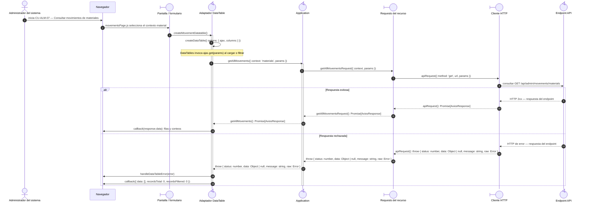

# `CU-ALM-07` — Consultar movimientos de materiales

**Patrones:** `FE-P07`.

## Participantes y trazabilidad

Los nombres breves del diagrama corresponden a los archivos vinculados siguientes.
La ruta completa se conserva en cada enlace, fuera de la cabecera visual. Un participante
puede agrupar colaboradores del mismo rol; esa agrupación no implica una clase ni un
proceso independiente. Los retornos representan el resultado o error propagado.

| Alias | Rol visual | Archivos de implementación |
| --- | --- | --- |
| `View` | boundary | [`movementsPage.js`](../../../../../../src/public/js/pages/admin/movements/movementsPage.js) |
| `Application` | control | [`movements.js`](../../../../../../src/public/js/application/admin/movements/movements.js) |
| `Request` | boundary | [`movementService.js`](../../../../../../src/public/js/services/admin/movementService.js) |
| `HTTP` | boundary | [`axiosInstanceApi.js`](../../../../../../src/public/js/services/axiosInstanceApi.js) |
| `Transport` | control | [`movementApiRoute.js`](../../../../../../src/routes/api/admin/movementApiRoute.js) [`movementController.js`](../../../../../../src/controllers/api/admin/movementController.js) |

| `Table` | control | [`movementDatatable.js`](../../../../../../src/public/js/plugins/datatable/admin/movements/movementDatatable.js) [`createDataTable.js`](../../../../../../src/public/js/plugins/datatable/core/base/createDataTable.js) |

## Secuencia de implementación

