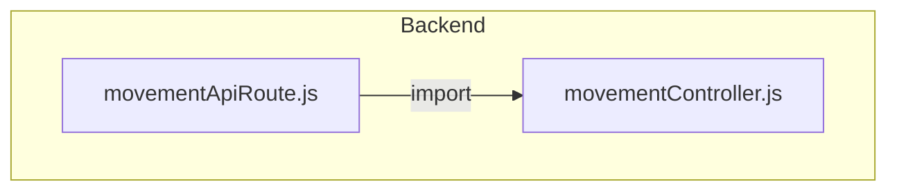
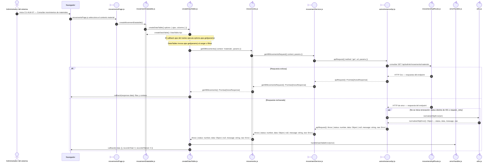

# `CU-ALM-07` — Consultar movimientos de materiales

**Patrones:** `FE-P07`.

## Participantes y trazabilidad

Cada línea de vida técnica corresponde a un único archivo de implementación, indicado
por su alias en la tabla. Dos archivos distintos usan participantes distintos. Los actores,
el navegador y la frontera de persistencia son elementos externos, no archivos del proyecto.
Los retornos representan el resultado o error de la función ejecutada en el archivo indicado.
La composición incluye también los archivos de configuración, construcción y reexport: cada
uno tiene un nodo propio, aunque no ejecute una delegación durante la petición.

| Alias | Rol visual | Archivo de implementación |
| --- | --- | --- |
| `View` | boundary | [`movementsPage.js`](../../../../../../src/public/js/pages/admin/movements/movementsPage.js) |
| `Application` | control | [`movements.js`](../../../../../../src/public/js/application/admin/movements/movements.js) |
| `Request` | boundary | [`movementService.js`](../../../../../../src/public/js/services/admin/movementService.js) |
| `HTTP` | boundary | [`axiosInstanceApi.js`](../../../../../../src/public/js/services/axiosInstanceApi.js) |
| `Transport` | control | [`movementApiRoute.js`](../../../../../../src/routes/api/admin/movementApiRoute.js) |
| `Table` | control | [`movementDatatable.js`](../../../../../../src/public/js/plugins/datatable/admin/movements/movementDatatable.js) |
| `TableCore` | control | [`createDataTable.js`](../../../../../../src/public/js/plugins/datatable/core/base/createDataTable.js) |
| `FileErrorHandler` | control | [`errorHandler.js`](../../../../../../src/public/js/api/errorHandler.js) |
| `FileMovementController` | control | [`movementController.js`](../../../../../../src/controllers/api/admin/movementController.js) |
| `FileUtils` | control | [`utils.js`](../../../../../../src/public/js/api/utils.js) |

### Configuración y construcción

El endpoint queda representado por su router. El controller asociado se desarrolla en la [secuencia backend `CU-ALM-07`](../../backend-code-sequences/catalogs/cu-alm-07.md#cu-alm-07): [`movementController.js`](../../../../../../src/controllers/api/admin/movementController.js).

## Composición de archivos

Los archivos que construyen, configuran o reexportan funciones aparecen como componentes
individuales. Las flechas representan imports reales, resueltos al cargar los módulos;
las llamadas durante la operación se muestran en las secuencias siguientes. Cada nombre
identifica un archivo y la tabla conserva su ruta completa.

## Secuencia de implementación

