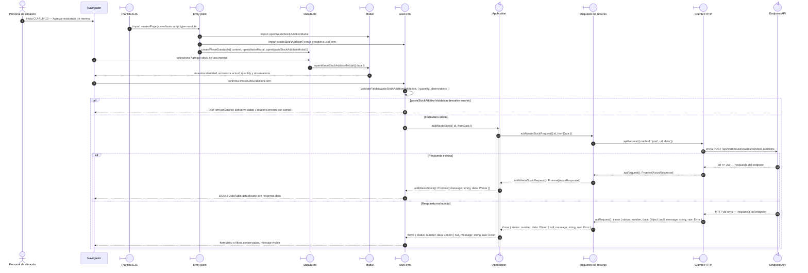

# `CU-ALM-13` — Agregar existencia de merma

**Patrones:** `FE-P02`.

## Participantes y trazabilidad

Los nombres breves del diagrama corresponden a los archivos vinculados siguientes.
La ruta completa se conserva en cada enlace, fuera de la cabecera visual. Un participante
puede agrupar colaboradores del mismo rol; esa agrupación no implica una clase ni un
proceso independiente. Los retornos representan el resultado o error propagado.

| Alias | Rol visual | Archivos de implementación |
| --- | --- | --- |
| `EJS` | boundary | [`wastesPage.ejs`](../../../../../../src/views/pages/warehouse/wastes/wastesPage.ejs) |
| `Page` | boundary | [`wastesPage.js`](../../../../../../src/public/js/pages/warehouse/wastes/wastesPage.js) |
| `Table` | boundary | [`wasteDatatable.js`](../../../../../../src/public/js/plugins/datatable/warehouse/wastes/wasteDatatable.js) |
| `Modal` | boundary | [`wasteStockAdditionModal.js`](../../../../../../src/public/js/pages/warehouse/wastes/wasteStockAdditionModal.js) |
| `Form` | boundary | [`wasteStockAdditionForm.js`](../../../../../../src/public/js/pages/warehouse/wastes/wasteStockAdditionForm.js) |
| `Application` | control | [`wastes.js`](../../../../../../src/public/js/application/warehouse/wastes/wastes.js) |
| `Request` | boundary | [`wasteService.js`](../../../../../../src/public/js/services/warehouse/wasteService.js) |
| `HTTP` | boundary | [`axiosInstanceApi.js`](../../../../../../src/public/js/services/axiosInstanceApi.js) |
| `Transport` | control | [`wasteApiRoute.js`](../../../../../../src/routes/api/warehouse/wasteApiRoute.js) [`wasteController.js`](../../../../../../src/controllers/api/warehouse/wasteController.js) |

## Secuencia de implementación

