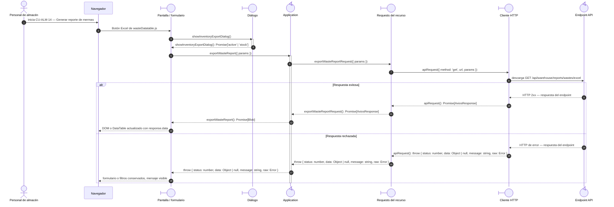

# `CU-ALM-14` — Generar reporte de mermas

**Patrones:** `FE-P08`.

## Participantes y trazabilidad

Los nombres breves del diagrama corresponden a los archivos vinculados siguientes.
La ruta completa se conserva en cada enlace, fuera de la cabecera visual. Un participante
puede agrupar colaboradores del mismo rol; esa agrupación no implica una clase ni un
proceso independiente. Los retornos representan el resultado o error propagado.

| Alias | Rol visual | Archivos de implementación |
| --- | --- | --- |
| `View` | boundary | [`wasteDatatable.js`](../../../../../../src/public/js/plugins/datatable/warehouse/wastes/wasteDatatable.js) |
| `Dialog` | boundary | [`reportExportDialog.js`](../../../../../../src/public/js/ui/reportExportDialog.js) |
| `Application` | control | [`report.js`](../../../../../../src/public/js/application/warehouse/report.js) |
| `Request` | boundary | [`reportService.js`](../../../../../../src/public/js/services/warehouse/reportService.js) |
| `HTTP` | boundary | [`axiosInstanceApi.js`](../../../../../../src/public/js/services/axiosInstanceApi.js) |
| `Transport` | control | [`reportApiRoute.js`](../../../../../../src/routes/api/warehouse/reportApiRoute.js) [`reportController.js`](../../../../../../src/controllers/api/warehouse/reportController.js) |

## Secuencia de implementación

