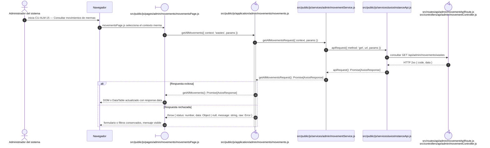

# `CU-ALM-15` — Consultar movimientos de mermas

**Patrones:** `FE-P07`.

```mermaid
sequenceDiagram
    autonumber
    actor Initiator as Administrador del sistema
    participant Browser as Navegador
    participant View@{ "type": "boundary" } as src/public/js/pages/admin/movements/movementsPage.js
    participant Application@{ "type": "control" } as src/public/js/application/admin/movements/movements.js
    participant Request as src/public/js/services/admin/movementService.js
    participant HTTP as src/public/js/services/axiosInstanceApi.js
    participant Transport@{ "type": "control" } as src/routes/api/admin/movementApiRoute.js<br/>src/controllers/api/admin/movementController.js

    Initiator->>Browser: inicia CU-ALM-15 — Consultar movimientos de mermas
    Browser->>View: movementsPage.js selecciona el contexto merma
    View->>Application: getAllMovements({ context: 'wastes', params })
    Application->>Request: getAllMovementsRequest({ context, params })
    activate Application
    Request->>HTTP: apiRequest({ method: 'get', url, params })
    HTTP->>Transport: consultar GET /api/admin/movements/wastes
    Transport-->>HTTP: HTTP 2xx { code, data }
    HTTP-->>Request: apiRequest(): Promise[AxiosResponse]
    Request-->>Application: getAllMovementsRequest(): Promise[AxiosResponse]
    alt Respuesta exitosa
        Application-->>View: getAllMovements(): Promise[AxiosResponse]
        View-->>Browser: DOM o DataTable actualizado con response.data
    else Respuesta rechazada
        Application-->>View: throw { status: number, data: Object | null, message: string, raw: Error }
        View-->>Browser: formulario o filtros conservados, mensaje visible
    end
    deactivate Application
```

