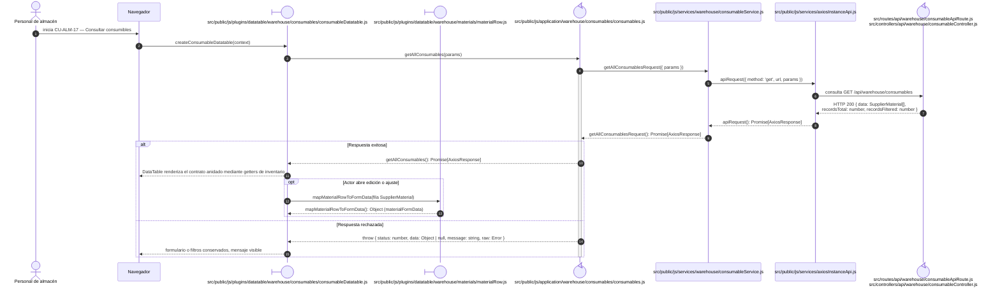

# `CU-ALM-17` — Consultar consumibles

**Patrones:** `FE-P02`.

```mermaid
sequenceDiagram
    autonumber
    actor Initiator as Personal de almacén
    participant Browser as Navegador
    participant View@{ "type": "boundary" } as src/public/js/plugins/datatable/warehouse/consumables/consumableDatatable.js
    participant RowAdapter@{ "type": "boundary" } as src/public/js/plugins/datatable/warehouse/materials/materialRow.js
    participant Application@{ "type": "control" } as src/public/js/application/warehouse/consumables/consumables.js
    participant Request as src/public/js/services/warehouse/consumableService.js
    participant HTTP as src/public/js/services/axiosInstanceApi.js
    participant Transport@{ "type": "control" } as src/routes/api/warehouse/consumableApiRoute.js<br/>src/controllers/api/warehouse/consumableController.js

    Initiator->>Browser: inicia CU-ALM-17 — Consultar consumibles
    Browser->>View: createConsumableDatatable(context)
    View->>Application: getAllConsumables(params)
    Application->>Request: getAllConsumablesRequest({ params })
    activate Application
    Request->>HTTP: apiRequest({ method: 'get', url, params })
    HTTP->>Transport: consulta GET /api/warehouse/consumables
    Transport-->>HTTP: HTTP 200 { data: SupplierMaterial[],<br/>recordsTotal: number, recordsFiltered: number }
    HTTP-->>Request: apiRequest(): Promise[AxiosResponse]
    Request-->>Application: getAllConsumablesRequest(): Promise[AxiosResponse]
    alt Respuesta exitosa
        Application-->>View: getAllConsumables(): Promise[AxiosResponse]
        View-->>Browser: DataTable renderiza el contrato anidado mediante getters de inventario
        opt Actor abre edición o ajuste
            View->>RowAdapter: mapMaterialRowToFormData(fila SupplierMaterial)
            RowAdapter-->>View: mapMaterialRowToFormData(): Object (materialFormData)
        end
    else Respuesta rechazada
        Application-->>View: throw { status: number, data: Object | null, message: string, raw: Error }
        View-->>Browser: formulario o filtros conservados, mensaje visible
    end
    deactivate Application
```
