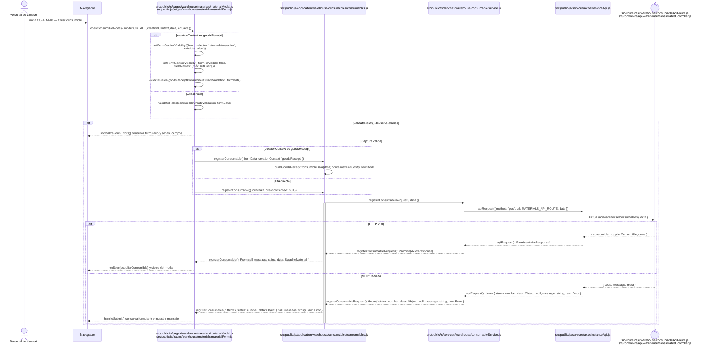

# `CU-ALM-18` — Crear consumible

**Patrones:** `FE-P02`.

```mermaid
sequenceDiagram
    actor Initiator as Personal de almacén
    participant Browser as Navegador
    participant View as src/public/js/pages/warehouse/materials/materialModal.js<br/>src/public/js/pages/warehouse/materials/materialForm.js
    participant Application as src/public/js/application/warehouse/consumables/consumables.js
    participant Request as src/public/js/services/warehouse/consumableService.js
    participant HTTP as src/public/js/services/axiosInstanceApi.js
    participant Transport@{ "type": "control" } as src/routes/api/warehouse/consumableApiRoute.js<br/>src/controllers/api/warehouse/consumableController.js

    Initiator->>Browser: inicia CU-ALM-18 — Crear consumible
    Browser->>View: openConsumibleModal({ mode: CREATE, creationContext, data, onSave })
    alt creationContext es goodsReceipt
        View->>View: setFormSectionVisibility({ form, selector: '.stock-data-section',<br/>isVisible: false })
        View->>View: setFormSectionVisibility({ form, isVisible: false,<br/>fieldNames: ['maxUnitCost'] })
        View->>View: validateFields(goodsReceiptConsumibleCreateValidation, formData)
    else Alta directa
        View->>View: validateFields(consumibleCreateValidation, formData)
    end
    alt validateFields() devuelve errores
        View-->>Browser: normalizeFormErrors() conserva formulario y señala campos
    else Captura válida
        alt creationContext es goodsReceipt
            View->>Application: registerConsumable({ formData, creationContext: 'goodsReceipt' })
            Application->>Application: buildGoodsReceiptConsumibleData(data) omite maxUnitCost y newStock
        else Alta directa
            View->>Application: registerConsumable({ formData, creationContext: null })
        end
        Application->>Request: registerConsumableRequest({ data })
        activate Application
        Request->>HTTP: apiRequest({ method: 'post', url: MATERIALS_API_ROUTE, data })
        HTTP->>Transport: POST /api/warehouse/consumables { data }
        alt HTTP 200
            Transport-->>HTTP: { consumible: supplierConsumible, code }
            HTTP-->>Request: apiRequest(): Promise[AxiosResponse]
            Request-->>Application: registerConsumableRequest(): Promise[AxiosResponse]
            Application-->>View: registerConsumable(): Promise[{ message: string, data: SupplierMaterial }]
            View-->>Browser: onSave(supplierConsumible) y cierre del modal
        else HTTP 4xx/5xx
            Transport-->>HTTP: { code, message, meta }
            HTTP-->>Request: apiRequest(): throw { status: number, data: Object | null, message: string, raw: Error }
            Request-->>Application: registerConsumableRequest(): throw { status: number, data: Object | null, message: string, raw: Error }
            Application-->>View: registerConsumable(): throw { status: number, data: Object | null, message: string, raw: Error }
            View-->>Browser: handleSubmit() conserva formulario y muestra mensaje
        end
        deactivate Application
    end
```
