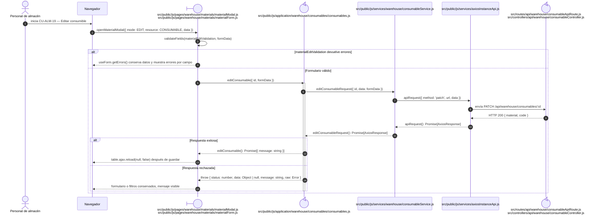

# `CU-ALM-19` — Editar consumible

**Patrones:** `FE-P02`.

```mermaid
sequenceDiagram
    autonumber
    actor Initiator as Personal de almacén
    participant Browser as Navegador
    participant View@{ "type": "boundary" } as src/public/js/pages/warehouse/materials/materialModal.js<br/>src/public/js/pages/warehouse/materials/materialForm.js
    participant Application@{ "type": "control" } as src/public/js/application/warehouse/consumables/consumables.js
    participant Request as src/public/js/services/warehouse/consumableService.js
    participant HTTP as src/public/js/services/axiosInstanceApi.js
    participant Transport@{ "type": "control" } as src/routes/api/warehouse/consumableApiRoute.js<br/>src/controllers/api/warehouse/consumableController.js

    Initiator->>Browser: inicia CU-ALM-19 — Editar consumible
    Browser->>View: openMaterialModal({ mode: EDIT, resource: CONSUMABLE, data })
    View->>View: validateFields(materialEditValidation, formData)
    alt materialEditValidation devuelve errores
        View-->>Browser: useForm.getErrors() conserva datos y muestra errores por campo
    else Formulario válido
        View->>Application: editConsumable({ id, formData })
        activate Application
        Application->>Request: editConsumableRequest({ id, data: formData })
        Request->>HTTP: apiRequest({ method: 'patch', url, data })
        HTTP->>Transport: envía PATCH /api/warehouse/consumables/:id
        Transport-->>HTTP: HTTP 200 { material, code }
        HTTP-->>Request: apiRequest(): Promise[AxiosResponse]
        Request-->>Application: editConsumableRequest(): Promise[AxiosResponse]
        alt Respuesta exitosa
            Application-->>View: editConsumable(): Promise[{ message: string }]
            View-->>Browser: table.ajax.reload(null, false) después de guardar
        else Respuesta rechazada
            Application-->>View: throw { status: number, data: Object | null, message: string, raw: Error }
            View-->>Browser: formulario o filtros conservados, mensaje visible
        end
        deactivate Application
    end
```
