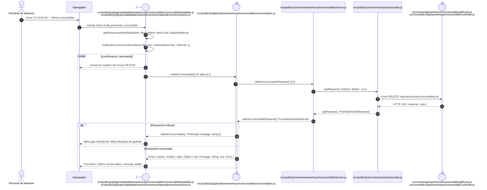

# `CU-ALM-20` — Retirar consumible

**Patrones:** `FE-P02`.

```mermaid
sequenceDiagram
    autonumber
    actor Initiator as Personal de almacén
    participant Browser as Navegador
    participant View@{ "type": "boundary" } as src/public/js/plugins/datatable/warehouse/consumables/consumableDatatable.js<br/>src/public/js/plugins/datatable/shared/inventory/materialInventoryActions.js
    participant Application@{ "type": "control" } as src/public/js/application/warehouse/consumables/consumables.js
    participant Request as src/public/js/services/warehouse/consumableService.js
    participant HTTP as src/public/js/services/axiosInstanceApi.js
    participant Transport@{ "type": "control" } as src/routes/api/warehouse/consumableApiRoute.js<br/>src/controllers/api/warehouse/consumableController.js

    Initiator->>Browser: inicia CU-ALM-20 — Retirar consumible
    Browser->>View: solicita retirar la fila proveedor-consumible
    View->>View: getResponsiveRowData(table, this) obtiene data.id de SupplierMaterial
    View->>View: notifications.showConfirmation({ title, text, confirmButtonText: 'Eliminar' })
    break [confirmación cancelada]
        View-->>Browser: conservar registro sin enviar DELETE
    end
    View->>Application: deleteConsumable({ id: data.id })
    activate Application
    Application->>Request: deleteConsumableRequest({ id })
    Request->>HTTP: apiRequest({ method: 'delete', url })
    HTTP->>Transport: envía DELETE /api/warehouse/consumables/:id
    Transport-->>HTTP: HTTP 200 { material, code }
    HTTP-->>Request: apiRequest(): Promise[AxiosResponse]
    Request-->>Application: deleteConsumableRequest(): Promise[AxiosResponse]
    alt Respuesta exitosa
        Application-->>View: deleteConsumable(): Promise[{ message: string }]
        View-->>Browser: table.ajax.reload(null, false) después de guardar
    else Respuesta rechazada
        Application-->>View: throw { status: number, data: Object | null, message: string, raw: Error }
        View-->>Browser: formulario o filtros conservados, mensaje visible
    end
    deactivate Application
```
