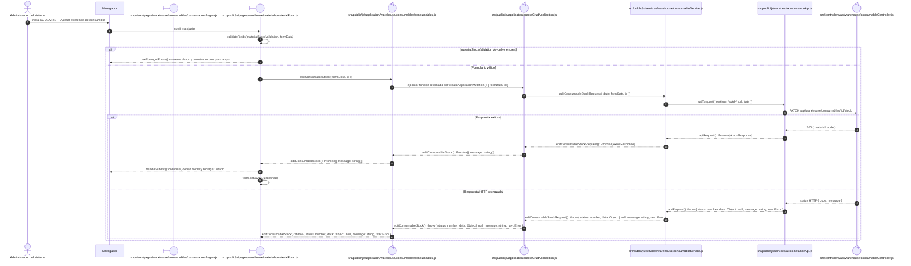

# `CU-ALM-21` — Ajustar existencia de consumible

**Patrones:** `FE-P02`.

```mermaid
sequenceDiagram
    autonumber
    actor Initiator as Administrador del sistema
    participant Browser as Navegador
    participant EJS@{ "type": "boundary" } as src/views/pages/warehouse/consumables/consumablesPage.ejs
    participant Form@{ "type": "boundary" } as src/public/js/pages/warehouse/materials/materialForm.js
    participant App@{ "type": "control" } as src/public/js/application/warehouse/consumables/consumables.js
    participant Factory@{ "type": "control" } as src/public/js/application/createCrudApplication.js
    participant Request as src/public/js/services/warehouse/consumableService.js
    participant HTTP as src/public/js/services/axiosInstanceApi.js
    participant API@{ "type": "control" } as src/controllers/api/warehouse/consumableController.js

    Initiator->>Browser: inicia CU-ALM-21 — Ajustar existencia de consumible
    Browser->>Form: confirma ajuste
    Form->>Form: validateFields(materialStockValidation, formData)
    alt materialStockValidation devuelve errores
        Form-->>Browser: useForm.getErrors() conserva datos y muestra errores por campo
    else Formulario válido
        Form->>App: editConsumableStock({ formData, id })
        App->>Factory: ejecutar función retornada por createApplicationMutation(): { formData, id }
        Factory->>Request: editConsumableStockRequest({ data: formData, id })
        Request->>HTTP: apiRequest({ method: 'patch', url, data })
        HTTP->>API: PATCH /api/warehouse/consumables/:id/stock
        alt Respuesta exitosa
            API-->>HTTP: 200 { material, code }
            HTTP-->>Request: apiRequest(): Promise[AxiosResponse]
            Request-->>Factory: editConsumableStockRequest(): Promise[AxiosResponse]
            Factory-->>App: editConsumableStock(): Promise[{ message: string }]
            App-->>Form: editConsumableStock(): Promise[{ message: string }]
            Form-->>Browser: handleSubmit(): confirmar, cerrar modal y recargar listado
            Form->>Form: form.onSave?.(undefined)
        else Respuesta HTTP rechazada
            API-->>HTTP: status HTTP { code, message }
            HTTP-->>Request: apiRequest(): throw { status: number, data: Object | null, message: string, raw: Error }
            Request-->>Factory: editConsumableStockRequest(): throw { status: number, data: Object | null, message: string, raw: Error }
            Factory-->>App: editConsumableStock(): throw { status: number, data: Object | null, message: string, raw: Error }
            App-->>Form: editConsumableStock(): throw { status: number, data: Object | null, message: string, raw: Error }
        end
    end
```
