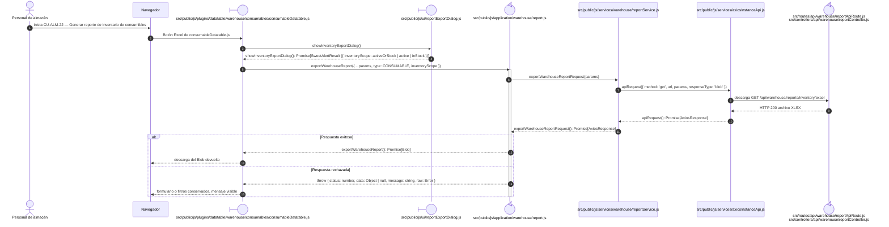

# `CU-ALM-22` — Generar reporte de inventario de consumibles

**Patrones:** `FE-P08`.

```mermaid
sequenceDiagram
    autonumber
    actor Initiator as Personal de almacén
    participant Browser as Navegador
    participant View@{ "type": "boundary" } as src/public/js/plugins/datatable/warehouse/consumables/consumableDatatable.js
    participant Dialog@{ "type": "boundary" } as src/public/js/ui/reportExportDialog.js
    participant Application@{ "type": "control" } as src/public/js/application/warehouse/report.js
    participant Request as src/public/js/services/warehouse/reportService.js
    participant HTTP as src/public/js/services/axiosInstanceApi.js
    participant Transport@{ "type": "control" } as src/routes/api/warehouse/reportApiRoute.js<br/>src/controllers/api/warehouse/reportController.js

    Initiator->>Browser: inicia CU-ALM-22 — Generar reporte de inventario de consumibles
    Browser->>View: Botón Excel de consumableDatatable.js
    View->>Dialog: showInventoryExportDialog()
    Dialog-->>View: showInventoryExportDialog(): Promise[SweetAlertResult ({ inventoryScope: activeOrStock | active | inStock })]
    View->>Application: exportWarehouseReport({ ...params, type: CONSUMABLE, inventoryScope })
    activate Application
    Application->>Request: exportWarehouseReportRequest(params)
    Request->>HTTP: apiRequest({ method: 'get', url, params, responseType: 'blob' })
    HTTP->>Transport: descarga GET /api/warehouse/reports/inventory/excel
    Transport-->>HTTP: HTTP 200 archivo XLSX
    HTTP-->>Request: apiRequest(): Promise[AxiosResponse]
    Request-->>Application: exportWarehouseReportRequest(): Promise[AxiosResponse]
    alt Respuesta exitosa
        Application-->>View: exportWarehouseReport(): Promise[Blob]
        View-->>Browser: descarga del Blob devuelto
    else Respuesta rechazada
        Application-->>View: throw { status: number, data: Object | null, message: string, raw: Error }
        View-->>Browser: formulario o filtros conservados, mensaje visible
    end
    deactivate Application
```
