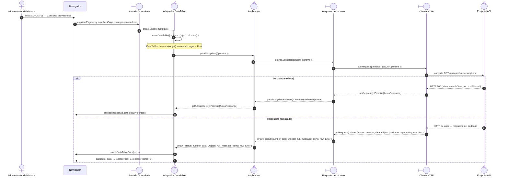

# `CU-CAT-01` — Consultar proveedores

**Patrones:** `FE-P02`.

## Participantes y trazabilidad

Los nombres breves del diagrama corresponden a los archivos vinculados siguientes.
La ruta completa se conserva en cada enlace, fuera de la cabecera visual. Un participante
puede agrupar colaboradores del mismo rol; esa agrupación no implica una clase ni un
proceso independiente. Los retornos representan el resultado o error propagado.

| Alias | Rol visual | Archivos de implementación |
| --- | --- | --- |
| `View` | boundary | [`suppliersPage.ejs`](../../../../../../src/views/pages/warehouse/suppliers/suppliersPage.ejs) [`suppliersPage.js`](../../../../../../src/public/js/pages/warehouse/suppliers/suppliersPage.js) |
| `Application` | control | [`suppliers.js`](../../../../../../src/public/js/application/warehouse/suppliers/suppliers.js) |
| `Request` | boundary | [`supplierService.js`](../../../../../../src/public/js/services/warehouse/supplierService.js) |
| `HTTP` | boundary | [`axiosInstanceApi.js`](../../../../../../src/public/js/services/axiosInstanceApi.js) |
| `Transport` | control | [`supplierApiRoute.js`](../../../../../../src/routes/api/warehouse/supplierApiRoute.js) [`supplierController.js`](../../../../../../src/controllers/api/warehouse/supplierController.js) |

| `Table` | control | [`supplierDatatable.js`](../../../../../../src/public/js/plugins/datatable/warehouse/suppliers/supplierDatatable.js) [`createDataTable.js`](../../../../../../src/public/js/plugins/datatable/core/base/createDataTable.js) |

## Secuencia de implementación

