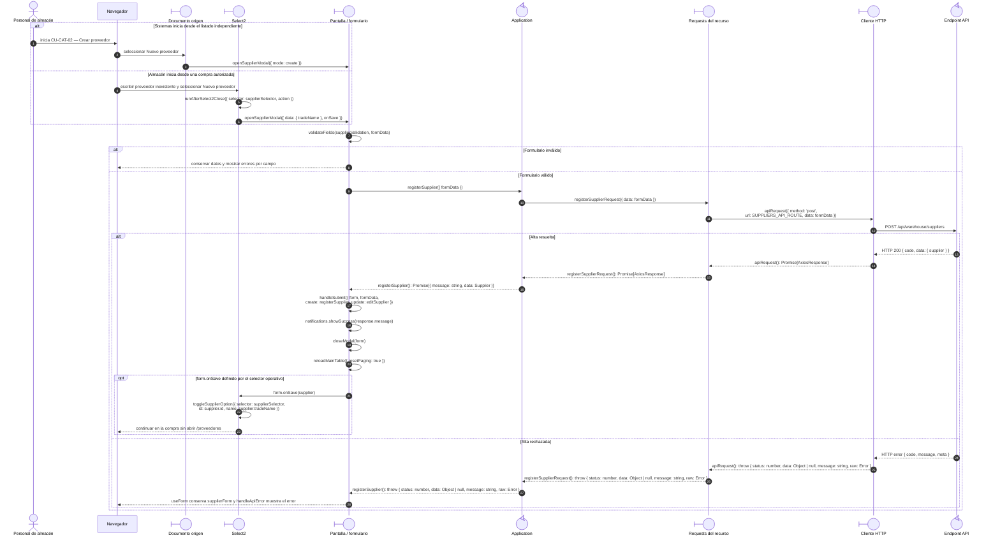

# `CU-CAT-02` — Crear proveedor

**Patrones:** `FE-P02`.

## Participantes y trazabilidad

Los nombres breves del diagrama corresponden a los archivos vinculados siguientes.
La ruta completa se conserva en cada enlace, fuera de la cabecera visual. Un participante
puede agrupar colaboradores del mismo rol; esa agrupación no implica una clase ni un
proceso independiente. Los retornos representan el resultado o error propagado.

| Alias | Rol visual | Archivos de implementación |
| --- | --- | --- |
| `Origin` | boundary | [`suppliersPage.js`](../../../../../../src/public/js/pages/warehouse/suppliers/suppliersPage.js) [`goodsReceiptModal.js`](../../../../../../src/public/js/pages/warehouse/goodsReceipts/goodsReceiptModal.js) |
| `Select` | boundary | [`supplier.js`](../../../../../../src/public/js/plugins/select2/domains/supplier.js) |
| `View` | boundary | [`supplierModal.js`](../../../../../../src/public/js/pages/warehouse/suppliers/supplierModal.js) [`supplierForm.js`](../../../../../../src/public/js/pages/warehouse/suppliers/supplierForm.js) |
| `Application` | control | [`suppliers.js`](../../../../../../src/public/js/application/warehouse/suppliers/suppliers.js) |
| `Request` | boundary | [`supplierService.js`](../../../../../../src/public/js/services/warehouse/supplierService.js) |
| `HTTP` | boundary | [`axiosInstanceApi.js`](../../../../../../src/public/js/services/axiosInstanceApi.js) |
| `Transport` | control | [`supplierApiRoute.js`](../../../../../../src/routes/api/warehouse/supplierApiRoute.js) [`supplierController.js`](../../../../../../src/controllers/api/warehouse/supplierController.js) |

## Secuencia de implementación

