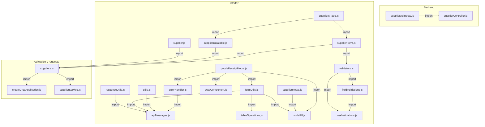
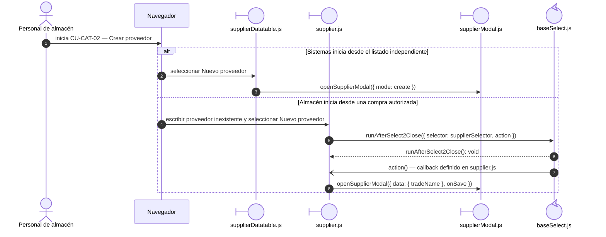
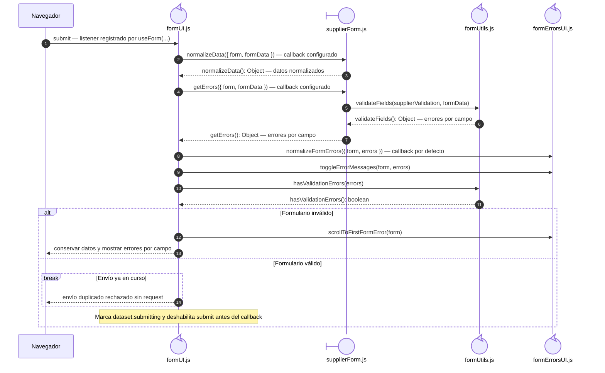
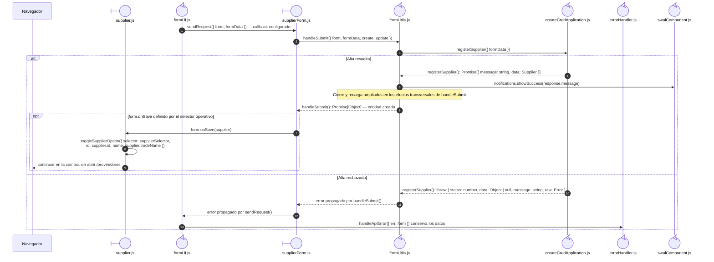
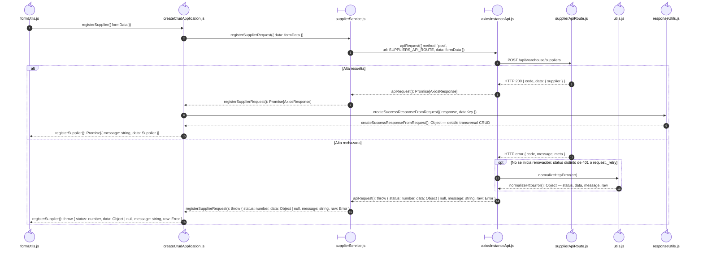

# `CU-CAT-02` — Crear proveedor

**Patrones:** `FE-P02`.

## Participantes y trazabilidad

Cada línea de vida técnica corresponde a un único archivo de implementación, indicado
por su alias en la tabla. Dos archivos distintos usan participantes distintos. Los actores,
el navegador y la frontera de persistencia son elementos externos, no archivos del proyecto.
Los retornos representan el resultado o error de la función ejecutada en el archivo indicado.
La composición incluye también los archivos de configuración, construcción y reexport: cada
uno tiene un nodo propio, aunque no ejecute una delegación durante la petición.

| Alias | Rol visual | Archivo de implementación |
| --- | --- | --- |
| `Origin` | boundary | [`supplierDatatable.js`](../../../../../../src/public/js/plugins/datatable/warehouse/suppliers/supplierDatatable.js) |
| `Select` | boundary | [`supplier.js`](../../../../../../src/public/js/plugins/select2/domains/supplier.js) |
| `View` | boundary | [`supplierForm.js`](../../../../../../src/public/js/pages/warehouse/suppliers/supplierForm.js) |
| `Application` | control | [`createCrudApplication.js`](../../../../../../src/public/js/application/createCrudApplication.js) |
| `Request` | boundary | [`supplierService.js`](../../../../../../src/public/js/services/warehouse/supplierService.js) |
| `HTTP` | boundary | [`axiosInstanceApi.js`](../../../../../../src/public/js/services/axiosInstanceApi.js) |
| `Transport` | control | [`supplierApiRoute.js`](../../../../../../src/routes/api/warehouse/supplierApiRoute.js) |
| `Modal` | boundary | [`supplierModal.js`](../../../../../../src/public/js/pages/warehouse/suppliers/supplierModal.js) |
| `FormUtils` | control | [`formUtils.js`](../../../../../../src/public/js/utils/formUtils.js) |
| `Form` | control | [`formUI.js`](../../../../../../src/public/js/ui/forms/formUI.js) |
| `SelectBase` | control | [`baseSelect.js`](../../../../../../src/public/js/plugins/select2/baseSelect.js) |
| `FileFormErrorsUI` | control | [`formErrorsUI.js`](../../../../../../src/public/js/ui/forms/formErrorsUI.js) |
| `FileSwalComponent` | control | [`swalComponent.js`](../../../../../../src/public/js/plugins/swal/swalComponent.js) |
| `FileModalUI` | control | [`modalUI.js`](../../../../../../src/public/js/ui/modalUI.js) |
| `FileTableOperations` | control | [`tableOperations.js`](../../../../../../src/public/js/plugins/datatable/core/base/tableOperations.js) |
| `FileErrorHandler` | control | [`errorHandler.js`](../../../../../../src/public/js/api/errorHandler.js) |
| `FileResponseUtils` | control | [`responseUtils.js`](../../../../../../src/public/js/utils/responseUtils.js) |
| `FileApiMessages` | control | [`apiMessages.js`](../../../../../../src/public/js/constants/apiMessages.js) |
| `FileSupplierController` | control | [`supplierController.js`](../../../../../../src/controllers/api/warehouse/supplierController.js) |
| `FileSuppliers` | control | [`suppliers.js`](../../../../../../src/public/js/application/warehouse/suppliers/suppliers.js) |
| `FileGoodsReceiptModal` | control | [`goodsReceiptModal.js`](../../../../../../src/public/js/pages/warehouse/goodsReceipts/goodsReceiptModal.js) |
| `FileSuppliersPage` | control | [`suppliersPage.js`](../../../../../../src/public/js/pages/warehouse/suppliers/suppliersPage.js) |
| `FileUtils` | control | [`utils.js`](../../../../../../src/public/js/api/utils.js) |
| `FileValidators` | control | [`validators.js`](../../../../../../src/public/js/utils/validations/validators.js) |
| `FileFieldValidations` | control | [`fieldValidations.js`](../../../../../../src/public/js/utils/validations/fieldValidations.js) |
| `FileBaseValidations` | control | [`baseValidations.js`](../../../../../../src/public/js/utils/validations/baseValidations.js) |

### Configuración y construcción

Las pantallas y modales operativos preparan la interacción. El botón independiente se implementa en el adaptador de tabla, mientras que el alta desde el documento se inicia en `Select`: [`suppliersPage.js`](../../../../../../src/public/js/pages/warehouse/suppliers/suppliersPage.js), [`goodsReceiptModal.js`](../../../../../../src/public/js/pages/warehouse/goodsReceipts/goodsReceiptModal.js).

El endpoint queda representado por su router. El controller asociado se desarrolla en la [secuencia backend `CU-CAT-02`](../../backend-code-sequences/catalogs/cu-cat-02.md#cu-cat-02): [`supplierController.js`](../../../../../../src/controllers/api/warehouse/supplierController.js).

La línea `Application` ejecuta la función generada en `createCrudApplication.js`. Su nombre público y la configuración de requests/contratos provienen de [`suppliers.js`](../../../../../../src/public/js/application/warehouse/suppliers/suppliers.js); exportar esa función no crea otra llamada durante cada petición.

Las llamadas internas de los helpers se amplían una vez en las
[colaboraciones CRUD compartidas](../../shared-runtime-behavior/03-crud-helper-collaborations.md). Sus archivos siguen representados
por separado en las figuras y la tabla de este caso.

## Composición de archivos

Los archivos que construyen, configuran o reexportan funciones aparecen como componentes
individuales. Las flechas representan imports reales, resueltos al cargar los módulos;
las llamadas durante la operación se muestran en las secuencias siguientes. Cada nombre
identifica un archivo y la tabla conserva su ruta completa.

## Construcción de funciones para esta operación

El configurador se ejecuta al evaluar su módulo. Después se invoca la función devuelta
por la fábrica, usando el nombre público mostrado en la secuencia.

| Nombre público | Archivo configurador (alias) | Archivo que construye el cuerpo (alias) |
| --- | --- | --- |
| `registerSupplier` | `FileSuppliers` | `Application` · `createCrudApplication(...)` |

## Preparación de la interfaz

Este nivel muestra las dos entradas posibles y el archivo que abre el modal. El submit posterior ejecuta los callbacks del formulario del siguiente nivel.

## Coordinación de la interfaz

Este nivel muestra apertura, normalización, validación y control de doble envío. Con
los datos válidos y `submitting` establecido, el listener continúa en `sendRequest`,
detallado en la figura siguiente. La rama inválida termina sin solicitar una mutación.

## Envío y resultado de la interfaz

Continúa el submit que superó la validación del nivel anterior. El callback del formulario
invoca la aplicación; su request se amplía en la colaboración de transporte. Aquí se
conservan los archivos que actualizan la interfaz o propagan el error al listener.

## Colaboración de aplicación y transporte

Amplía la llamada a `Application` del nivel anterior: cada request y el cliente HTTP tienen su propio archivo. El router identifica el endpoint de destino; su ejecución interna está en la secuencia backend del mismo CU. Los resultados regresan al caller de la primera figura.

