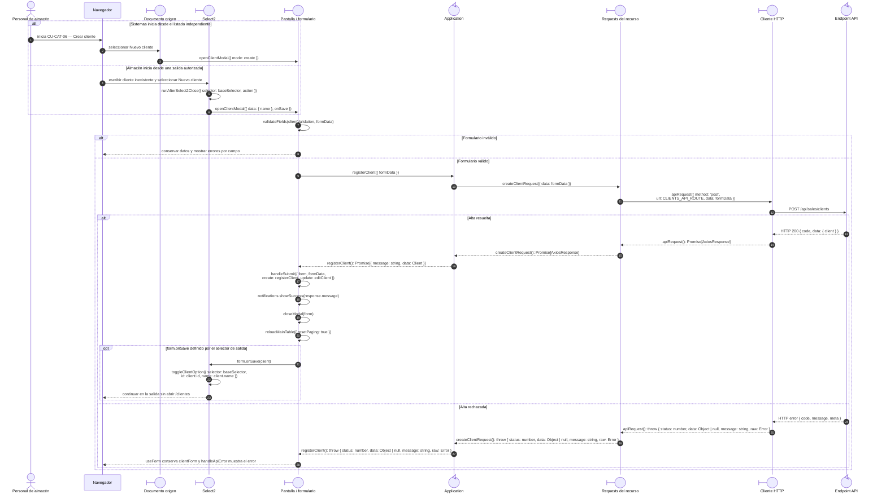

# `CU-CAT-06` — Crear cliente

**Patrones:** `FE-P02`.

## Participantes y trazabilidad

Los nombres breves del diagrama corresponden a los archivos vinculados siguientes.
La ruta completa se conserva en cada enlace, fuera de la cabecera visual. Un participante
puede agrupar colaboradores del mismo rol; esa agrupación no implica una clase ni un
proceso independiente. Los retornos representan el resultado o error propagado.

| Alias | Rol visual | Archivos de implementación |
| --- | --- | --- |
| `Origin` | boundary | [`clientsPage.js`](../../../../../../src/public/js/pages/sales/clients/clientsPage.js) [`goodsIssueModal.js`](../../../../../../src/public/js/pages/warehouse/goodsIssues/goodsIssueModal.js) |
| `Select` | boundary | [`client.js`](../../../../../../src/public/js/plugins/select2/domains/client.js) |
| `View` | boundary | [`clientModal.js`](../../../../../../src/public/js/pages/sales/clients/clientModal.js) [`clientForm.js`](../../../../../../src/public/js/pages/sales/clients/clientForm.js) |
| `Application` | control | [`clients.js`](../../../../../../src/public/js/application/sales/clients/clients.js) |
| `Request` | boundary | [`clientService.js`](../../../../../../src/public/js/services/sales/clientService.js) |
| `HTTP` | boundary | [`axiosInstanceApi.js`](../../../../../../src/public/js/services/axiosInstanceApi.js) |
| `Transport` | control | [`clientApiRoute.js`](../../../../../../src/routes/api/sales/clientApiRoute.js) [`clientController.js`](../../../../../../src/controllers/api/sales/clientController.js) |

## Secuencia de implementación

