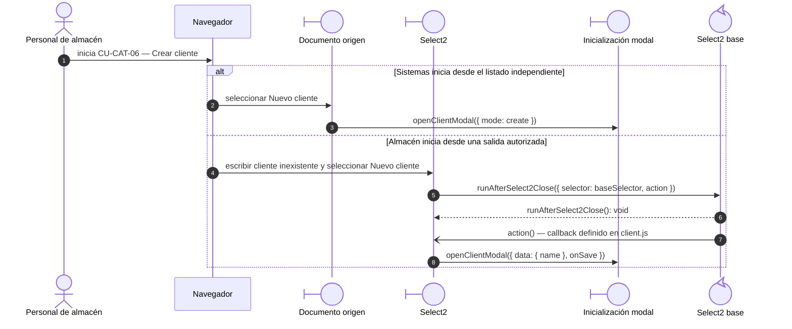
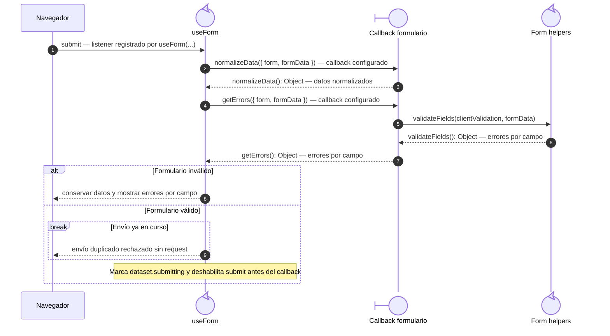
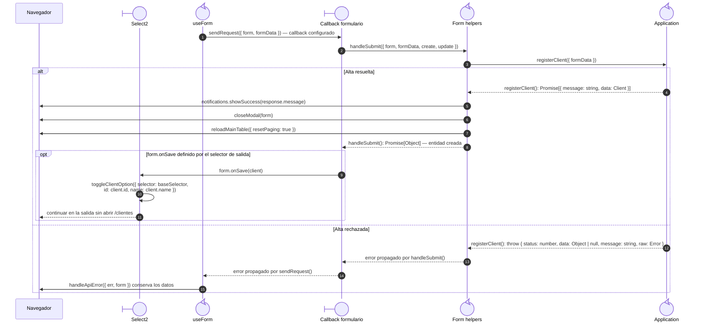
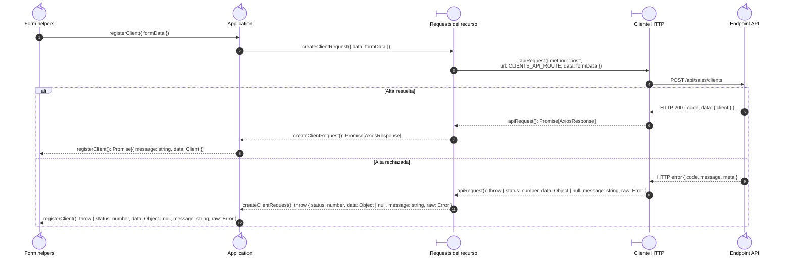

# `CU-CAT-06` — Crear cliente

**Patrones:** `FE-P02`.

## Participantes y trazabilidad

Cada línea de vida técnica corresponde a un único archivo de implementación, indicado
por su alias en la tabla. Dos archivos distintos usan participantes distintos. Los actores,
el navegador y la frontera de persistencia son elementos externos, no archivos del proyecto.
Los retornos representan el resultado o error de la función ejecutada en el archivo indicado.

| Alias | Rol visual | Archivo de implementación |
| --- | --- | --- |
| `Origin` | boundary | [`clientDatatable.js`](../../../../../../src/public/js/plugins/datatable/sales/clients/clientDatatable.js) |
| `Select` | boundary | [`client.js`](../../../../../../src/public/js/plugins/select2/domains/client.js) |
| `View` | boundary | [`clientForm.js`](../../../../../../src/public/js/pages/sales/clients/clientForm.js) |
| `Application` | control | [`createCrudApplication.js`](../../../../../../src/public/js/application/createCrudApplication.js) |
| `Request` | boundary | [`clientService.js`](../../../../../../src/public/js/services/sales/clientService.js) |
| `HTTP` | boundary | [`axiosInstanceApi.js`](../../../../../../src/public/js/services/axiosInstanceApi.js) |
| `Transport` | control | [`clientApiRoute.js`](../../../../../../src/routes/api/sales/clientApiRoute.js) |
| `Modal` | boundary | [`clientModal.js`](../../../../../../src/public/js/pages/sales/clients/clientModal.js) |
| `FormUtils` | control | [`formUtils.js`](../../../../../../src/public/js/utils/formUtils.js) |
| `Form` | control | [`formUI.js`](../../../../../../src/public/js/ui/forms/formUI.js) |
| `SelectBase` | control | [`baseSelect.js`](../../../../../../src/public/js/plugins/select2/baseSelect.js) |

### Configuración y archivos de contexto

Las pantallas y modales operativos preparan la interacción. El botón independiente se implementa en el adaptador de tabla, mientras que el alta desde el documento se inicia en `Select`: [`clientsPage.js`](../../../../../../src/public/js/pages/sales/clients/clientsPage.js), [`goodsIssueModal.js`](../../../../../../src/public/js/pages/warehouse/goodsIssues/goodsIssueModal.js).

El endpoint queda representado por su router. El controller asociado se desarrolla en la [secuencia backend `CU-CAT-06`](../../backend-code-sequences/catalogs/cu-cat-06.md#cu-cat-06): [`clientController.js`](../../../../../../src/controllers/api/sales/clientController.js).

La línea `Application` ejecuta la función generada en `createCrudApplication.js`. Su nombre público y la configuración de requests/contratos provienen de [`clients.js`](../../../../../../src/public/js/application/sales/clients/clients.js); exportar esa función no crea otra llamada durante cada petición.

## Preparación de la interfaz

Este nivel muestra las dos entradas posibles y el archivo que abre el modal. El submit posterior ejecuta los callbacks del formulario del siguiente nivel.

## Coordinación de la interfaz

Este nivel muestra apertura, normalización, validación y control de doble envío. Con
los datos válidos y `submitting` establecido, el listener continúa en `sendRequest`,
detallado en la figura siguiente. La rama inválida termina sin solicitar una mutación.

## Envío y resultado de la interfaz

Continúa el submit que superó la validación del nivel anterior. El callback del formulario
invoca la aplicación; su request se amplía en la colaboración de transporte. Aquí se
conservan los archivos que actualizan la interfaz o propagan el error al listener.

## Colaboración de aplicación y transporte

Amplía la llamada a `Application` del nivel anterior: cada request y el cliente HTTP tienen su propio archivo. El router identifica el endpoint de destino; su ejecución interna está en la secuencia backend del mismo CU. Los resultados regresan al caller de la primera figura.

