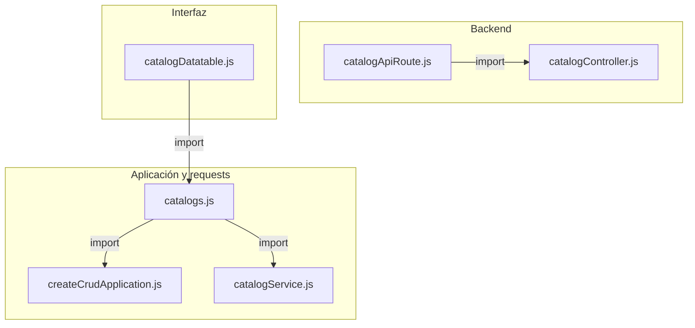
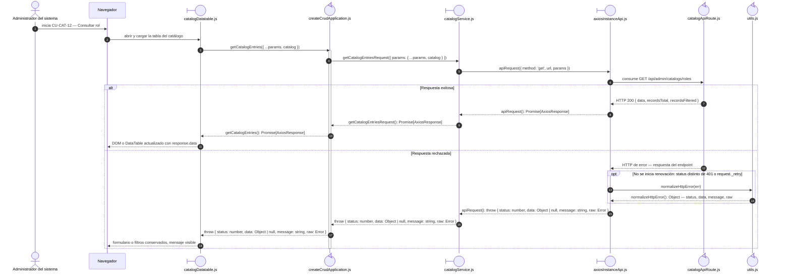

# `CU-CAT-12` — Consultar rol

**Patrones:** `FE-P03`.

## Participantes y trazabilidad

Cada línea de vida técnica corresponde a un único archivo de implementación, indicado
por su alias en la tabla. Dos archivos distintos usan participantes distintos. Los actores,
el navegador y la frontera de persistencia son elementos externos, no archivos del proyecto.
Los retornos representan el resultado o error de la función ejecutada en el archivo indicado.
La composición incluye también los archivos de configuración, construcción y reexport: cada
uno tiene un nodo propio, aunque no ejecute una delegación durante la petición.

| Alias | Rol visual | Archivo de implementación |
| --- | --- | --- |
| `View` | boundary | [`catalogDatatable.js`](../../../../../../src/public/js/plugins/datatable/admin/catalogs/catalogDatatable.js) |
| `Application` | control | [`createCrudApplication.js`](../../../../../../src/public/js/application/createCrudApplication.js) |
| `Request` | boundary | [`catalogService.js`](../../../../../../src/public/js/services/admin/catalogService.js) |
| `HTTP` | boundary | [`axiosInstanceApi.js`](../../../../../../src/public/js/services/axiosInstanceApi.js) |
| `Transport` | control | [`catalogApiRoute.js`](../../../../../../src/routes/api/admin/catalogApiRoute.js) |
| `FileCatalogController` | control | [`catalogController.js`](../../../../../../src/controllers/api/admin/catalogController.js) |
| `FileCatalogs` | control | [`catalogs.js`](../../../../../../src/public/js/application/admin/catalogs/catalogs.js) |
| `FileUtils` | control | [`utils.js`](../../../../../../src/public/js/api/utils.js) |

### Configuración y construcción

El endpoint queda representado por su router. El controller asociado se desarrolla en la [secuencia backend `CU-CAT-12`](../../backend-code-sequences/catalogs/cu-cat-12.md#cu-cat-12): [`catalogController.js`](../../../../../../src/controllers/api/admin/catalogController.js).

La línea `Application` ejecuta la función generada en `createCrudApplication.js`. Su nombre público y la configuración de requests/contratos provienen de [`catalogs.js`](../../../../../../src/public/js/application/admin/catalogs/catalogs.js); exportar esa función no crea otra llamada durante cada petición.

## Composición de archivos

Los archivos que construyen, configuran o reexportan funciones aparecen como componentes
individuales. Las flechas representan imports reales, resueltos al cargar los módulos;
las llamadas durante la operación se muestran en las secuencias siguientes. Cada nombre
identifica un archivo y la tabla conserva su ruta completa.

## Construcción de funciones para esta operación

El configurador se ejecuta al evaluar su módulo. Después se invoca la función devuelta
por la fábrica, usando el nombre público mostrado en la secuencia.

| Nombre público | Archivo configurador (alias) | Archivo que construye el cuerpo (alias) |
| --- | --- | --- |
| `getCatalogEntries` | `FileCatalogs` | `Application` · `createCrudApplication(...)` |

## Secuencia de implementación

