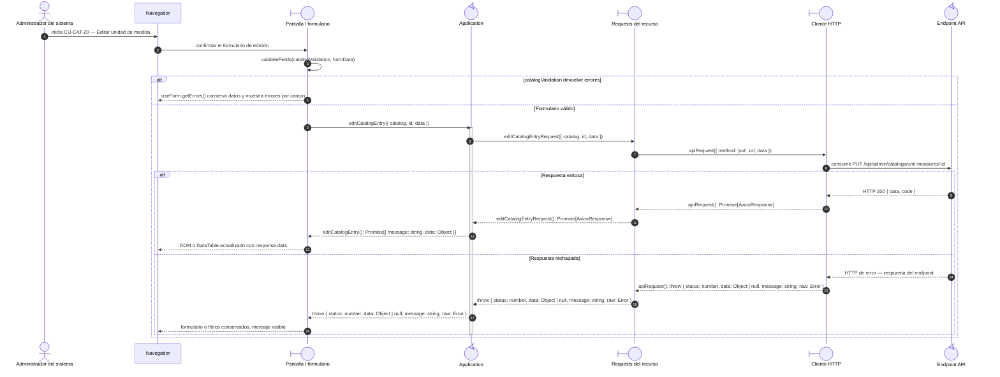

# `CU-CAT-20` — Editar unidad de medida

**Patrones:** `FE-P03`.

## Participantes y trazabilidad

Los nombres breves del diagrama corresponden a los archivos vinculados siguientes.
La ruta completa se conserva en cada enlace, fuera de la cabecera visual. Un participante
puede agrupar colaboradores del mismo rol; esa agrupación no implica una clase ni un
proceso independiente. Los retornos representan el resultado o error propagado.

| Alias | Rol visual | Archivos de implementación |
| --- | --- | --- |
| `View` | boundary | [`catalogForm.js`](../../../../../../src/public/js/pages/admin/catalogs/catalogForm.js) |
| `Application` | control | [`catalogs.js`](../../../../../../src/public/js/application/admin/catalogs/catalogs.js) |
| `Request` | boundary | [`catalogService.js`](../../../../../../src/public/js/services/admin/catalogService.js) |
| `HTTP` | boundary | [`axiosInstanceApi.js`](../../../../../../src/public/js/services/axiosInstanceApi.js) |
| `Transport` | control | [`catalogApiRoute.js`](../../../../../../src/routes/api/admin/catalogApiRoute.js) [`catalogController.js`](../../../../../../src/controllers/api/admin/catalogController.js) |

## Secuencia de implementación

