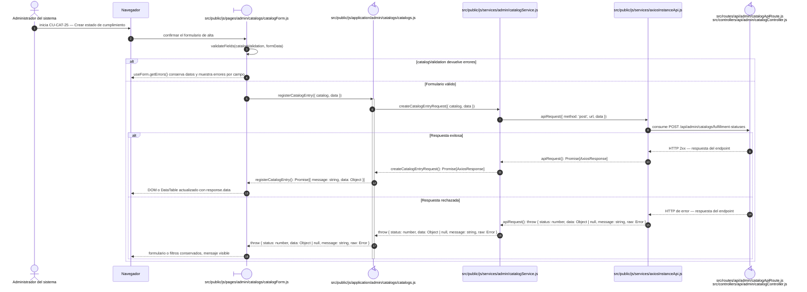

# `CU-CAT-25` — Crear estado de cumplimiento

**Patrones:** `FE-P03`.

```mermaid
sequenceDiagram
    autonumber
    actor Initiator as Administrador del sistema
    participant Browser as Navegador
    participant View@{ "type": "boundary" } as src/public/js/pages/admin/catalogs/catalogForm.js
    participant Application@{ "type": "control" } as src/public/js/application/admin/catalogs/catalogs.js
    participant Request as src/public/js/services/admin/catalogService.js
    participant HTTP as src/public/js/services/axiosInstanceApi.js
    participant Transport@{ "type": "control" } as src/routes/api/admin/catalogApiRoute.js<br/>src/controllers/api/admin/catalogController.js

    Initiator->>Browser: inicia CU-CAT-25 — Crear estado de cumplimiento
    Browser->>View: confirmar el formulario de alta
    View->>View: validateFields(catalogValidation, formData)
    alt catalogValidation devuelve errores
        View-->>Browser: useForm.getErrors() conserva datos y muestra errores por campo
    else Formulario válido
        View->>Application: registerCatalogEntry({ catalog, data })
        activate Application
        Application->>Request: createCatalogEntryRequest({ catalog, data })
        Request->>HTTP: apiRequest({ method: 'post', url, data })
        HTTP->>Transport: consume POST /api/admin/catalogs/fulfillment-statuses
        alt Respuesta exitosa
            Transport-->>HTTP: HTTP 2xx — respuesta del endpoint
            HTTP-->>Request: apiRequest(): Promise[AxiosResponse]
            Request-->>Application: createCatalogEntryRequest(): Promise[AxiosResponse]
            Application-->>View: registerCatalogEntry(): Promise[{ message: string, data: Object }]
            View-->>Browser: DOM o DataTable actualizado con response.data
        else Respuesta rechazada
            Transport-->>HTTP: HTTP de error — respuesta del endpoint
            HTTP-->>Request: apiRequest(): throw { status: number, data: Object | null, message: string, raw: Error }
            Request-->>Application: throw { status: number, data: Object | null, message: string, raw: Error }
            Application-->>View: throw { status: number, data: Object | null, message: string, raw: Error }
            View-->>Browser: formulario o filtros conservados, mensaje visible
        end
        deactivate Application
    end
```

