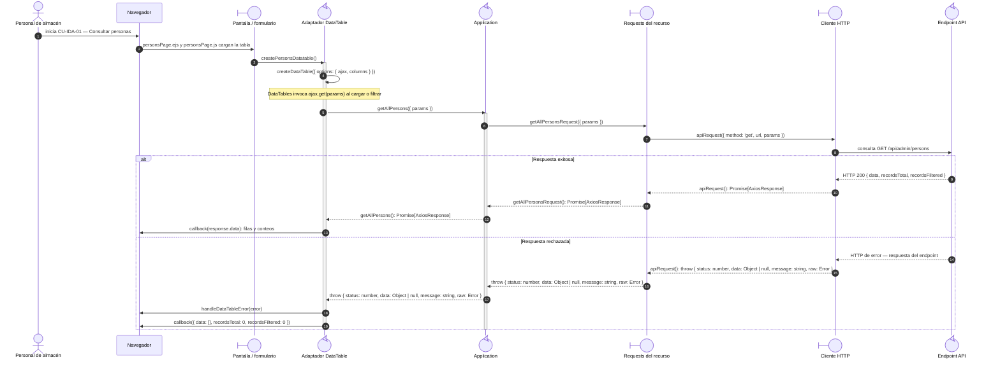

# `CU-IDA-01` — Consultar personas

**Patrones:** `FE-P02`.

## Participantes y trazabilidad

Los nombres breves del diagrama corresponden a los archivos vinculados siguientes.
La ruta completa se conserva en cada enlace, fuera de la cabecera visual. Un participante
puede agrupar colaboradores del mismo rol; esa agrupación no implica una clase ni un
proceso independiente. Los retornos representan el resultado o error propagado.

| Alias | Rol visual | Archivos de implementación |
| --- | --- | --- |
| `View` | boundary | [`personsPage.ejs`](../../../../../../src/views/pages/admin/persons/personsPage.ejs) [`personsPage.js`](../../../../../../src/public/js/pages/admin/persons/personsPage.js) |
| `Application` | control | [`persons.js`](../../../../../../src/public/js/application/admin/persons/persons.js) |
| `Request` | boundary | [`personService.js`](../../../../../../src/public/js/services/admin/personService.js) |
| `HTTP` | boundary | [`axiosInstanceApi.js`](../../../../../../src/public/js/services/axiosInstanceApi.js) |
| `Transport` | control | [`personApiRoute.js`](../../../../../../src/routes/api/admin/personApiRoute.js) [`personController.js`](../../../../../../src/controllers/api/admin/personController.js) |

| `Table` | control | [`personDatatable.js`](../../../../../../src/public/js/plugins/datatable/admin/persons/personDatatable.js) [`createDataTable.js`](../../../../../../src/public/js/plugins/datatable/core/base/createDataTable.js) |

## Secuencia de implementación

