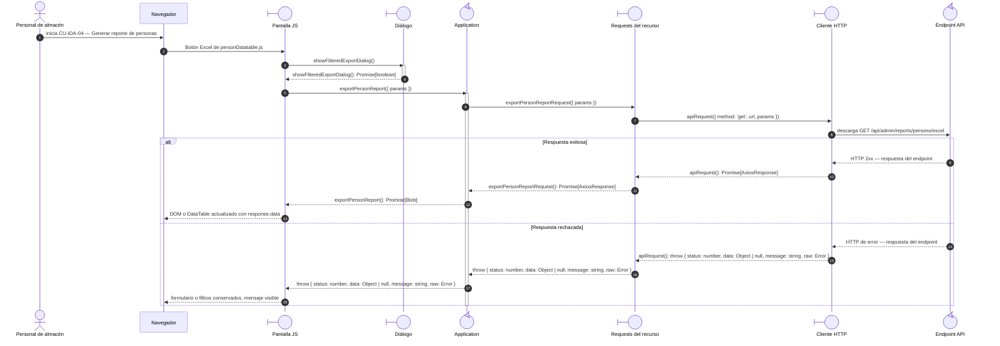

# `CU-IDA-04` — Generar reporte de personas

**Patrones:** `FE-P08`.

## Participantes y trazabilidad

Cada línea de vida técnica corresponde a un único archivo de implementación, indicado
por su alias en la tabla. Dos archivos distintos usan participantes distintos. Los actores,
el navegador y la frontera de persistencia son elementos externos, no archivos del proyecto.
Los retornos representan el resultado o error de la función ejecutada en el archivo indicado.

| Alias | Rol visual | Archivo de implementación |
| --- | --- | --- |
| `View` | boundary | [`personDatatable.js`](../../../../../../src/public/js/plugins/datatable/admin/persons/personDatatable.js) |
| `Dialog` | boundary | [`reportExportDialog.js`](../../../../../../src/public/js/ui/reportExportDialog.js) |
| `Application` | control | [`createReportApplication.js`](../../../../../../src/public/js/application/createReportApplication.js) |
| `Request` | boundary | [`reportService.js`](../../../../../../src/public/js/services/admin/reportService.js) |
| `HTTP` | boundary | [`axiosInstanceApi.js`](../../../../../../src/public/js/services/axiosInstanceApi.js) |
| `Transport` | control | [`reportController.js`](../../../../../../src/controllers/api/admin/reportController.js) |

La línea `Application` ejecuta la función generada en `createReportApplication.js`. Su nombre público y la configuración de requests/contratos provienen de [`report.js`](../../../../../../src/public/js/application/admin/report.js); exportar esa función no crea otra llamada durante cada petición.

## Secuencia de implementación

