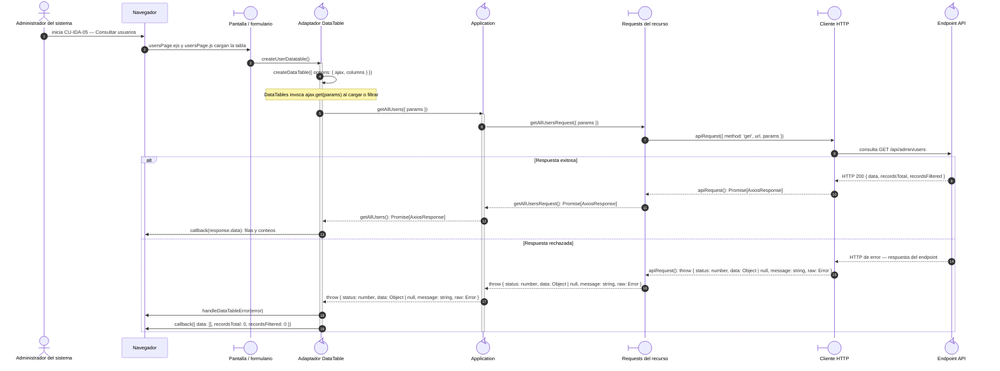

# `CU-IDA-05` — Consultar usuarios

**Patrones:** `FE-P02`.

## Participantes y trazabilidad

Los nombres breves del diagrama corresponden a los archivos vinculados siguientes.
La ruta completa se conserva en cada enlace, fuera de la cabecera visual. Un participante
puede agrupar colaboradores del mismo rol; esa agrupación no implica una clase ni un
proceso independiente. Los retornos representan el resultado o error propagado.

| Alias | Rol visual | Archivos de implementación |
| --- | --- | --- |
| `View` | boundary | [`usersPage.ejs`](../../../../../../src/views/pages/admin/users/usersPage.ejs) [`usersPage.js`](../../../../../../src/public/js/pages/admin/users/usersPage.js) |
| `Application` | control | [`users.js`](../../../../../../src/public/js/application/admin/users/users.js) |
| `Request` | boundary | [`userService.js`](../../../../../../src/public/js/services/admin/userService.js) |
| `HTTP` | boundary | [`axiosInstanceApi.js`](../../../../../../src/public/js/services/axiosInstanceApi.js) |
| `Transport` | control | [`userApiRoute.js`](../../../../../../src/routes/api/admin/userApiRoute.js) [`userController.js`](../../../../../../src/controllers/api/admin/userController.js) |

| `Table` | control | [`userDatatable.js`](../../../../../../src/public/js/plugins/datatable/admin/users/userDatatable.js) [`createDataTable.js`](../../../../../../src/public/js/plugins/datatable/core/base/createDataTable.js) |

## Secuencia de implementación

