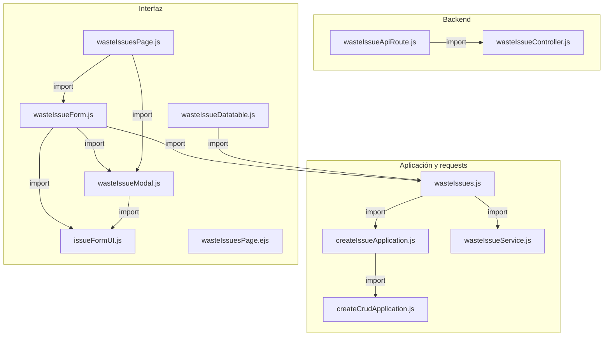
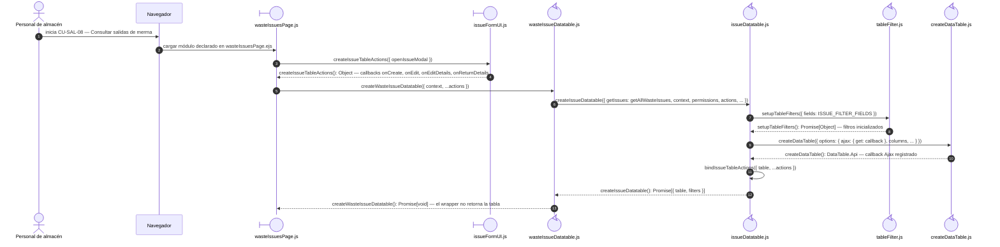
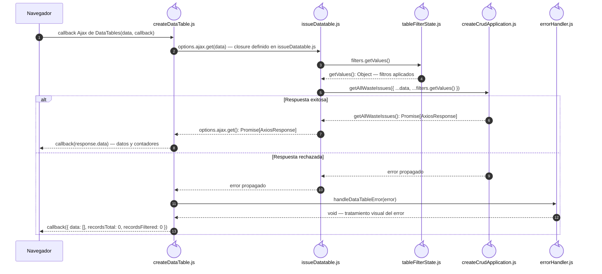
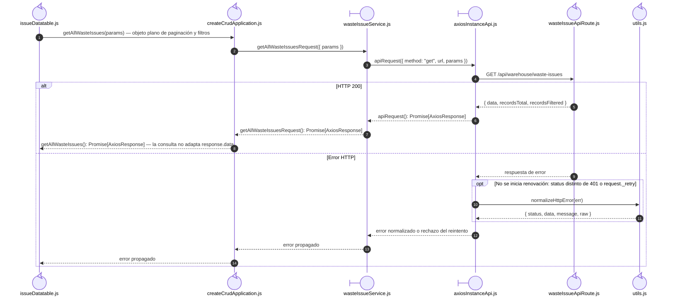

# `CU-SAL-08` — Consultar salidas de merma

**Patrones:** `FE-P05`.

## Participantes y trazabilidad

Cada línea de vida técnica corresponde a un único archivo de implementación, indicado
por su alias en la tabla. Dos archivos distintos usan participantes distintos. Los actores,
el navegador y la frontera de persistencia son elementos externos, no archivos del proyecto.
Los retornos representan el resultado o error de la función ejecutada en el archivo indicado.
La composición incluye también los archivos de configuración, construcción y reexport: cada
uno tiene un nodo propio, aunque no ejecute una delegación durante la petición.

| Alias | Rol visual | Archivo de implementación |
| --- | --- | --- |
| `View` | boundary | [`wasteIssuesPage.ejs`](../../../../../../src/views/pages/warehouse/wasteIssues/wasteIssuesPage.ejs) |
| `Application` | control | [`createCrudApplication.js`](../../../../../../src/public/js/application/createCrudApplication.js) |
| `Request` | boundary | [`wasteIssueService.js`](../../../../../../src/public/js/services/warehouse/wasteIssueService.js) |
| `HTTP` | boundary | [`axiosInstanceApi.js`](../../../../../../src/public/js/services/axiosInstanceApi.js) |
| `Transport` | control | [`wasteIssueApiRoute.js`](../../../../../../src/routes/api/warehouse/wasteIssueApiRoute.js) |
| `FileWasteIssueController` | control | [`wasteIssueController.js`](../../../../../../src/controllers/api/warehouse/wasteIssueController.js) |
| `FileCreateIssueApplication` | control | [`createIssueApplication.js`](../../../../../../src/public/js/application/warehouse/issues/createIssueApplication.js) |
| `FileWasteIssues` | control | [`wasteIssues.js`](../../../../../../src/public/js/application/warehouse/wasteIssues/wasteIssues.js) |
| `Page` | boundary | [`wasteIssuesPage.js`](../../../../../../src/public/js/pages/warehouse/wasteIssues/wasteIssuesPage.js) |
| `Table` | control | [`wasteIssueDatatable.js`](../../../../../../src/public/js/plugins/datatable/warehouse/wasteIssues/wasteIssueDatatable.js) |
| `IssueTable` | control | [`issueDatatable.js`](../../../../../../src/public/js/plugins/datatable/shared/issues/issueDatatable.js) |
| `TableCore` | control | [`createDataTable.js`](../../../../../../src/public/js/plugins/datatable/core/base/createDataTable.js) |
| `IssueUI` | boundary | [`issueFormUI.js`](../../../../../../src/public/js/ui/issues/issueFormUI.js) |
| `Filters` | control | [`tableFilter.js`](../../../../../../src/public/js/plugins/datatable/core/filters/tableFilter.js) |
| `FilterState` | control | [`tableFilterState.js`](../../../../../../src/public/js/plugins/datatable/core/filters/tableFilterState.js) |
| `Errors` | control | [`errorHandler.js`](../../../../../../src/public/js/api/errorHandler.js) |
| `Normalize` | control | [`utils.js`](../../../../../../src/public/js/api/utils.js) |
| `FileWasteIssueForm` | control | [`wasteIssueForm.js`](../../../../../../src/public/js/pages/warehouse/wasteIssues/wasteIssueForm.js) |
| `FileWasteIssueModal` | control | [`wasteIssueModal.js`](../../../../../../src/public/js/pages/warehouse/wasteIssues/wasteIssueModal.js) |

### Configuración y construcción

El endpoint queda representado por su router. El controller asociado se desarrolla en la [secuencia backend `CU-SAL-08`](../../backend-code-sequences/issues/cu-sal-08.md#cu-sal-08): [`wasteIssueController.js`](../../../../../../src/controllers/api/warehouse/wasteIssueController.js).

La aplicación ejecuta closures de `createCrudApplication.js`, configuradas por [`wasteIssues.js`](../../../../../../src/public/js/application/warehouse/wasteIssues/wasteIssues.js) mediante [`createIssueApplication.js`](../../../../../../src/public/js/application/warehouse/issues/createIssueApplication.js). Estos archivos de construcción no añaden delegaciones por petición.

## Composición de archivos

Los archivos que construyen, configuran o reexportan funciones aparecen como componentes
individuales. Las flechas representan imports reales, resueltos al cargar los módulos;
las llamadas durante la operación se muestran en las secuencias siguientes. Cada nombre
identifica un archivo y la tabla conserva su ruta completa.

## Construcción de funciones para esta operación

El configurador se ejecuta al evaluar su módulo. Después se invoca la función devuelta
por la fábrica, usando el nombre público mostrado en la secuencia.

| Nombre público | Archivo configurador (alias) | Archivo que construye el cuerpo (alias) |
| --- | --- | --- |
| `getAllWasteIssues` | `FileWasteIssues` | `FileCreateIssueApplication` · `createIssueApplication(...)` |

## Preparación de la interfaz

La plantilla EJS declara el módulo de la página; no consulta la API. La página configura
acciones y la tabla específica, que delega en el adaptador compartido. Este inicializa
los filtros antes de construir DataTables. La carga de opciones de filtros es preparación
de controles y no reemplaza la consulta del listado.

## Coordinación de la interfaz

DataTables invoca el callback Ajax durante su ciclo de carga o recarga; esta figura
amplía ese callback y no presupone que espere al retorno del constructor. El callback
`get` pertenece a `issueDatatable.js`; `getValues` pertenece a `tableFilterState.js`.
El objeto de filtros se pasa directamente a la aplicación, sin envolverlo en `{ params }`.

## Colaboración de aplicación y transporte

La fábrica CRUD envuelve los parámetros para el request y conserva el `AxiosResponse`.
Solo el callback de DataTables extrae `response.data`. La renovación de sesión y el
reintento 401 se describen en el [comportamiento transversal de transporte](../../shared-runtime-behavior/02-browser-session-and-form-state.md).
El controller y la persistencia se desarrollan en la secuencia backend enlazada arriba.

