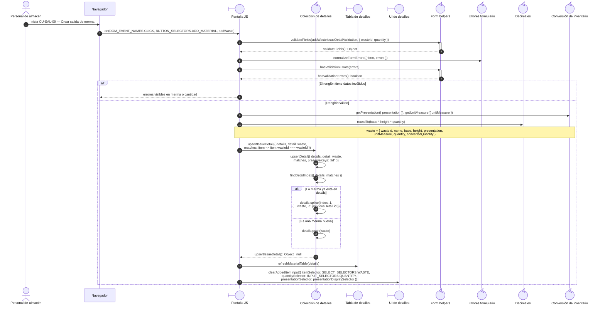
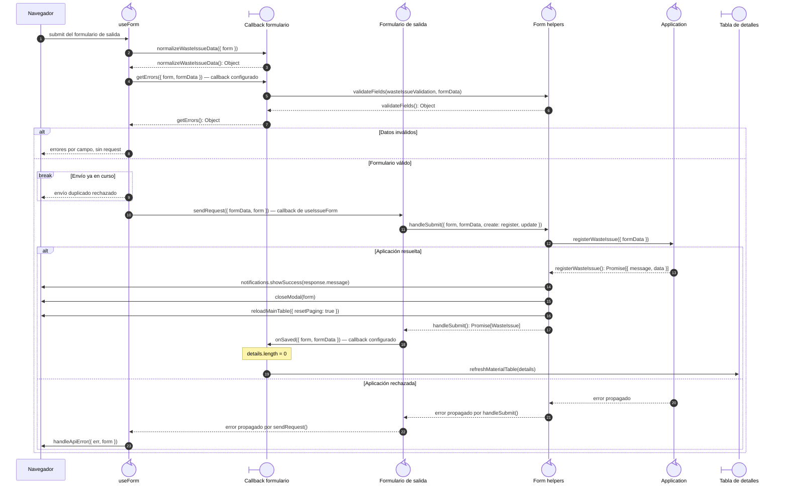
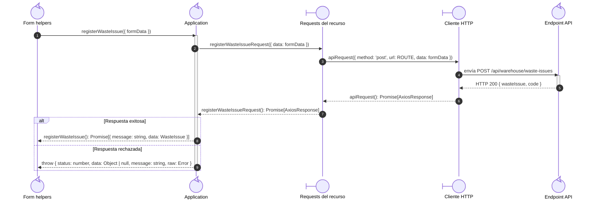

# `CU-SAL-09` — Crear salida de merma

**Patrones:** `FE-P05`.

## Participantes y trazabilidad

Cada línea de vida técnica corresponde a un único archivo de implementación, indicado
por su alias en la tabla. Dos archivos distintos usan participantes distintos. Los actores,
el navegador y la frontera de persistencia son elementos externos, no archivos del proyecto.
Los retornos representan el resultado o error de la función ejecutada en el archivo indicado.

| Alias | Rol visual | Archivo de implementación |
| --- | --- | --- |
| `View` | boundary | [`wasteIssueForm.js`](../../../../../../src/public/js/pages/warehouse/wasteIssues/wasteIssueForm.js) |
| `DetailCollection` | control | [`detailCollectionUtils.js`](../../../../../../src/public/js/utils/detailCollectionUtils.js) |
| `DetailTable` | boundary | [`renderMaterialDatatable.js`](../../../../../../src/public/js/plugins/datatable/shared/inventory/renderMaterialDatatable.js) |
| `DetailFormUI` | boundary | [`detailFormUI.js`](../../../../../../src/public/js/ui/forms/detailFormUI.js) |
| `FormUtils` | control | [`formUtils.js`](../../../../../../src/public/js/utils/formUtils.js) |
| `InventoryUtils` | control | [`warehouseInventoryUtils.js`](../../../../../../src/public/js/utils/warehouseInventoryUtils.js) |
| `Application` | control | [`createCrudApplication.js`](../../../../../../src/public/js/application/createCrudApplication.js) |
| `Request` | boundary | [`wasteIssueService.js`](../../../../../../src/public/js/services/warehouse/wasteIssueService.js) |
| `HTTP` | boundary | [`axiosInstanceApi.js`](../../../../../../src/public/js/services/axiosInstanceApi.js) |
| `Transport` | control | [`wasteIssueApiRoute.js`](../../../../../../src/routes/api/warehouse/wasteIssueApiRoute.js) |
| `Form` | control | [`formUI.js`](../../../../../../src/public/js/ui/forms/formUI.js) |
| `IssueUI` | control | [`issueFormUI.js`](../../../../../../src/public/js/ui/issues/issueFormUI.js) |
| `FormErrors` | control | [`formErrorsUI.js`](../../../../../../src/public/js/ui/forms/formErrorsUI.js) |
| `Decimal` | control | [`formatUtils.js`](../../../../../../src/public/js/utils/formatUtils.js) |

### Configuración y archivos de contexto

El endpoint queda representado por su router. El controller asociado se desarrolla en la [secuencia backend `CU-SAL-09`](../../backend-code-sequences/issues/cu-sal-09.md#cu-sal-09): [`wasteIssueController.js`](../../../../../../src/controllers/api/warehouse/wasteIssueController.js).

La aplicación ejecuta closures de `createCrudApplication.js`, configuradas por [`wasteIssues.js`](../../../../../../src/public/js/application/warehouse/wasteIssues/wasteIssues.js) mediante [`createIssueApplication.js`](../../../../../../src/public/js/application/warehouse/issues/createIssueApplication.js). Estos archivos de construcción no añaden delegaciones por petición.

## Coordinación de la interfaz

El archivo `wasteIssueForm.js` define `addWaste` y registra su evento. Aquí se muestra
la validación de un renglón y su incorporación a `details`. El submit se desarrolla en
el siguiente nivel; `wasteIssueModal.js` prepara el modal y exporta esa colección.

## Envío y resultado de la interfaz

`useIssueForm`, definido en `issueFormUI.js`, configura el listener común de `formUI.js`.
Los callbacks de normalización y validación se definen en `wasteIssueForm.js`; el callback
`sendRequest` se define en `issueFormUI.js` y delega en `handleSubmit`. No comparten una
línea de vida aunque participen en el mismo submit.

## Colaboración de aplicación y transporte

Amplía la llamada a `Application` del nivel anterior: cada request y el cliente HTTP tienen su propio archivo. El router identifica el endpoint de destino; su ejecución interna está en la secuencia backend del mismo CU. Los resultados regresan al caller de la primera figura.

