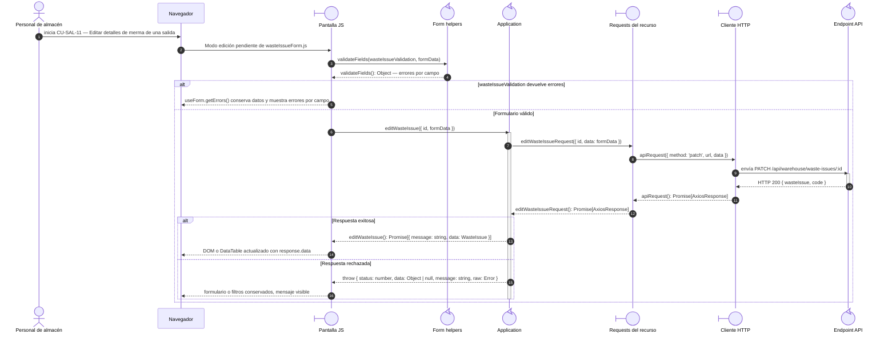

# `CU-SAL-11` — Editar detalles de merma de una salida

**Patrones:** `FE-P05`.

## Participantes y trazabilidad

Cada línea de vida técnica corresponde a un único archivo de implementación, indicado
por su alias en la tabla. Dos archivos distintos usan participantes distintos. Los actores,
el navegador y la frontera de persistencia son elementos externos, no archivos del proyecto.
Los retornos representan el resultado o error de la función ejecutada en el archivo indicado.

| Alias | Rol visual | Archivo de implementación |
| --- | --- | --- |
| `View` | boundary | [`wasteIssueForm.js`](../../../../../../src/public/js/pages/warehouse/wasteIssues/wasteIssueForm.js) |
| `Application` | control | [`createCrudApplication.js`](../../../../../../src/public/js/application/createCrudApplication.js) |
| `Request` | boundary | [`wasteIssueService.js`](../../../../../../src/public/js/services/warehouse/wasteIssueService.js) |
| `HTTP` | boundary | [`axiosInstanceApi.js`](../../../../../../src/public/js/services/axiosInstanceApi.js) |
| `Transport` | control | [`wasteIssueApiRoute.js`](../../../../../../src/routes/api/warehouse/wasteIssueApiRoute.js) |
| `FormUtils` | control | [`formUtils.js`](../../../../../../src/public/js/utils/formUtils.js) |

### Configuración y archivos de contexto

El endpoint queda representado por su router. El controller asociado se desarrolla en la [secuencia backend `CU-SAL-11`](../../backend-code-sequences/issues/cu-sal-11.md#cu-sal-11): [`wasteIssueController.js`](../../../../../../src/controllers/api/warehouse/wasteIssueController.js).

La aplicación ejecuta closures de `createCrudApplication.js`, configuradas por [`wasteIssues.js`](../../../../../../src/public/js/application/warehouse/wasteIssues/wasteIssues.js) mediante [`createIssueApplication.js`](../../../../../../src/public/js/application/warehouse/issues/createIssueApplication.js). Estos archivos de construcción no añaden delegaciones por petición.

## Secuencia de implementación

