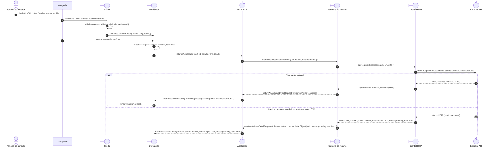

# `CU-SAL-13` — Devolver merma surtida

**Patrones:** `FE-P05`, `FE-P06`.

## Participantes y trazabilidad

Los nombres breves del diagrama corresponden a los archivos vinculados siguientes.
La ruta completa se conserva en cada enlace, fuera de la cabecera visual. Un participante
puede agrupar colaboradores del mismo rol; esa agrupación no implica una clase ni un
proceso independiente. Los retornos representan el resultado o error propagado.

| Alias | Rol visual | Archivos de implementación |
| --- | --- | --- |
| `Issue` | boundary | [`wasteIssueReturn.js`](../../../../../../src/public/js/pages/warehouse/wasteIssues/returns/wasteIssueReturn.js) |
| `Return` | boundary | [`issueReturnUI.js`](../../../../../../src/public/js/ui/issues/issueReturnUI.js) |
| `App` | control | [`wasteIssues.js`](../../../../../../src/public/js/application/warehouse/wasteIssues/wasteIssues.js) |
| `Request` | boundary | [`wasteIssueService.js`](../../../../../../src/public/js/services/warehouse/wasteIssueService.js) |
| `HTTP` | boundary | [`axiosInstanceApi.js`](../../../../../../src/public/js/services/axiosInstanceApi.js) |
| `API` | control | [`wasteIssueController.js`](../../../../../../src/controllers/api/warehouse/wasteIssueController.js) |

## Secuencia de implementación

