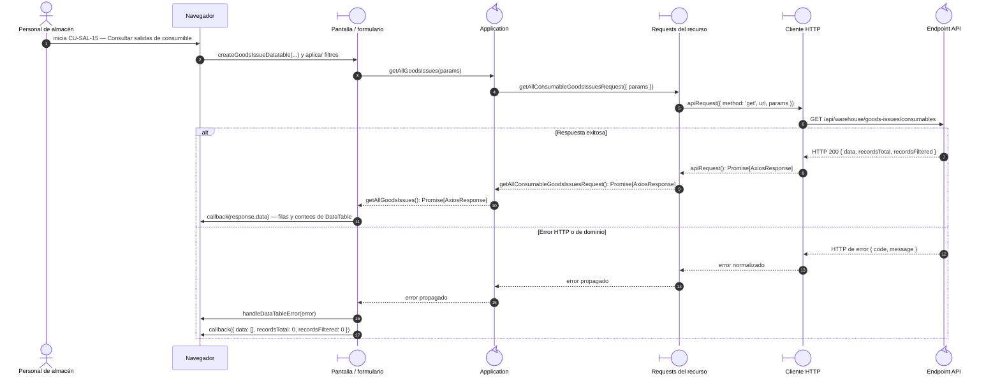

# `CU-SAL-15` — Consultar salidas de consumible

**Patrones:** `FE-P05`.

## Participantes y trazabilidad

Los nombres breves del diagrama corresponden a los archivos vinculados siguientes.
La ruta completa se conserva en cada enlace, fuera de la cabecera visual. Un participante
puede agrupar colaboradores del mismo rol; esa agrupación no implica una clase ni un
proceso independiente. Los retornos representan el resultado o error propagado.

| Alias | Rol visual | Archivos de implementación |
| --- | --- | --- |
| `View` | boundary | [`goodsIssueDatatable.js`](../../../../../../src/public/js/plugins/datatable/warehouse/goodsIssues/goodsIssueDatatable.js) [`createDataTable.js`](../../../../../../src/public/js/plugins/datatable/core/base/createDataTable.js) |
| `Application` | control | [`goodsIssues.js`](../../../../../../src/public/js/application/warehouse/goodsIssues/goodsIssues.js) [`consumableGoodsIssues.js`](../../../../../../src/public/js/application/warehouse/goodsIssues/consumables/consumableGoodsIssues.js) [`createCrudApplication.js`](../../../../../../src/public/js/application/createCrudApplication.js) |
| `Request` | boundary | [`consumableGoodsIssueService.js`](../../../../../../src/public/js/services/warehouse/goodsIssues/consumables/consumableGoodsIssueService.js) [`createGoodsIssueRequests.js`](../../../../../../src/public/js/services/warehouse/goodsIssues/createGoodsIssueRequests.js) |
| `HTTP` | boundary | [`axiosInstanceApi.js`](../../../../../../src/public/js/services/axiosInstanceApi.js) |
| `Transport` | control | [`consumableGoodsIssueApiRoute.js`](../../../../../../src/routes/api/warehouse/goodsIssues/consumables/consumableGoodsIssueApiRoute.js) [`consumableGoodsIssueController.js`](../../../../../../src/controllers/api/warehouse/goodsIssues/consumables/consumableGoodsIssueController.js) |

## Secuencia de implementación

