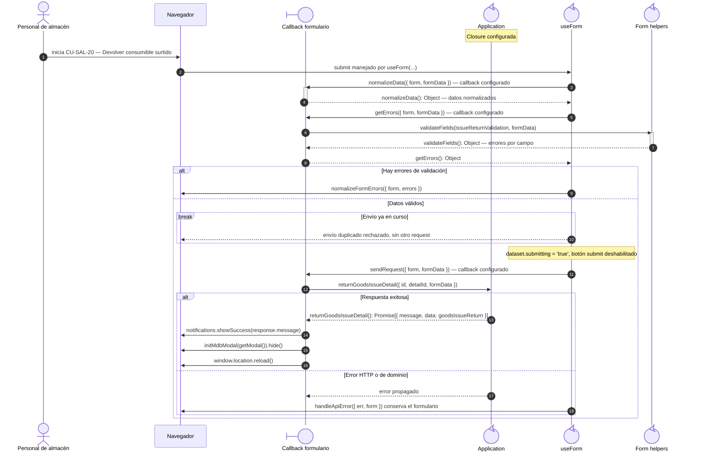
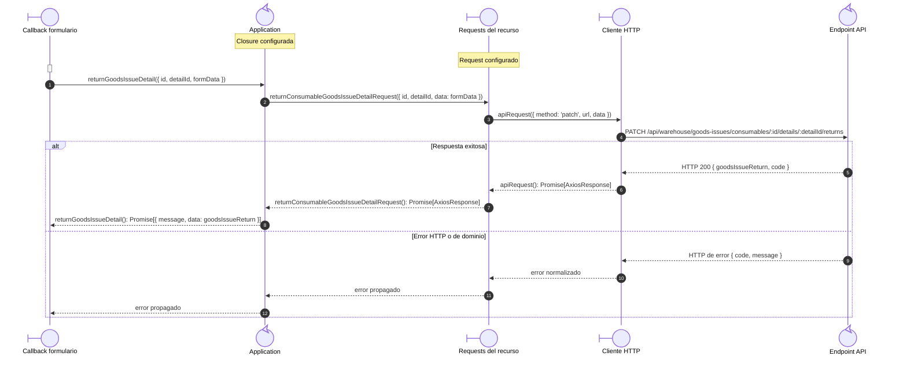

# `CU-SAL-20` — Devolver consumible surtido

**Patrones:** `FE-P05`, `FE-P06`.

## Participantes y trazabilidad

Cada línea de vida técnica corresponde a un único archivo de implementación, indicado
por su alias en la tabla. Dos archivos distintos usan participantes distintos. Los actores,
el navegador y la frontera de persistencia son elementos externos, no archivos del proyecto.
Los retornos representan el resultado o error de la función ejecutada en el archivo indicado.

| Alias | Rol visual | Archivo de implementación |
| --- | --- | --- |
| `View` | boundary | [`issueReturnUI.js`](../../../../../../src/public/js/ui/issues/issueReturnUI.js) |
| `Application` | control | [`createCrudApplication.js`](../../../../../../src/public/js/application/createCrudApplication.js) |
| `Request` | boundary | [`createGoodsIssueRequests.js`](../../../../../../src/public/js/services/warehouse/goodsIssues/createGoodsIssueRequests.js) |
| `HTTP` | boundary | [`axiosInstanceApi.js`](../../../../../../src/public/js/services/axiosInstanceApi.js) |
| `Transport` | control | [`consumableGoodsIssueApiRoute.js`](../../../../../../src/routes/api/warehouse/goodsIssues/consumables/consumableGoodsIssueApiRoute.js) |
| `Form` | control | [`formUI.js`](../../../../../../src/public/js/ui/forms/formUI.js) |
| `FormUtils` | control | [`formUtils.js`](../../../../../../src/public/js/utils/formUtils.js) |

### Configuración y archivos de contexto

Estos módulos seleccionan/configuran y exportan la función de aplicación. Su cuerpo se ejecuta en la fábrica de la línea `Application`, sin una llamada intermedia entre reexports: [`goodsIssues.js`](../../../../../../src/public/js/application/warehouse/goodsIssues/goodsIssues.js), [`consumableGoodsIssues.js`](../../../../../../src/public/js/application/warehouse/goodsIssues/consumables/consumableGoodsIssues.js).

Estos módulos configuran o reexportan el request. La función que llama a `apiRequest` está definida en el archivo de la línea `Request`: [`consumableGoodsIssueService.js`](../../../../../../src/public/js/services/warehouse/goodsIssues/consumables/consumableGoodsIssueService.js).

El endpoint queda representado por su router. El controller asociado se desarrolla en la [secuencia backend `CU-SAL-20`](../../backend-code-sequences/issues/cu-sal-20.md#cu-sal-20): [`consumableGoodsIssueController.js`](../../../../../../src/controllers/api/warehouse/goodsIssues/consumables/consumableGoodsIssueController.js).

## Coordinación de la interfaz

Este nivel conserva entrada, callbacks y efectos de interfaz. La llamada a `Application` se amplía en la colaboración de transporte, con los mismos argumentos y resultado.

## Colaboración de aplicación y transporte

Amplía la llamada a `Application` del nivel anterior: cada request y el cliente HTTP tienen su propio archivo. El router identifica el endpoint de destino; su ejecución interna está en la secuencia backend del mismo CU. Los resultados regresan al caller de la primera figura.

