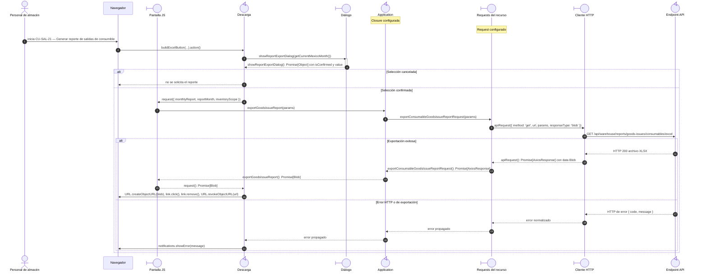

# `CU-SAL-21` — Generar reporte de salidas de consumible

**Patrones:** `FE-P08`.

## Participantes y trazabilidad

Cada línea de vida técnica corresponde a un único archivo de implementación, indicado
por su alias en la tabla. Dos archivos distintos usan participantes distintos. Los actores,
el navegador y la frontera de persistencia son elementos externos, no archivos del proyecto.
Los retornos representan el resultado o error de la función ejecutada en el archivo indicado.

| Alias | Rol visual | Archivo de implementación |
| --- | --- | --- |
| `View` | boundary | [`goodsIssueDatatable.js`](../../../../../../src/public/js/plugins/datatable/warehouse/goodsIssues/goodsIssueDatatable.js) |
| `Export` | control | [`tableUI.js`](../../../../../../src/public/js/ui/tableUI.js) |
| `Dialog` | boundary | [`reportExportDialog.js`](../../../../../../src/public/js/ui/reportExportDialog.js) |
| `Application` | control | [`createReportApplication.js`](../../../../../../src/public/js/application/createReportApplication.js) |
| `Request` | boundary | [`createGoodsIssueRequests.js`](../../../../../../src/public/js/services/warehouse/goodsIssues/createGoodsIssueRequests.js) |
| `HTTP` | boundary | [`axiosInstanceApi.js`](../../../../../../src/public/js/services/axiosInstanceApi.js) |
| `Transport` | control | [`consumableGoodsIssueReportApiRoute.js`](../../../../../../src/routes/api/warehouse/goodsIssues/consumables/consumableGoodsIssueReportApiRoute.js) |

### Configuración y archivos de contexto

Estos módulos seleccionan/configuran y exportan la función de aplicación. Su cuerpo se ejecuta en la fábrica de la línea `Application`, sin una llamada intermedia entre reexports: [`report.js`](../../../../../../src/public/js/application/warehouse/report.js).

Estos módulos configuran o reexportan el request. La función que llama a `apiRequest` está definida en el archivo de la línea `Request`: [`reportService.js`](../../../../../../src/public/js/services/warehouse/reportService.js), [`consumableGoodsIssueService.js`](../../../../../../src/public/js/services/warehouse/goodsIssues/consumables/consumableGoodsIssueService.js).

El endpoint queda representado por su router. El controller asociado se desarrolla en la [secuencia backend `CU-SAL-21`](../../backend-code-sequences/issues/cu-sal-21.md#cu-sal-21): [`consumableGoodsIssueReportController.js`](../../../../../../src/controllers/api/warehouse/goodsIssues/consumables/consumableGoodsIssueReportController.js).

## Secuencia de implementación

