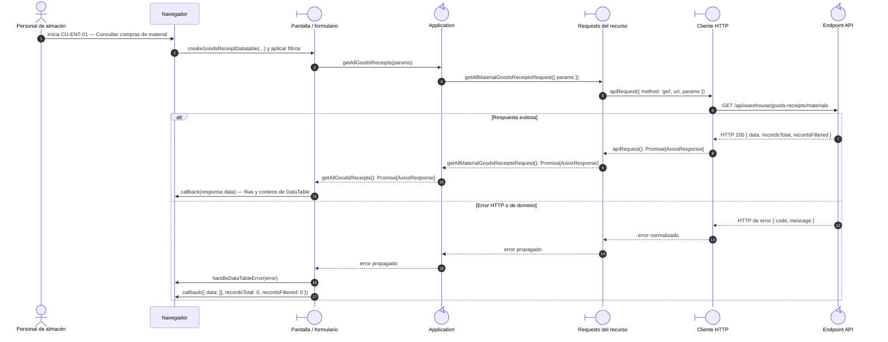

# `CU-ENT-01` — Consultar compras de material

**Patrones:** `FE-P02`, `FE-P04`.

## Participantes y trazabilidad

Los nombres breves del diagrama corresponden a los archivos vinculados siguientes.
La ruta completa se conserva en cada enlace, fuera de la cabecera visual. Un participante
puede agrupar colaboradores del mismo rol; esa agrupación no implica una clase ni un
proceso independiente. Los retornos representan el resultado o error propagado.

| Alias | Rol visual | Archivos de implementación |
| --- | --- | --- |
| `View` | boundary | [`goodsReceiptDatatable.js`](../../../../../../src/public/js/plugins/datatable/warehouse/goodsReceipts/goodsReceiptDatatable.js) [`createDataTable.js`](../../../../../../src/public/js/plugins/datatable/core/base/createDataTable.js) |
| `Application` | control | [`goodsReceipts.js`](../../../../../../src/public/js/application/warehouse/goodsReceipts/goodsReceipts.js) [`materialGoodsReceipts.js`](../../../../../../src/public/js/application/warehouse/goodsReceipts/materials/materialGoodsReceipts.js) [`createCrudApplication.js`](../../../../../../src/public/js/application/createCrudApplication.js) |
| `Request` | boundary | [`materialGoodsReceiptService.js`](../../../../../../src/public/js/services/warehouse/goodsReceipts/materials/materialGoodsReceiptService.js) [`createGoodsReceiptRequests.js`](../../../../../../src/public/js/services/warehouse/goodsReceipts/createGoodsReceiptRequests.js) |
| `HTTP` | boundary | [`axiosInstanceApi.js`](../../../../../../src/public/js/services/axiosInstanceApi.js) |
| `Transport` | control | [`materialGoodsReceiptApiRoute.js`](../../../../../../src/routes/api/warehouse/goodsReceipts/materials/materialGoodsReceiptApiRoute.js) [`materialGoodsReceiptController.js`](../../../../../../src/controllers/api/warehouse/goodsReceipts/materials/materialGoodsReceiptController.js) |

## Secuencia de implementación

