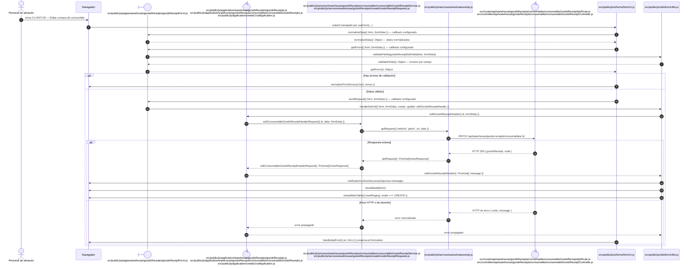

# `CU-ENT-09` — Editar compra de consumible

**Patrones:** `FE-P02`, `FE-P04`.

```mermaid
sequenceDiagram
    autonumber
    actor Initiator as Personal de almacén
    participant Browser as Navegador
    participant View@{ "type": "boundary" } as src/public/js/pages/warehouse/goodsReceipts/goodsReceiptForm.js
    participant Application@{ "type": "control" } as src/public/js/application/warehouse/goodsReceipts/goodsReceipts.js<br/>src/public/js/application/warehouse/goodsReceipts/consumables/consumableGoodsReceipts.js<br/>src/public/js/application/createCrudApplication.js
    participant Request as src/public/js/services/warehouse/goodsReceipts/consumables/consumableGoodsReceiptService.js<br/>src/public/js/services/warehouse/goodsReceipts/createGoodsReceiptRequests.js
    participant HTTP as src/public/js/services/axiosInstanceApi.js
    participant Transport@{ "type": "control" } as src/routes/api/warehouse/goodsReceipts/consumables/consumableGoodsReceiptApiRoute.js<br/>src/controllers/api/warehouse/goodsReceipts/consumables/consumableGoodsReceiptController.js
    participant Form as src/public/js/ui/forms/formUI.js
    participant FormUtils as src/public/js/utils/formUtils.js

    Initiator->>Browser: inicia CU-ENT-09 — Editar compra de consumible
    Browser->>Form: submit manejado por useForm(...)
    Form->>View: normalizeData({ form, formData }) — callback configurado
    View-->>Form: normalizeData(): Object — datos normalizados
    Form->>View: getErrors({ form, formData }) — callback configurado
    View->>FormUtils: validateFields(goodsReceiptEditValidation, formData)
    FormUtils-->>View: validateFields(): Object — errores por campo
    View-->>Form: getErrors(): Object
    alt Hay errores de validación
        Form->>Browser: normalizeFormErrors({ form, errors })
    else Datos válidos
        Form->>View: sendRequest({ form, formData }) — callback configurado
        View->>FormUtils: handleSubmit({ form, formData, create, update: editGoodsReceiptHeader })
        FormUtils->>Application: editGoodsReceiptHeader({ id, formData })
        Application->>Request: editConsumableGoodsReceiptHeaderRequest({ id, data: formData })
        Request->>HTTP: apiRequest({ method: 'patch', url, data })
        HTTP->>Transport: PATCH /api/warehouse/goods-receipts/consumables/:id
        alt Respuesta exitosa
            Transport-->>HTTP: HTTP 200 { goodsReceipt, code }
            HTTP-->>Request: apiRequest(): Promise[AxiosResponse]
            Request-->>Application: editConsumableGoodsReceiptHeaderRequest(): Promise[AxiosResponse]
            Application-->>FormUtils: editGoodsReceiptHeader(): Promise[{ message }]
            FormUtils->>Browser: notifications.showSuccess(response.message)
            FormUtils->>Browser: closeModal(form)
            FormUtils->>Browser: reloadMainTable({ resetPaging: mode === CREATE })
        else Error HTTP o de dominio
            Transport-->>HTTP: HTTP de error { code, message }
            HTTP-->>Request: error normalizado
            Request-->>Application: error propagado
            Application-->>FormUtils: error propagado
            Form->>Browser: handleApiError({ err, form }) conserva el formulario
        end
    end
```
