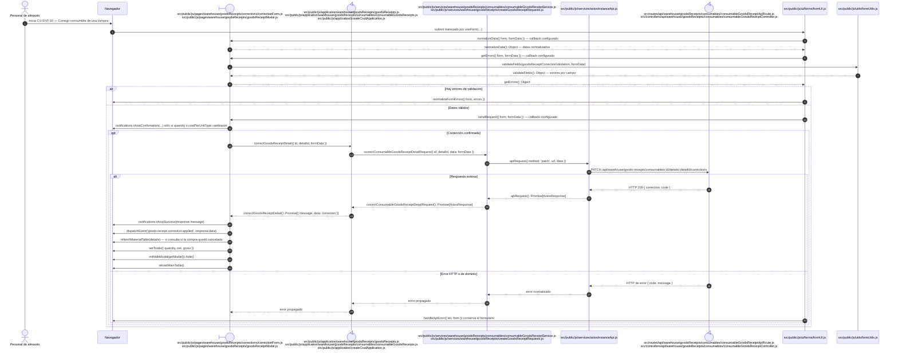

# `CU-ENT-10` — Corregir consumible de una compra

**Patrones:** `FE-P02`, `FE-P04`.

```mermaid
sequenceDiagram
    autonumber
    actor Initiator as Personal de almacén
    participant Browser as Navegador
    participant View@{ "type": "boundary" } as src/public/js/pages/warehouse/goodsReceipts/corrections/correctionForm.js<br/>src/public/js/pages/warehouse/goodsReceipts/goodsReceiptModal.js
    participant Application@{ "type": "control" } as src/public/js/application/warehouse/goodsReceipts/goodsReceipts.js<br/>src/public/js/application/warehouse/goodsReceipts/consumables/consumableGoodsReceipts.js<br/>src/public/js/application/createCrudApplication.js
    participant Request as src/public/js/services/warehouse/goodsReceipts/consumables/consumableGoodsReceiptService.js<br/>src/public/js/services/warehouse/goodsReceipts/createGoodsReceiptRequests.js
    participant HTTP as src/public/js/services/axiosInstanceApi.js
    participant Transport@{ "type": "control" } as src/routes/api/warehouse/goodsReceipts/consumables/consumableGoodsReceiptApiRoute.js<br/>src/controllers/api/warehouse/goodsReceipts/consumables/consumableGoodsReceiptController.js
    participant Form as src/public/js/ui/forms/formUI.js
    participant FormUtils as src/public/js/utils/formUtils.js

    Initiator->>Browser: inicia CU-ENT-10 — Corregir consumible de una compra
    Browser->>Form: submit manejado por useForm(...)
    Form->>View: normalizeData({ form, formData }) — callback configurado
    View-->>Form: normalizeData(): Object — datos normalizados
    Form->>View: getErrors({ form, formData }) — callback configurado
    View->>FormUtils: validateFields(goodsReceiptCorrectionValidation, formData)
    FormUtils-->>View: validateFields(): Object — errores por campo
    View-->>Form: getErrors(): Object
    alt Hay errores de validación
        Form->>Browser: normalizeFormErrors({ form, errors })
    else Datos válidos
        Form->>View: sendRequest({ form, formData }) — callback configurado
        View->>Browser: notifications.showConfirmation(...) sólo si quantity o costPerUnitType cambiaron
        opt Corrección confirmada
            View->>Application: correctGoodsReceiptDetail({ id, detailId, formData })
            Application->>Request: correctConsumableGoodsReceiptDetailRequest({ id, detailId, data: formData })
            Request->>HTTP: apiRequest({ method: 'patch', url, data })
            HTTP->>Transport: PATCH /api/warehouse/goods-receipts/consumables/:id/details/:detailId/corrections
            alt Respuesta exitosa
                Transport-->>HTTP: HTTP 200 { correction, code }
                HTTP-->>Request: apiRequest(): Promise[AxiosResponse]
                Request-->>Application: correctConsumableGoodsReceiptDetailRequest(): Promise[AxiosResponse]
                Application-->>View: correctGoodsReceiptDetail(): Promise[{ message, data: correction }]
                View->>Browser: notifications.showSuccess(response.message)
                View->>Browser: dispatchEvent('goods-receipt-correction:applied', response.data)
                View->>Browser: refreshMaterialTable(details) — o consulta si la compra quedó cancelada
                View->>Browser: setTotals({ quantity, net, gross })
                View->>Browser: initMdbModal(getModal()).hide()
                View->>Browser: reloadMainTable()
            else Error HTTP o de dominio
                Transport-->>HTTP: HTTP de error { code, message }
                HTTP-->>Request: error normalizado
                Request-->>Application: error propagado
                Application-->>View: error propagado
                Form->>Browser: handleApiError({ err, form }) conserva el formulario
            end
        end
    end
```
