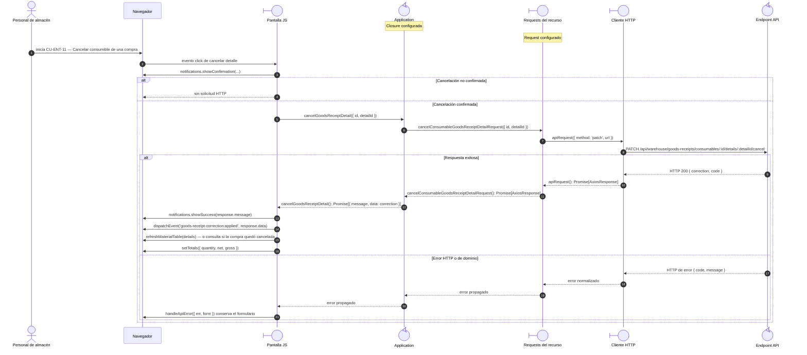

# `CU-ENT-11` — Cancelar consumible de una compra

**Patrones:** `FE-P02`, `FE-P04`.

## Participantes y trazabilidad

Cada línea de vida técnica corresponde a un único archivo de implementación, indicado
por su alias en la tabla. Dos archivos distintos usan participantes distintos. Los actores,
el navegador y la frontera de persistencia son elementos externos, no archivos del proyecto.
Los retornos representan el resultado o error de la función ejecutada en el archivo indicado.

| Alias | Rol visual | Archivo de implementación |
| --- | --- | --- |
| `View` | boundary | [`goodsReceiptModal.js`](../../../../../../src/public/js/pages/warehouse/goodsReceipts/goodsReceiptModal.js) |
| `Application` | control | [`createCrudApplication.js`](../../../../../../src/public/js/application/createCrudApplication.js) |
| `Request` | boundary | [`createGoodsReceiptRequests.js`](../../../../../../src/public/js/services/warehouse/goodsReceipts/createGoodsReceiptRequests.js) |
| `HTTP` | boundary | [`axiosInstanceApi.js`](../../../../../../src/public/js/services/axiosInstanceApi.js) |
| `Transport` | control | [`consumableGoodsReceiptApiRoute.js`](../../../../../../src/routes/api/warehouse/goodsReceipts/consumables/consumableGoodsReceiptApiRoute.js) |

### Configuración y archivos de contexto

Estos módulos seleccionan/configuran y exportan la función de aplicación. Su cuerpo se ejecuta en la fábrica de la línea `Application`, sin una llamada intermedia entre reexports: [`goodsReceipts.js`](../../../../../../src/public/js/application/warehouse/goodsReceipts/goodsReceipts.js), [`consumableGoodsReceipts.js`](../../../../../../src/public/js/application/warehouse/goodsReceipts/consumables/consumableGoodsReceipts.js).

Estos módulos configuran o reexportan el request. La función que llama a `apiRequest` está definida en el archivo de la línea `Request`: [`consumableGoodsReceiptService.js`](../../../../../../src/public/js/services/warehouse/goodsReceipts/consumables/consumableGoodsReceiptService.js).

El endpoint queda representado por su router. El controller asociado se desarrolla en la [secuencia backend `CU-ENT-11`](../../backend-code-sequences/purchases/cu-ent-11.md#cu-ent-11): [`consumableGoodsReceiptController.js`](../../../../../../src/controllers/api/warehouse/goodsReceipts/consumables/consumableGoodsReceiptController.js).

## Secuencia de implementación

