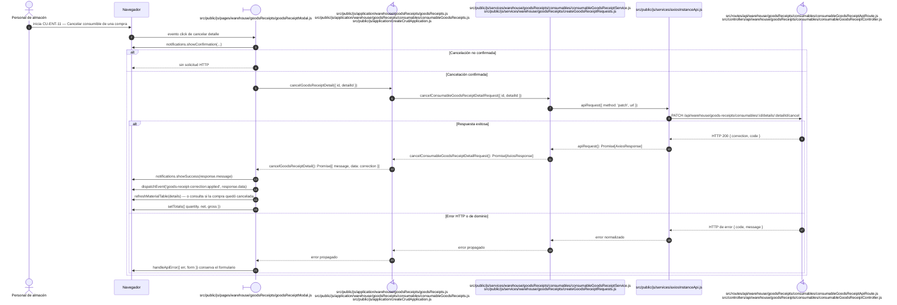

# `CU-ENT-11` — Cancelar consumible de una compra

**Patrones:** `FE-P02`, `FE-P04`.

```mermaid
sequenceDiagram
    autonumber
    actor Initiator as Personal de almacén
    participant Browser as Navegador
    participant View@{ "type": "boundary" } as src/public/js/pages/warehouse/goodsReceipts/goodsReceiptModal.js
    participant Application@{ "type": "control" } as src/public/js/application/warehouse/goodsReceipts/goodsReceipts.js<br/>src/public/js/application/warehouse/goodsReceipts/consumables/consumableGoodsReceipts.js<br/>src/public/js/application/createCrudApplication.js
    participant Request as src/public/js/services/warehouse/goodsReceipts/consumables/consumableGoodsReceiptService.js<br/>src/public/js/services/warehouse/goodsReceipts/createGoodsReceiptRequests.js
    participant HTTP as src/public/js/services/axiosInstanceApi.js
    participant Transport@{ "type": "control" } as src/routes/api/warehouse/goodsReceipts/consumables/consumableGoodsReceiptApiRoute.js<br/>src/controllers/api/warehouse/goodsReceipts/consumables/consumableGoodsReceiptController.js

    Initiator->>Browser: inicia CU-ENT-11 — Cancelar consumible de una compra
    Browser->>View: evento click de cancelar detalle
    View->>Browser: notifications.showConfirmation(...)
    alt Cancelación no confirmada
        View-->>Browser: sin solicitud HTTP
    else Cancelación confirmada
        View->>Application: cancelGoodsReceiptDetail({ id, detailId })
        Application->>Request: cancelConsumableGoodsReceiptDetailRequest({ id, detailId })
        Request->>HTTP: apiRequest({ method: 'patch', url })
        HTTP->>Transport: PATCH /api/warehouse/goods-receipts/consumables/:id/details/:detailId/cancel
        alt Respuesta exitosa
            Transport-->>HTTP: HTTP 200 { correction, code }
            HTTP-->>Request: apiRequest(): Promise[AxiosResponse]
            Request-->>Application: cancelConsumableGoodsReceiptDetailRequest(): Promise[AxiosResponse]
            Application-->>View: cancelGoodsReceiptDetail(): Promise[{ message, data: correction }]
            View->>Browser: notifications.showSuccess(response.message)
            View->>Browser: dispatchEvent('goods-receipt-correction:applied', response.data)
            View->>Browser: refreshMaterialTable(details) — o consulta si la compra quedó cancelada
            View->>Browser: setTotals({ quantity, net, gross })
        else Error HTTP o de dominio
            Transport-->>HTTP: HTTP de error { code, message }
            HTTP-->>Request: error normalizado
            Request-->>Application: error propagado
            Application-->>View: error propagado
            View->>Browser: handleApiError({ err, form }) conserva el formulario
        end
    end
```
