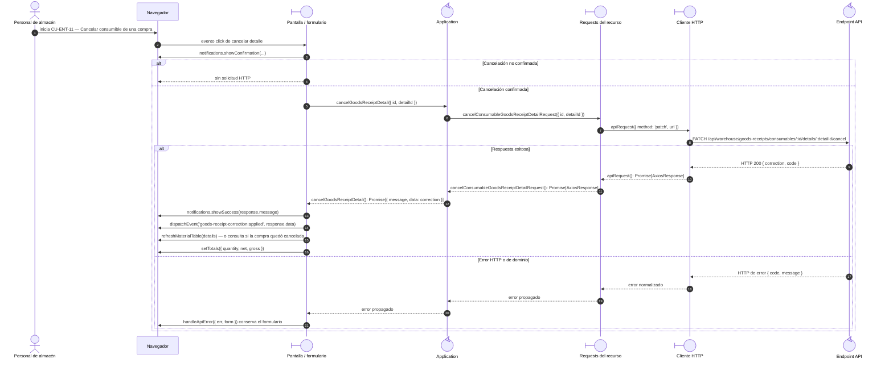

# `CU-ENT-11` — Cancelar consumible de una compra

**Patrones:** `FE-P02`, `FE-P04`.

## Participantes y trazabilidad

Los nombres breves del diagrama corresponden a los archivos vinculados siguientes.
La ruta completa se conserva en cada enlace, fuera de la cabecera visual. Un participante
puede agrupar colaboradores del mismo rol; esa agrupación no implica una clase ni un
proceso independiente. Los retornos representan el resultado o error propagado.

| Alias | Rol visual | Archivos de implementación |
| --- | --- | --- |
| `View` | boundary | [`goodsReceiptModal.js`](../../../../../../src/public/js/pages/warehouse/goodsReceipts/goodsReceiptModal.js) |
| `Application` | control | [`goodsReceipts.js`](../../../../../../src/public/js/application/warehouse/goodsReceipts/goodsReceipts.js) [`consumableGoodsReceipts.js`](../../../../../../src/public/js/application/warehouse/goodsReceipts/consumables/consumableGoodsReceipts.js) [`createCrudApplication.js`](../../../../../../src/public/js/application/createCrudApplication.js) |
| `Request` | boundary | [`consumableGoodsReceiptService.js`](../../../../../../src/public/js/services/warehouse/goodsReceipts/consumables/consumableGoodsReceiptService.js) [`createGoodsReceiptRequests.js`](../../../../../../src/public/js/services/warehouse/goodsReceipts/createGoodsReceiptRequests.js) |
| `HTTP` | boundary | [`axiosInstanceApi.js`](../../../../../../src/public/js/services/axiosInstanceApi.js) |
| `Transport` | control | [`consumableGoodsReceiptApiRoute.js`](../../../../../../src/routes/api/warehouse/goodsReceipts/consumables/consumableGoodsReceiptApiRoute.js) [`consumableGoodsReceiptController.js`](../../../../../../src/controllers/api/warehouse/goodsReceipts/consumables/consumableGoodsReceiptController.js) |

## Secuencia de implementación

