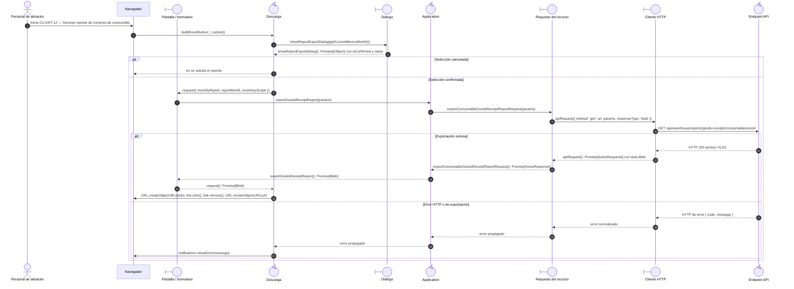

# `CU-ENT-12` — Generar reporte de compras de consumible

**Patrones:** `FE-P08`.

## Participantes y trazabilidad

Los nombres breves del diagrama corresponden a los archivos vinculados siguientes.
La ruta completa se conserva en cada enlace, fuera de la cabecera visual. Un participante
puede agrupar colaboradores del mismo rol; esa agrupación no implica una clase ni un
proceso independiente. Los retornos representan el resultado o error propagado.

| Alias | Rol visual | Archivos de implementación |
| --- | --- | --- |
| `View` | boundary | [`goodsReceiptDatatable.js`](../../../../../../src/public/js/plugins/datatable/warehouse/goodsReceipts/goodsReceiptDatatable.js) |
| `Export` | control | [`tableUI.js`](../../../../../../src/public/js/ui/tableUI.js) |
| `Dialog` | boundary | [`reportExportDialog.js`](../../../../../../src/public/js/ui/reportExportDialog.js) |
| `Application` | control | [`report.js`](../../../../../../src/public/js/application/warehouse/report.js) [`createReportApplication.js`](../../../../../../src/public/js/application/createReportApplication.js) |
| `Request` | boundary | [`reportService.js`](../../../../../../src/public/js/services/warehouse/reportService.js) [`consumableGoodsReceiptService.js`](../../../../../../src/public/js/services/warehouse/goodsReceipts/consumables/consumableGoodsReceiptService.js) [`createGoodsReceiptRequests.js`](../../../../../../src/public/js/services/warehouse/goodsReceipts/createGoodsReceiptRequests.js) |
| `HTTP` | boundary | [`axiosInstanceApi.js`](../../../../../../src/public/js/services/axiosInstanceApi.js) |
| `Transport` | control | [`consumableGoodsReceiptReportApiRoute.js`](../../../../../../src/routes/api/warehouse/goodsReceipts/consumables/consumableGoodsReceiptReportApiRoute.js) [`consumableGoodsReceiptReportController.js`](../../../../../../src/controllers/api/warehouse/goodsReceipts/consumables/consumableGoodsReceiptReportController.js) |

## Secuencia de implementación

