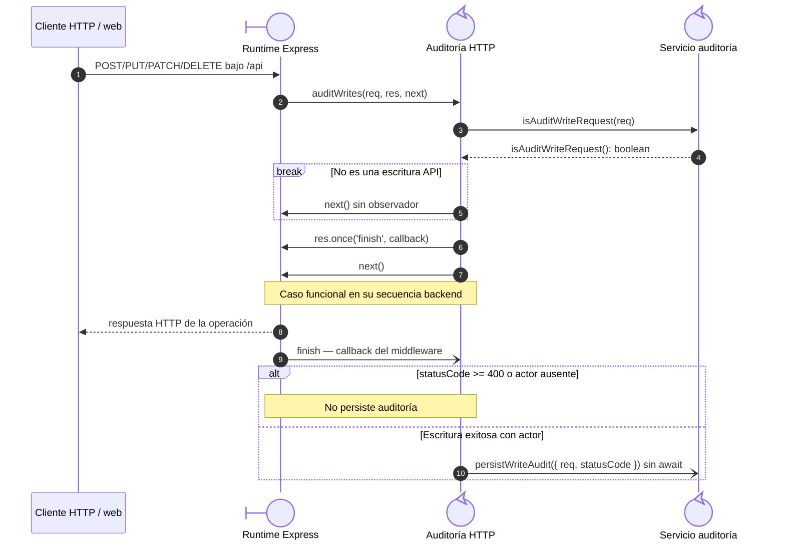
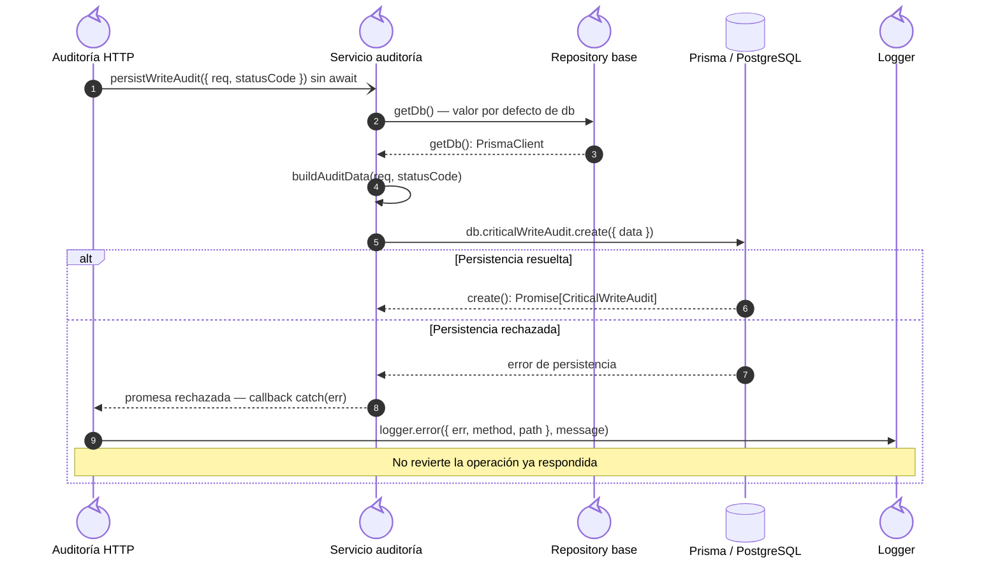

# 1. Auditoría de escrituras: comportamiento transversal

### Secuencia transversal de auditoría de escrituras

**Identificador:** `DIA-BE-SEQ-006`. **Requisito:** `RN-008`. La auditoría observa
la finalización de la respuesta y no participa en la transacción funcional. La secuencia
hace explícita esa persistencia *best effort*. El caso funcional se consulta en su propia
secuencia backend; no se agrupan ruta, controller y servicio en una línea de vida.

## Participantes y trazabilidad

Cada participante técnico corresponde a un archivo distinto. `Express`, el cliente y
la persistencia representan límites externos de esta colaboración. El objeto `res`,
su evento `finish` y la función `next` pertenecen al runtime Express.

| Alias | Rol visual | Archivo de implementación |
| --- | --- | --- |
| `Audit` | control | [`auditMiddleware.js`](../../../../../src/middleware/auditMiddleware.js) |
| `AuditService` | control | [`auditService.js`](../../../../../src/services/audit/auditService.js) |
| `Repository` | control | [`baseRepository.js`](../../../../../src/repository/baseRepository.js) |
| `Logger` | control | [`logger.js`](../../../../../src/utils/logger.js) |

## Registro del observador y finalización HTTP

El runtime ejecuta el caso funcional antes de emitir `finish`. Una respuesta elegible
inicia `persistWriteAudit` sin esperar su promesa; la siguiente figura amplía esa llamada.

## Persistencia best effort y fallo de auditoría

Esta colaboración amplía la llamada anterior. El archivo del servicio construye los
datos y utiliza `getDb()`, definido en el repository; los límites Prisma/PostgreSQL
representan el acceso persistente. El callback `catch` se define en el middleware,
por lo que el error vuelve a su línea de vida antes de invocar al logger.

