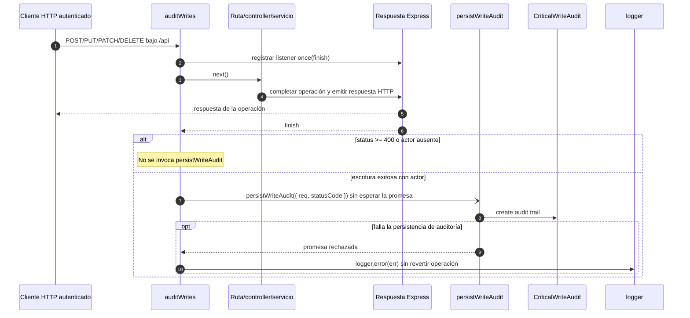

# 1. Auditoría de escrituras: comportamiento transversal

La secuencia es propietaria del momento de observación/persistencia compartido por
las escrituras API. Las dependencias de sus archivos están en la referencia técnica
del backend; aquí se describe el comportamiento asíncrono.

### Secuencia transversal de auditoría de escrituras

**Identificador:** `DIA-BE-SEQ-006`. **Requisito:** `RN-008`. La auditoría observa la
respuesta HTTP y no forma parte de la transacción funcional actual; este diagrama hace
explícita esa garantía *best effort*.

**Fuente:** `src/middleware/auditMiddleware.js` y `src/services/audit/auditService.js`.
