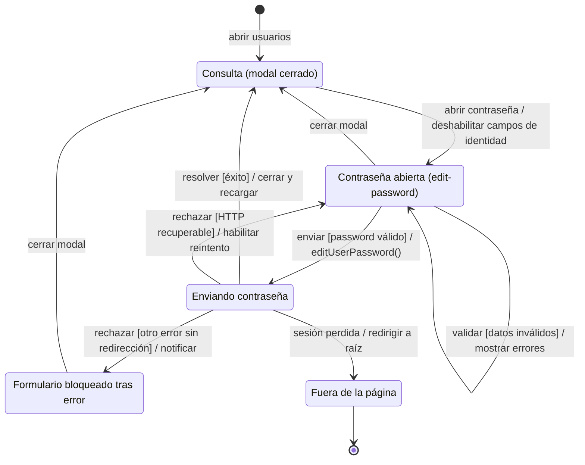
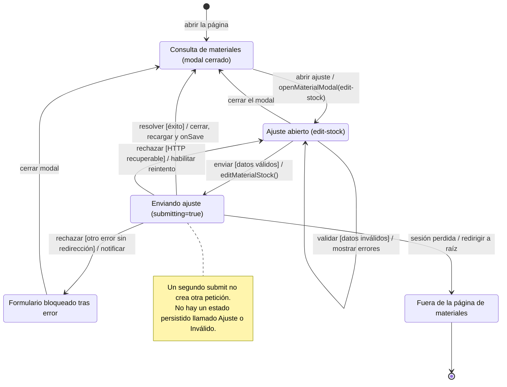
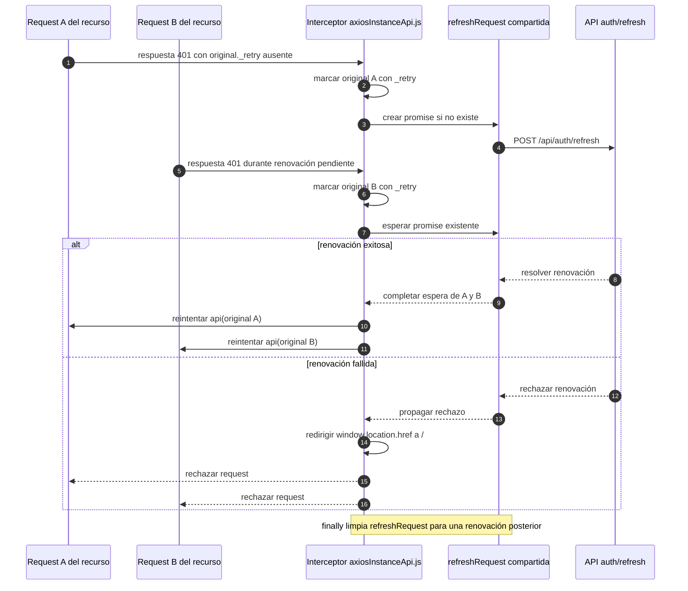

# 2. Sesión HTTP y estados técnicos de formularios

Esta sección conserva el comportamiento compartido y los estados locales que no son
estados de negocio. Los archivos y dependencias de cada módulo están en desarrollo.

### Estados técnicos complementarios

Estos diagramas describen los estados del formulario durante la interacción, como
complemento de las secuencias por caso de uso.

**Estado técnico complementario:** `DIA-FE-TEC-EST-CU-IDA-08`. El objeto modelado es
el modal en modo contraseña (`FORM_MODES.EDIT_PASSWORD`), abierto desde la consulta.
El formulario conserva ese modo ante un error que permite reintentar el envío; no cambia al modo de edición de
datos ni modela el estado persistido del usuario.

La elección del modo ocurre en `userModal.js`; la validación y la mutación se seleccionan
en `userForm.js`. `handleSubmit` cierra el modal y recarga la tabla sólo tras el éxito.
`handleApiError` permite reintentar HTTP 400, 403, 404 y 409; la figura los agrupa
como «HTTP recuperable». Para los demás fallos, la implementación actual notifica sin restablecer `submitting`: cerrar y volver
a abrir el modal inicializa el formulario. El cliente HTTP intenta renovar una sesión
ante 401 antes de abandonar la página.

**Estado técnico complementario:** `DIA-FE-TEC-EST-CU-ALM-05`. Modela el modal de ajuste
abierto desde Materiales. El servidor comprueba el permiso y la existencia disponible antes de aplicar el ajuste;
la validación local del formulario no sustituye esas comprobaciones.

La evidencia está en `materialModal.js`, `materialForm.js`, `formUI.js`, `formUtils.js`
y `api/errorHandler.js`. Ante HTTP 400, 403, 404 y 409, el manejador de errores restablece el estado de envío y
permite reintentar. Los demás errores de red o servidor siguen el comportamiento
descrito para el formulario de contraseña.

### Renovación coordinada del transporte HTTP

**Identificador:** `DIA-FE-TEC-SES-001`. **Pregunta:** ¿cómo comparten dos peticiones
con 401 una renovación de sesión sin crear un refresh por componente?
**Fuente:** `src/public/js/services/axiosInstanceApi.js`. **Alcance:** ejemplo con dos
solicitudes cuya renovación coincide en el tiempo; no representa concurrencia de negocio.

La coordinación pertenece al transporte común, no al formulario ni al plugin Select2.
`_retry` impide otra renovación para la misma petición reintentada; `refreshRequest`
comparte sólo la renovación pendiente y se limpia en `finally`. El error de una nueva
respuesta 401 del reintento no abre indefinidamente más renovaciones.
