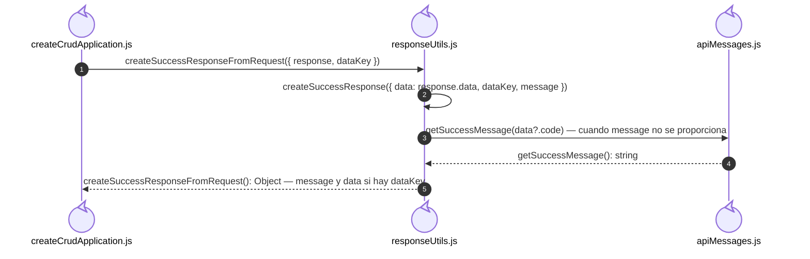
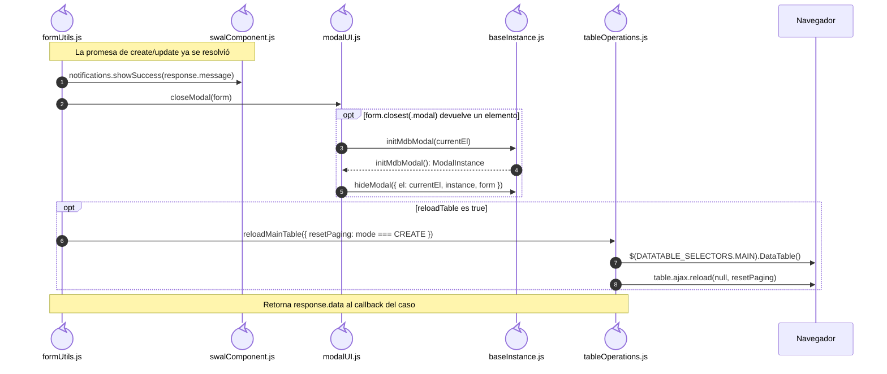

# Colaboraciones de los helpers CRUD

Estas figuras amplían funciones compartidas del código. Los casos conservan su actor,
validación, callback, aplicación y request específicos; no se vuelve a describir aquí
el proceso de una operación ni se usan participantes que agrupen archivos diferentes.

## Participantes y trazabilidad

| Alias | Rol visual | Archivo de implementación |
| --- | --- | --- |
| `Application` | control | [`createCrudApplication.js`](../../../../../src/public/js/application/createCrudApplication.js) |
| `Response` | control | [`responseUtils.js`](../../../../../src/public/js/utils/responseUtils.js) |
| `Messages` | control | [`apiMessages.js`](../../../../../src/public/js/constants/apiMessages.js) |
| `FormUtils` | control | [`formUtils.js`](../../../../../src/public/js/utils/formUtils.js) |
| `Notifications` | control | [`swalComponent.js`](../../../../../src/public/js/plugins/swal/swalComponent.js) |
| `Modal` | control | [`modalUI.js`](../../../../../src/public/js/ui/modalUI.js) |
| `Mdb` | control | [`baseInstance.js`](../../../../../src/public/js/plugins/mdb/baseInstance.js) |
| `Table` | control | [`tableOperations.js`](../../../../../src/public/js/plugins/datatable/core/base/tableOperations.js) |

## Adaptación de la respuesta CRUD

La closure de mutación de `createCrudApplication.js` espera el request y entonces
invoca `createSuccessResponseFromRequest`. Esta función llama a `createSuccessResponse`
en el mismo archivo. El mensaje se resuelve desde el código API; `data` sólo se añade
si el configurador suministró `dataKey`. Listados y reportes tienen contratos distintos.

## Efectos posteriores de handleSubmit

El caso ya muestra cómo `handleSubmit` elige `create` o `update`, valida la existencia
del id para update y espera la función configurada. Esta ampliación comienza después
de resolver esa promesa. Un fallo de aplicación se propaga antes de estos efectos.
El orden es notificar, cerrar y recargar si `reloadTable` es true. La función retorna
`response.data`, que puede ser undefined según el contrato de la aplicación.

