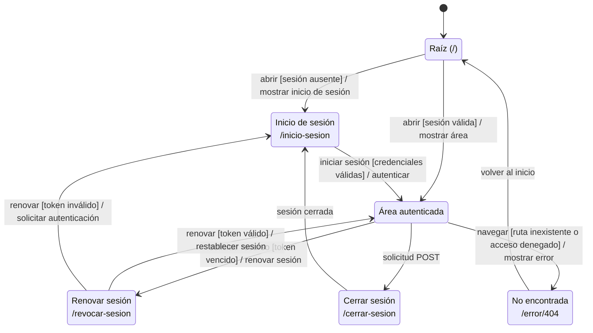
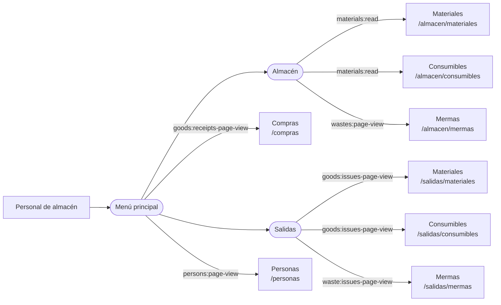
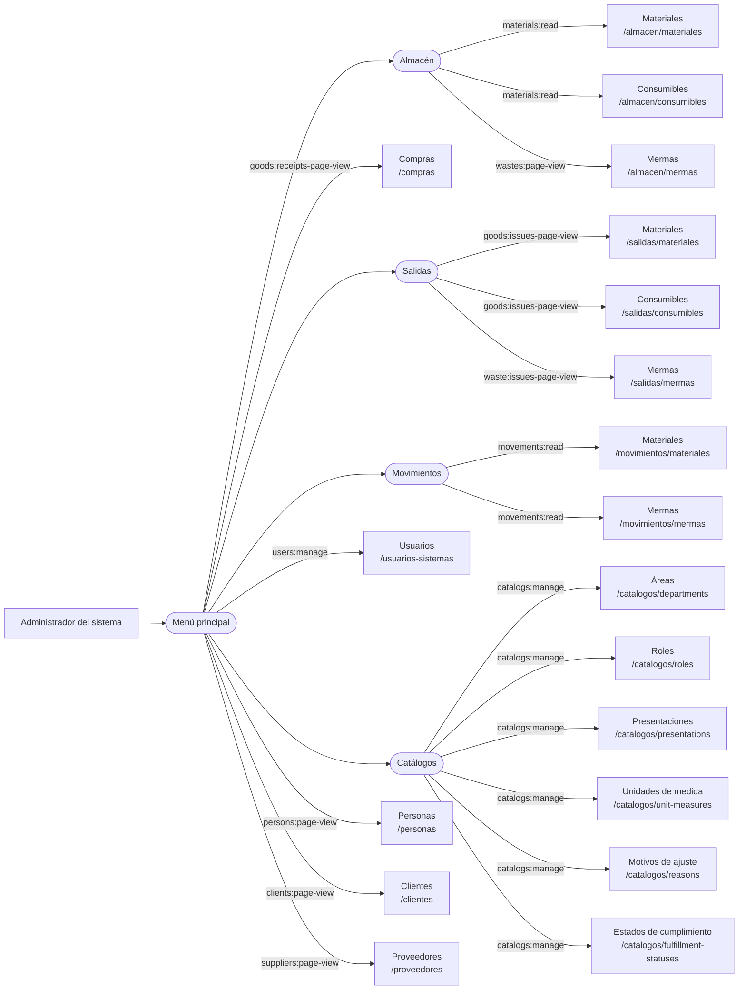

# 2. Navegación web por actor

Esta vista separa la navegación de los dos actores con acceso vigente. Cada flecha
significa que el destino se ofrece desde el menú principal; no impone una secuencia de
trabajo. Las categorías redondeadas despliegan opciones y no registran una URL propia.
La visibilidad final siempre depende de los permisos calculados para la sesión y las
rutas vuelven a comprobar la autorización en el servidor.

Los diagramas se contrastan con el partial compartido `src/views/layout/ui/navList.ejs`.
La definición normativa de los actores permanece en la
[SRS](../../../../requirements/requirements-specification/03-actors-and-system-responsibilities.md):
ambos actores especializan a Usuario registrado. Sus destinos operativos compartidos
se autorizan explícitamente; no hay generalización entre Administrador y Personal de almacén.

## Acceso y sesión compartidos

**Identificador:** `DIA-ARQ-EST-001`.

La raíz dirige a la autenticación o al área protegida según la sesión. Este recorrido es
común a ambos actores y no representa una pantalla adicional para el área autenticada.

## Personal de almacén

**Identificador:** `DIA-ARQ-NAV-001`. El mapa muestra la navegación operativa base del
actor. Las etiquetas de las flechas indican el permiso que hace visible cada destino.
Los accesos independientes de administración, movimientos, clientes, proveedores y
catálogos auxiliares no forman parte de este recorrido.

## Administrador del sistema

**Identificador:** `DIA-ARQ-NAV-002`. Este actor dispone de la navegación operativa y de
los destinos administrativos. El diagrama expande todos los destinos para que pueda
leerse sin depender del mapa anterior; las etiquetas reproducen el permiso comprobado
por el menú compartido para mostrar cada opción.

Los modales CRUD no se dibujan como pantallas porque reutilizan la página propietaria y
no tienen rutas web independientes. Las redirecciones históricas se mantienen en el
[catálogo de pantallas](03-catalog-of-screens.md#redirecciones-de-compatibilidad).
