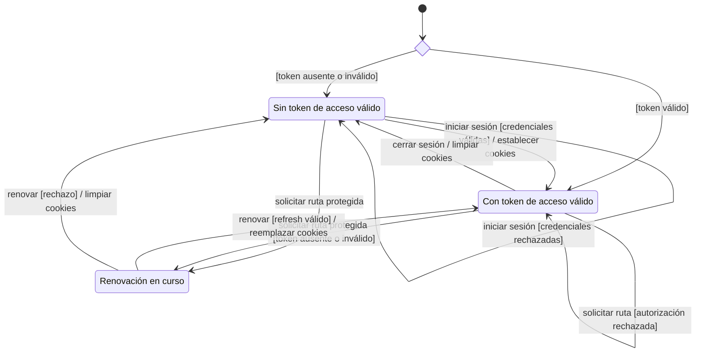
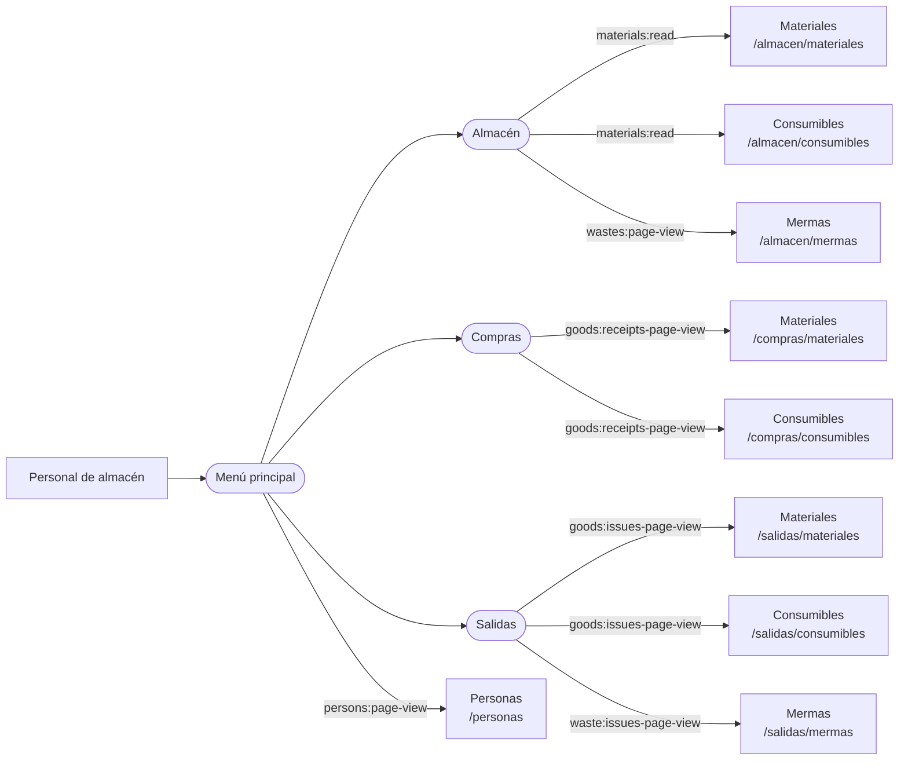
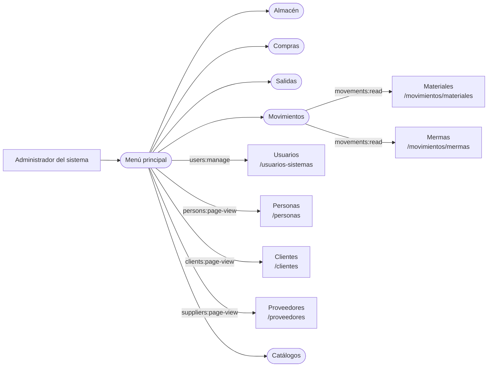
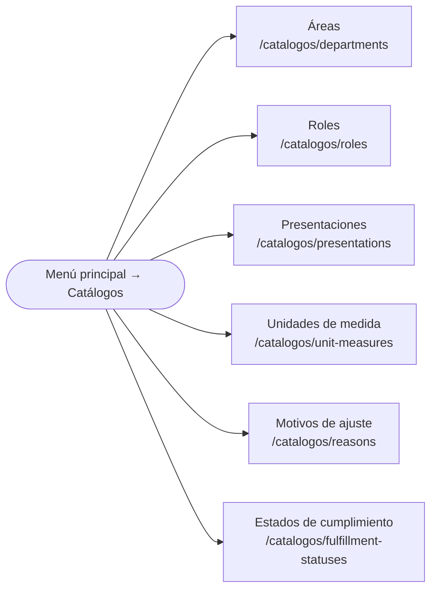

# 2. Navegación web por actor

Esta vista separa la navegación de los dos actores con acceso vigente. Cada flecha
significa que el destino se ofrece desde el menú principal; no impone una secuencia de
trabajo. Las categorías redondeadas despliegan opciones y no registran una URL propia.
La visibilidad final siempre depende de los permisos calculados para la sesión y las
rutas vuelven a comprobar la autorización en el servidor.

Los diagramas se contrastan con el partial compartido `src/views/layout/ui/navList.ejs`.
La definición normativa de los actores permanece en la
[SRS](../../../../requirements/requirements-specification/03-actors-and-system-responsibilities.md):
ambos actores acceden a destinos operativos compartidos que se autorizan explícitamente
en el servidor. La generalización funcional de los casos de uso no sustituye esas políticas.

## Acceso y sesión compartidos

**Identificador:** `DIA-ARQ-EST-001`.

El objeto modelado es la condición de acceso de la sesión web, determinada por las
credenciales disponibles. Tener un token válido no concede todos los permisos: cada
ruta protegida comprueba además la cuenta y sus asignaciones. Las páginas y las
redirecciones se describen en la tabla posterior, no como estados de la sesión.

| Situación | Destino o resultado web |
| --- | --- |
| Abrir `/` | `/almacen/materiales` con token válido; `/inicio-sesion` sin él. La ruta de destino vuelve a comprobar la autorización. |
| Iniciar sesión | La pantalla `/inicio-sesion` envía las credenciales a la API; un rechazo conserva el formulario y el acceso exitoso permite entrar al área protegida. |
| Solicitar una ruta protegida sin token de acceso válido | Se conserva `returnTo` y se redirige a `/revocar-sesion`, incluso si aún no se ha iniciado sesión. |
| Renovación correcta | Regresa al destino conservado en `returnTo` o al referente; la nueva petición vuelve a comprobar la cuenta y sus permisos. |
| Renovación rechazada o POST `/cerrar-sesion` | Limpia las cookies y redirige a `/inicio-sesion`. |
| Cuenta o permiso rechazado en una ruta web protegida | Redirige a `/error/404`; esta redirección no cierra la sesión ni renueva las credenciales. |
| Ruta inexistente | Muestra la página de error; no cambia por sí sola la condición de acceso. |

La figura corresponde al acceso **web**. La API responde 401 o 403 según el rechazo;
el cliente HTTP gestiona su propia renovación. Las fuentes son `homeWebRoute.js`,
`authMiddleware.js` y los controladores de autenticación web y API.

## Personal de almacén

**Identificador:** `DIA-ARQ-NAV-001`. El mapa muestra la navegación operativa base del
actor. Las etiquetas de las flechas indican el permiso que hace visible cada destino.
Los accesos independientes de administración, movimientos, clientes, proveedores y
catálogos auxiliares no forman parte de este recorrido.

## Administrador del sistema

**Identificador:** `DIA-ARQ-NAV-002`. El administrador dispone de los destinos
operativos del mapa `DIA-ARQ-NAV-001` y de los accesos administrativos siguientes.
Los catálogos auxiliares se detallan en una figura aparte para conservar la legibilidad;
ambas figuras representan opciones del mismo menú, no pasos obligatorios.
Almacén, Compras y Salidas son submenús; sus destinos operativos se detallan en la
figura del Personal de almacén y también están disponibles para el administrador.
El submenú Catálogos se desarrolla en la figura siguiente. Los identificadores de
diagrama son referencias documentales y no forman parte de las opciones de Nexus.

### Catálogos auxiliares del administrador

**Identificador:** `DIA-ARQ-NAV-003`. El submenú se ofrece sólo con
`catalogs:manage`; cada destino comprueba nuevamente ese permiso en el servidor.

Los modales CRUD no se dibujan como pantallas porque reutilizan la página propietaria y
no tienen rutas web independientes. Las redirecciones históricas se mantienen en el
[catálogo de pantallas](03-catalog-of-screens.md#redirecciones-de-compatibilidad).
