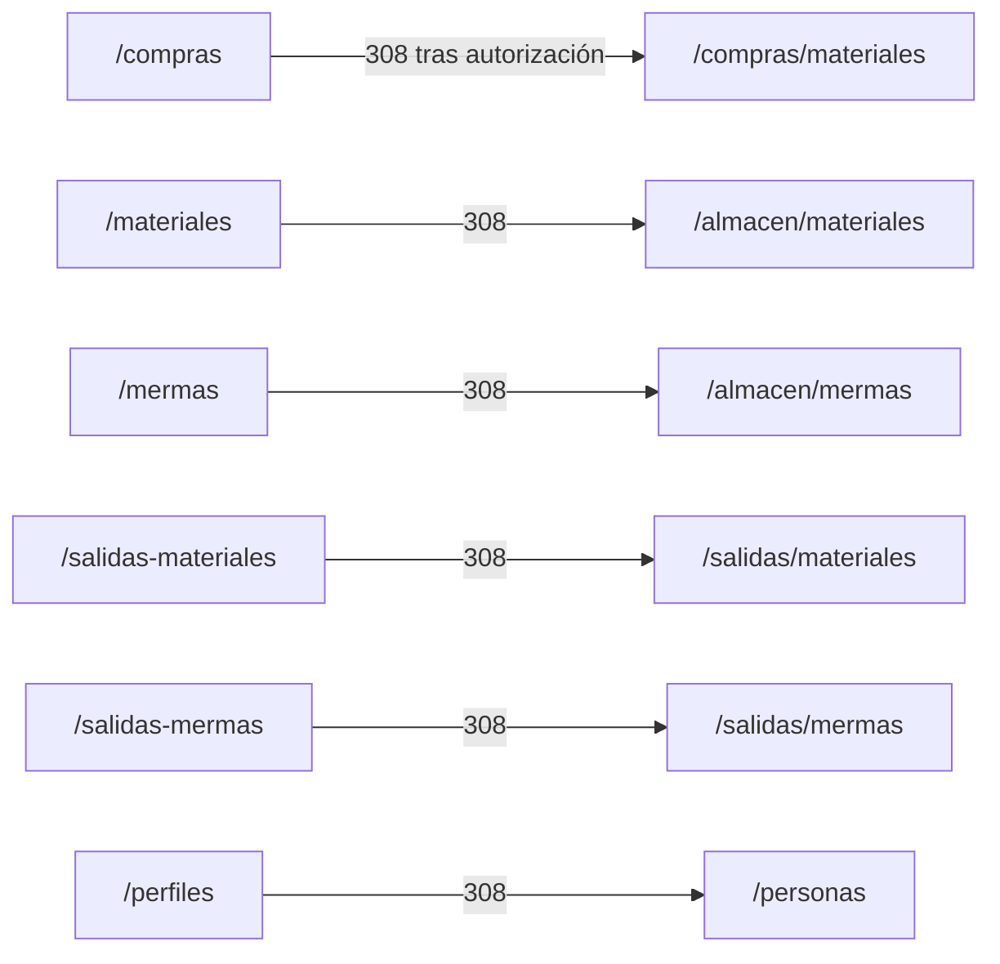

# 3. Catálogo de pantallas

Las pantallas se agrupan por área para no mezclar en una sola tabla los destinos
operativos, administrativos y transversales. Cada fila identifica un destino web
registrado, su propósito y la vista que lo implementa. El acceso se ofrece en el menú
sólo cuando la sesión posee el permiso indicado por
`src/views/layout/ui/navList.ejs`; las rutas vuelven a comprobarlo en el servidor.

### Acceso

| Pantalla y ruta | Propósito visible | Interacciones principales | Implementación EJS |
| --- | --- | --- | --- |
| Inicio de sesión (`/inicio-sesion`) | Autenticar una cuenta. | Capturar credenciales e iniciar sesión. | `src/views/pages/home/login/loginPage.ejs` |

### Operación compartida de Almacén

| Pantalla y ruta | Propósito visible | Interacciones principales | Implementación EJS |
| --- | --- | --- | --- |
| Existencias (`/almacen/materiales`) | Consultar materiales no clasificados como consumibles y su stock; las columnas `Existencia` y `Costo Unitario de Conversión` mantienen los mismos títulos que en Mermas, y todas las celdas de cada fila, incluido el nombre, se muestran centradas. | Filtrar, paginar y abrir el alta/edición de material. | `src/views/pages/warehouse/materials/materialsPage.ejs` |
| Consumibles (`/almacen/consumibles`) | Administrar las existencias clasificadas explícitamente como consumibles, sin inferirlas de sus dimensiones o unidad. | Buscar y filtrar por proveedor; registrar, editar, retirar y exportar; el ajuste de stock corresponde sólo al administrador. Comparte los permisos y reglas del inventario de materiales. | `src/views/pages/warehouse/consumables/consumablesPage.ejs` |
| Mermas (`/almacen/mermas`) | Consultar y administrar existencias de merma con todas las celdas de cada fila centradas, incluido el nombre. | Filtrar, registrar/editar, agregar stock para almacén y ajustar stock sólo para administración. | `src/views/pages/warehouse/wastes/wastesPage.ejs` |
| Compras de materiales y consumibles (`/compras/materiales`, `/compras/consumibles`) | Consultar y registrar entradas separadas por tipo de inventario mediante un flujo compartido. | Filtrar, registrar compra, crear el material o consumible del contexto, crear proveedores desde la operación y corregir detalles sin mezclar tipos; el listado independiente de proveedores es administrativo. | `src/views/pages/warehouse/goodsReceipts/goodsReceiptsPage.ejs` |
| Salidas de almacén (`/salidas/materiales`) | Consultar y registrar entregas de materiales. | Consultar, registrar, editar encabezado y detalles permitidos, surtir, devolver y exportar; crear un cliente desde el selector cuando sea necesario. | `src/views/pages/warehouse/goodsIssues/goodsIssuesPage.ejs` |
| Salidas de consumibles (`/salidas/consumibles`) | Consultar y registrar entregas de consumibles. | Consultar, registrar, editar encabezado y detalles pendientes, surtir, devolver y exportar Excel (`CU-SAL-15` a `CU-SAL-21`); crear un cliente desde el selector. Reutiliza la vista y los permisos de salidas de materiales. | `src/views/pages/warehouse/goodsIssues/goodsIssuesPage.ejs` |
| Salidas de mermas (`/salidas/mermas`) | Consultar y registrar salidas de merma. | Registrar, editar, surtir y devolver detalles de merma. | `src/views/pages/warehouse/wasteIssues/wasteIssuesPage.ejs` |

### Administración y personas

**Movimientos**, **Catálogos**, **Usuarios**, **Clientes** y **Proveedores** son accesos
independientes del **Administrador del sistema** en la política vigente. **Personas**
también está disponible para el Personal de almacén con el permiso correspondiente.
La ubicación técnica de una plantilla no determina quién puede abrirla.

| Pantalla y ruta | Propósito visible | Interacciones principales | Implementación EJS |
| --- | --- | --- | --- |
| Catálogos (`/catalogos/departments`, `/catalogos/roles`, `/catalogos/presentations`, `/catalogos/unit-measures`, `/catalogos/reasons`, `/catalogos/fulfillment-statuses`) | Administrar áreas, roles, presentaciones, unidades, motivos y estados desde una pantalla CRUD por catálogo y una implementación compartida por capas. | Elegir uno de los seis accesos del submenú; listar, crear y editar con `catalogs:manage`; sólo para el Administrador del sistema. | `src/views/pages/admin/catalogs/catalogsPage.ejs` |
| Proveedores (`/proveedores`) | Consultar y administrar proveedores. | Crear/editar desde modal; listado independiente sólo para el administrador. | `src/views/pages/warehouse/suppliers/suppliersPage.ejs` |
| Clientes (`/clientes`) | Consultar y administrar clientes. | Crear/editar desde modal. | `src/views/pages/sales/clients/clientsPage.ejs` |
| Usuarios (`/usuarios-sistemas`) | Administrar cuentas y asignaciones. | Crear/editar usuario, roles y departamentos. | `src/views/pages/admin/users/usersPage.ejs` |
| Personas (`/personas`) | Administrar personas participantes del negocio. | Filtrar y crear/editar datos y asignaciones. | `src/views/pages/admin/persons/personsPage.ejs` |
| Movimientos de materiales (`/movimientos/materiales`) | Auditar movimientos del inventario de materiales. | Filtrar, consultar y exportar el historial con `movements:read`; sólo para el Administrador del sistema. | `src/views/pages/admin/movements/movementsPage.ejs` |
| Movimientos de merma (`/movimientos/mermas`) | Auditar movimientos del inventario de merma. | Filtrar, consultar y exportar el historial con `movements:read`; sólo para el Administrador del sistema. | `src/views/pages/admin/movements/movementsPage.ejs` |

### Sistema

| Pantalla y ruta | Propósito visible | Interacciones principales | Implementación EJS |
| --- | --- | --- | --- |
| No encontrada (`/error/404`) | Recuperar al usuario de una URL inexistente. | Volver al inicio apropiado según la sesión. | `src/views/pages/error/notFound/notFoundPage.ejs` |

### Redirecciones de compatibilidad

Las salidas de materiales y consumibles reutilizan la misma vista y permisos. El
contexto de cada página determina el catálogo consultado por Select2, su texto de
búsqueda y las rutas específicas del listado, las escrituras y la exportación.
Como en compras, cada ruta usa una fachada que fija el tipo de inventario;
`GoodsIssue.type` persiste el contexto y el servidor comprueba que cada detalle
pertenezca al mismo tipo. No se
permite editar, surtir ni devolver una salida desde el contexto contrario. Los
documentos históricos mixtos o vacíos se conservan en la base, pero no aparecen
en estas secciones ni admiten escrituras desde ellas hasta regularizar su contexto.

La creación y las acciones sobre una salida parten de su consulta. En consumibles,
la edición de detalles sólo está disponible antes del primer surtimiento; cada detalle
seleccionado se surte por toda su cantidad pendiente. La devolución requiere que la
salida completa esté **Surtida**. El reporte de salidas es operativo; no equivale a la
consulta administrativa del historial de movimientos. Los procedimientos se mantienen
en el [recorrido del manual](../../../../user-manual/cases/issues/15-cap-sal-con-01-walkthrough.md).
