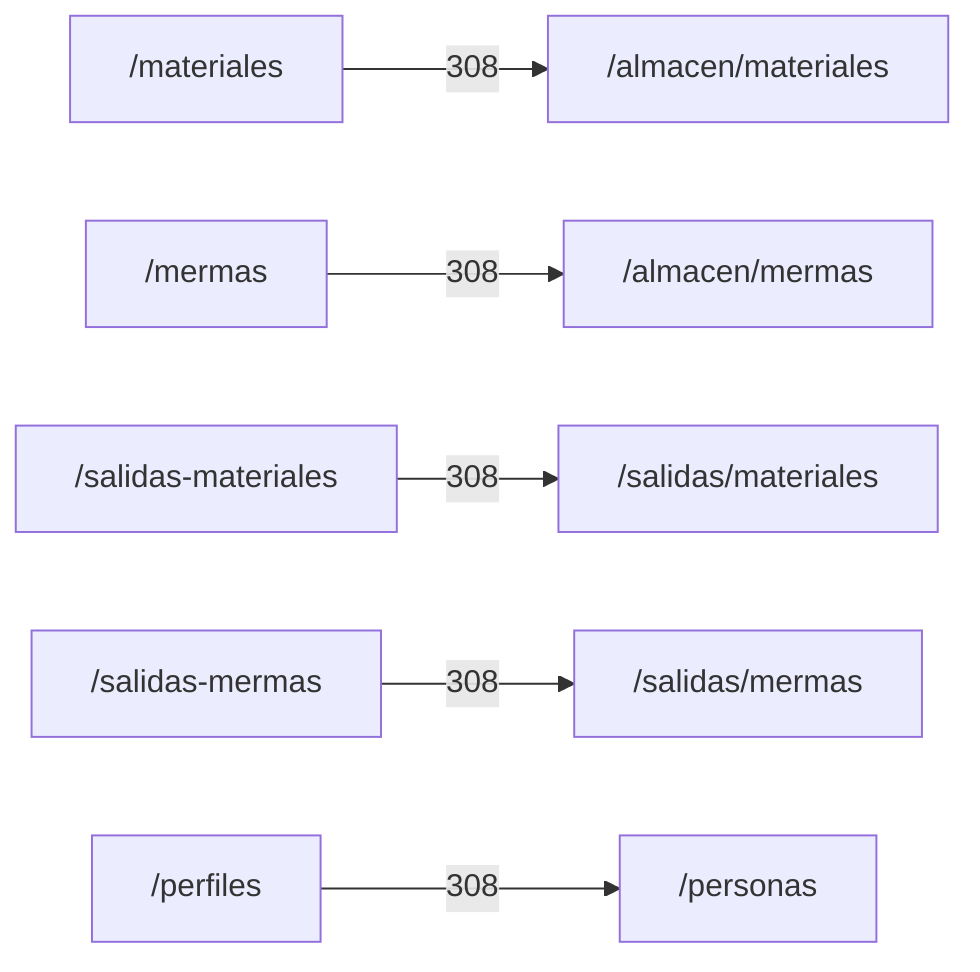

# 3. Catálogo de pantallas

Las pantallas se agrupan por área para no mezclar en una sola tabla los destinos
operativos, administrativos y transversales. Cada fila identifica un destino web
registrado, su propósito y la vista que lo implementa. El acceso se ofrece en el menú
sólo cuando la sesión posee el permiso indicado por
`src/views/layout/ui/navList.ejs`; las rutas vuelven a comprobarlo en el servidor.

### Acceso

| Pantalla y ruta | Propósito visible | Interacciones principales | Implementación EJS |
| --- | --- | --- | --- |
| Inicio de sesión (`/inicio-sesion`) | Autenticar una cuenta. | Capturar credenciales e iniciar sesión. | `src/views/pages/home/login/loginPage.ejs` |

### Área Almacén

| Pantalla y ruta | Propósito visible | Interacciones principales | Implementación EJS |
| --- | --- | --- | --- |
| Existencias (`/almacen/materiales`) | Consultar materiales no clasificados como consumibles y su stock; las columnas `Existencia` y `Costo Unitario de Conversión` mantienen los mismos títulos que en Mermas, y todas las celdas de cada fila, incluido el nombre, se muestran centradas. | Filtrar, paginar y abrir el alta/edición de material. | `src/views/pages/warehouse/materials/materialsPage.ejs` |
| Consumibles (`/almacen/consumibles`) | Administrar las existencias clasificadas explícitamente como consumibles, sin inferirlas de sus dimensiones o unidad. | Buscar y filtrar por proveedor; registrar, editar, retirar, ajustar stock y exportar con los mismos permisos y reglas del inventario de materiales. | `src/views/pages/warehouse/consumables/consumablesPage.ejs` |
| Mermas (`/almacen/mermas`) | Consultar y administrar existencias de merma con todas las celdas de cada fila centradas, incluido el nombre. | Filtrar, registrar/editar, agregar stock para almacén y ajustar stock sólo para administración. | `src/views/pages/warehouse/wastes/wastesPage.ejs` |
| Compras de materiales y consumibles (`/compras/materiales`, `/compras/consumibles`) | Consultar y registrar entradas separadas por tipo de inventario mediante un flujo compartido. | Filtrar, registrar compra, crear el material o consumible del contexto, administrar proveedores y corregir detalles sin mezclar tipos. | `src/views/pages/warehouse/goodsReceipts/goodsReceiptsPage.ejs` |
| Salidas de almacén (`/salidas/materiales`) | Consultar y registrar entregas de materiales. | Filtrar, registrar salida, seleccionar cliente y devolver detalles. | `src/views/pages/warehouse/goodsIssues/goodsIssuesPage.ejs` |
| Salidas de mermas (`/salidas/mermas`) | Consultar y registrar salidas de merma. | Registrar, editar, surtir y devolver detalles de merma. | `src/views/pages/warehouse/wasteIssues/wasteIssuesPage.ejs` |
| Proveedores (`/proveedores`) | Consultar y administrar proveedores. | Crear/editar desde modal. | `src/views/pages/warehouse/suppliers/suppliersPage.ejs` |

### Área Sistemas

**Movimientos** y **Catálogos** son accesos exclusivos del **Administrador del
sistema** del área Sistemas en la política vigente.

| Pantalla y ruta | Propósito visible | Interacciones principales | Implementación EJS |
| --- | --- | --- | --- |
| Catálogos (`/catalogos/departments`, `/catalogos/roles`, `/catalogos/presentations`, `/catalogos/unit-measures`, `/catalogos/reasons`, `/catalogos/fulfillment-statuses`) | Administrar áreas, roles, presentaciones, unidades, motivos y estados desde una pantalla CRUD por catálogo y una implementación compartida por capas. | Elegir uno de los seis accesos del submenú; listar, crear y editar con `catalogs:manage`; sólo para el Administrador del sistema. | `src/views/pages/admin/catalogs/catalogsPage.ejs` |
| Clientes (`/clientes`) | Consultar y administrar clientes. | Crear/editar desde modal. | `src/views/pages/sales/clients/clientsPage.ejs` |
| Usuarios (`/usuarios-sistemas`) | Administrar cuentas y asignaciones. | Crear/editar usuario, roles y departamentos. | `src/views/pages/admin/users/usersPage.ejs` |
| Personas (`/personas`) | Administrar personas participantes del negocio. | Filtrar y crear/editar datos y asignaciones. | `src/views/pages/admin/persons/personsPage.ejs` |
| Movimientos de materiales (`/movimientos/materiales`) | Auditar movimientos del inventario de materiales. | Filtrar, consultar y exportar el historial con `movements:read`; sólo para el Administrador del sistema. | `src/views/pages/admin/movements/movementsPage.ejs` |
| Movimientos de merma (`/movimientos/mermas`) | Auditar movimientos del inventario de merma. | Filtrar, consultar y exportar el historial con `movements:read`; sólo para el Administrador del sistema. | `src/views/pages/admin/movements/movementsPage.ejs` |

### Sistema

| Pantalla y ruta | Propósito visible | Interacciones principales | Implementación EJS |
| --- | --- | --- | --- |
| No encontrada (`/error/404`) | Recuperar al usuario de una URL inexistente. | Volver al inicio apropiado según la sesión. | `src/views/pages/error/notFound/notFoundPage.ejs` |

### Redirecciones de compatibilidad

