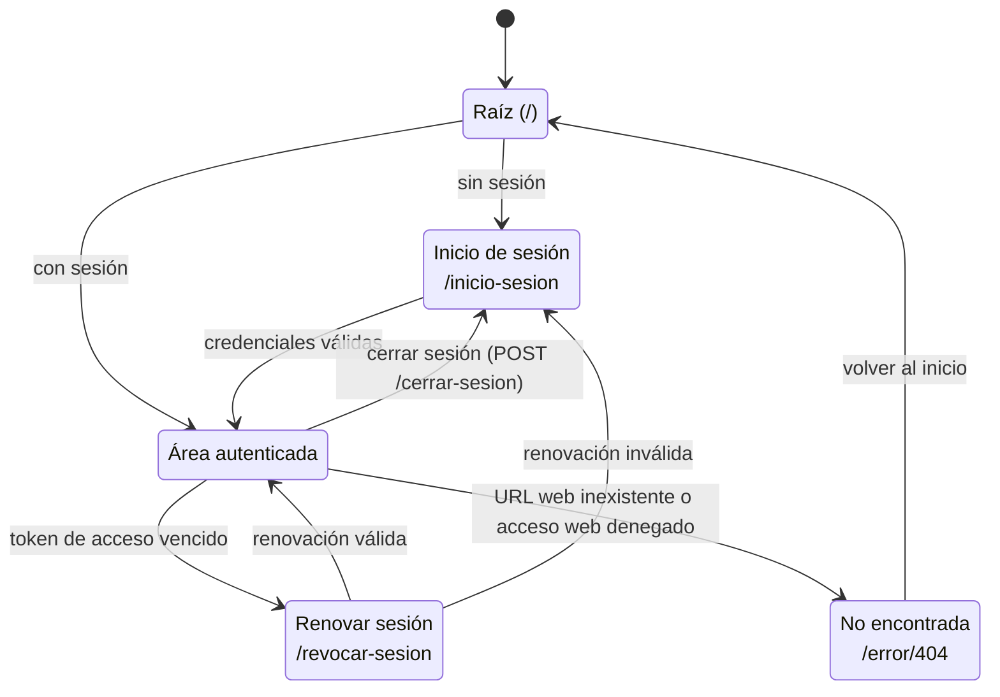
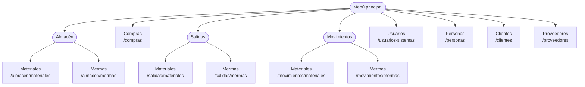

# 2. Mapa visual de navegación

La navegación se documenta con dos vistas para no confundir estados de sesión con la
jerarquía del menú. La primera usa la notación de máquina de estados de Mermaid,
inspirada en UML, porque sus flechas sí representan transiciones. La segunda es un
mapa de sitio dirigido: una flecha significa que el destino se ofrece desde el menú,
no que exista una secuencia obligatoria entre pantallas. Las rutas entre paréntesis
son las URL registradas; el acceso efectivo y la visibilidad de cada opción dependen
de los permisos calculados para la sesión.

El shell usa en todos los tamaños el mismo control de navegación del encabezado. Para
que sea inmediatamente reconocible, ocupa la posición inicial convencional, conserva
el icono de hamburguesa, muestra siempre la etiqueta «Menú principal» y emplea mayor
contraste que las acciones secundarias. El control abre desde arriba y por encima del
contenido un único offcanvas adaptable, con etiquetas completas, por lo que no resta
anchura a tablas y formularios ni redimensiona la página. El panel se ancla a los
cuatro bordes de la ventana y sobrescribe las variables de tamaño del componente de
MDB con el `100%` de su bloque contenedor fijo. También mantiene el desplazamiento
vertical dentro de su cuerpo; así ocupa toda el área visible sin que el alto
predeterminado del offcanvas vuelva a recortarlo al cambiar el tamaño o la orientación.
En anchos menores a `1200px` mantiene una columna fácil de recorrer; a partir de ese
ancho distribuye las opciones en tres columnas, o cuatro desde `1600px`, para
aprovechar el espacio horizontal sin estrechar cada opción ni convertir la navegación
en una barra lateral permanente. Cada acceso de primer nivel forma un bloque visual y
las categorías conservan sus opciones relacionadas dentro de ese bloque. Se mantiene
una única lista semántica y el partial compartido `navList`: las columnas son una
adaptación de presentación, no listas paralelas que puedan divergir en permisos,
estado activo o destinos. La interacción, el estado activo, los permisos y los
submenús conservan una sola implementación en todos los tamaños, y la capa superpuesta
concentra la atención en la navegación.
Durante la apertura, el activador sincroniza `aria-expanded` con los eventos de MDB.
El panel identifica explícitamente su título como «Menú principal», expone la lista
como navegación principal, aporta una instrucción no visible asociada mediante
`aria-describedby` y conserva dentro del encabezado su control compartido de cierre.
Así, la señal visual para abrir permanece siempre reconocible, la interfaz evita texto
explicativo redundante y las acciones de abrir y cerrar están disponibles en el
contexto donde cada una se utiliza.
La identidad se resuelve con un monograma tipográfico, fondos con profundidad y
transiciones breves; no depende de una imagen adicional y respeta la preferencia del
sistema para reducir movimiento.

### Estados de acceso y sesión

Esta máquina cubre las rutas web que no son destinos del menú: raíz, autenticación,
renovación, cierre de sesión y recuperación ante una ruta no encontrada. El estado
«Área autenticada» agrupa las pantallas protegidas inventariadas en el mapa de sitio
siguiente; no representa una pantalla adicional.

### Mapa de sitio del menú principal

El nodo raíz representa el partial compartido `navList`. Los nodos de categoría son
controles que despliegan opciones y no URL; los rectángulos terminales son todas las
pantallas ofrecidas por el menú vigente. Abrir o cerrar el offcanvas no cambia de
pantalla y, por ello, no se modela como transición.

La ruta `/movimientos` redirige a `/movimientos/materiales`; los alias históricos se
documentan en [Redirecciones de compatibilidad](03-catalogo-de-pantallas.md#redirecciones-de-compatibilidad). No
se dibujan los modales CRUD como páginas porque reutilizan el contexto de su pantalla
propietaria y no registran rutas web independientes.
