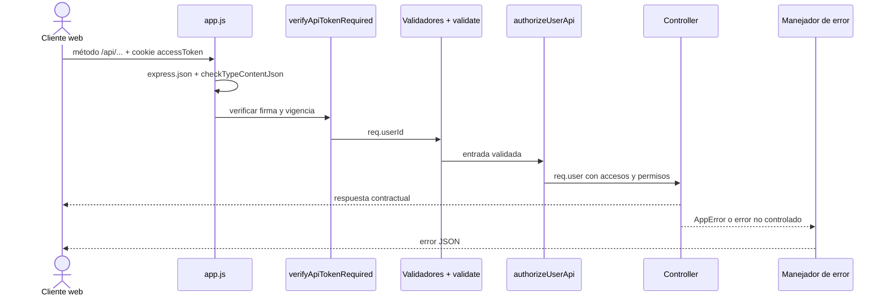

# Contrato de la API

Este documento es propietario del contrato HTTP y no de las reglas de negocio ni del
esquema persistente. La relación con requisitos, diseño y evidencia se consulta en el
[mapa de datos, persistencia y acceso](index.md).

## Cómo documentar una ruta API

La documentación de una ruta combina información de varias capas, pero conserva una
sola ficha contractual en esta familia. El [mapa generado](../generated/code-map.md)
mantiene el inventario de métodos, URLs y archivos; una ficha se agrega aquí sólo cuando
necesita explicar cómo consumir la operación. La explicación interna de nombres y
colaboraciones se mantiene en la
[documentación técnica del código](../architecture/technical-code-documentation.md), sin
copiar el contrato HTTP.

No se adopta una norma ISO como sustituto de una especificación de interfaz HTTP para
Express. [ISO/IEC/IEEE 1016:2009](https://www.iso.org/standard/45144.html) puede orientar
la descripción de interfaces dentro del diseño, pero **OpenAPI 3.1** es la referencia
procesable prevista para métodos, parámetros, cuerpos, respuestas y seguridad. Esta
distinción y el alcance adoptado se conservan en las
[normas documentales](../governance/documentation-standards.md#decisión-para-documentación-técnica-y-rutas-api).

Cada ficha de ruta debe indicar, cuando aplique:

| Campo | Contenido verificable | Fuente que se revisa |
| --- | --- | --- |
| Identidad | Método HTTP, ruta completa y propósito observable. | `src/routes/api/index.js` y router del dominio. |
| Acceso | Cookie de sesión, permiso requerido y respuestas `401` o `403`. | `authMiddleware.js`, `permissions.js` y router. |
| Entrada | Parámetros de ruta, query, tipo de contenido y cuerpo aceptado. | Router, validadores y DTO. |
| Salida correcta | Código HTTP, forma JSON o archivo y código estable de éxito. | Controller y prueba HTTP. |
| Errores | Código HTTP, `code`, `message`, `meta` o `errors` que el consumidor puede interpretar. | Middleware, errores de dominio y manejador final. |
| Efectos | Persistencia, movimiento, auditoría o evento que sea relevante para el consumidor. | Servicio y requisitos; no se infiere sólo desde el verbo HTTP. |
| Evidencia | Prueba de integración que comprueba el contrato o brecha explícita del plan. | `tests/integration` y plan de pruebas. |

No se documenta una respuesta supuesta a partir de convenciones generales. Por ejemplo,
las creaciones vigentes no usan todas el mismo código HTTP: la ficha debe registrar el
`status` real del controller hasta que una decisión funcional cambie y pruebe el
contrato.

### Prefijo, montaje y orden de middleware

`registerApiRoutes` monta los routers declarados en `API_ROUTES` bajo `/api`. Por ello,
la URL contractual se obtiene uniendo `/api`, el prefijo del dominio y el path local del
router. Un `router.patch('/:id/stock', ...)` montado en `/warehouse/materials` se publica
como `PATCH /api/warehouse/materials/:id/stock`.

Para rutas privadas con cuerpo JSON se conserva este recorrido:

El orden concreto se lee de izquierda a derecha en cada declaración del router. La
autenticación suele preceder la validación y la autorización; las excepciones públicas,
como inicio o renovación de sesión, se documentan expresamente y no se fuerzan a usar
middleware que contradiga su propósito. Un cambio de orden puede modificar qué error
observa el consumidor, por lo que se revisa como parte del contrato.

### Reglas transversales vigentes

#### Tipo de contenido

- `express.json()` analiza las peticiones bajo `/api`.
- `checkTypeContentJson` permite `GET`, peticiones sin cuerpo y cuerpos vacíos; cuando
  existe un cuerpo exige que `Content-Type` incluya `application/json`.
- Un tipo incompatible responde `415` con
  `{ "code": "INVALID_CONTENT_TYPE", "contentType": "application/json" }`.
- Las rutas `/upload` y `/text` tienen validadores separados para
  `multipart/form-data` y `text/plain`; no se asume que pertenecen al contrato JSON.

#### Autenticación y autorización

- La API actual recibe el token en la cookie `accessToken`; no documenta un encabezado
  `Authorization: Bearer` porque `verifyApiTokenRequired` no lo consume.
- Una cookie ausente, inválida o vencida responde `401` con
  `{ "code": "INVALID_AUTH" }` y elimina la cookie de acceso cuando corresponde.
- `authorizeUserApi(permission)` vuelve a cargar el usuario, resuelve la política del
  permiso y expone el usuario autorizado como `req.user`.
- Un usuario autenticado sin el rol y departamento exigidos responde `403` con
  `{ "code": "FORBIDDEN" }`; si el usuario ya no existe responde `401`.

#### Validación

- Los arreglos de `express-validator` se ejecutan antes de `validate`.
- Una entrada inválida responde `400` con
  `{ "errors": { "campo": { "code": "..." } }, "code": "VALIDATION_ERROR" }`.
- Los errores de `details` pueden contener errores anidados por índice; la ficha de una
  operación con detalles debe mostrar esa estructura y no reducirla a un string.
- `validateLogin` es una excepción deliberada: una entrada de acceso inválida responde
  `401` con `{ "code": "LOGIN_ERROR" }` para no usar el contrato de formularios CRUD.

#### Respuestas y errores de dominio

- Los listados para DataTables responden `200` con `data`, `recordsTotal` y
  `recordsFiltered`.
- Las escrituras responden con el recurso o resultado y un `code` estable de éxito; el
  código HTTP exacto se documenta por operación.
- Un `AppError` conserva su `statusCode` y responde con `code`, `message` y `meta`.
- Una ruta API inexistente responde `404` con
  `{ "message": "Ruta no encontrada." }`.
- Un error no controlado responde `500` con `code: "SERVER_ERROR"` y se registra con el
  contexto de la petición; ningún contrato debe depender del stack interno.

### Query de listados compatibles con DataTables

Los controladores que reutilizan `requestQueryUtils.js` aceptan estas variantes. Cada
recurso declara por separado sus filtros adicionales y columnas ordenables.

| Concepto | Parámetros aceptados | Normalización |
| --- | --- | --- |
| Inicio | `start` | Entero no negativo; fallback `0`. |
| Tamaño | `length` | Entero no negativo; fallback `10`. |
| Búsqueda | `search`, `search.value` o `search[value]` | String; fallback vacío. |
| Columna | `order[0].column` o `order[0][column]` | Índice hacia la lista segura declarada por el controller. |
| Dirección | `order[0].dir` o `order[0][dir]` | Sólo `asc` o `desc`; cualquier otro valor usa la dirección predeterminada. |

El cliente no envía un nombre de columna arbitrario directamente a Prisma. El
controller traduce el índice usando su arreglo `columns`, lo que forma parte de la
especificación particular del listado.

### Ejemplo aplicado: ajuste de existencias de material

Esta ficha muestra el nivel de detalle esperado; no reemplaza los validadores ni las
reglas de negocio.

| Campo | Contrato vigente |
| --- | --- |
| Identidad | `PATCH /api/warehouse/materials/:id/stock`; registra un ajuste protegido sobre las existencias de un material. |
| Acceso | Cookie `accessToken` válida y permiso `MATERIALS_ADJUST_STOCK`. Respuestas transversales `401` y `403`. |
| Parámetro | `id`: identificador del material leído desde `req.params.id`. |
| Cuerpo JSON | `supplierId`, `newStock`, `reasonId` y `observations`, sujetos a `materialStockValidation`; el DTO sólo conserva esos campos. |
| Validación | `supplierId` y `reasonId` deben ser UUID válidos; `newStock` usa la validación numérica del contexto; `observations` usa la regla compartida de inventario. |
| Respuesta correcta | `200` con `{ "material": { ... }, "code": "UPDATED_MATERIAL" }`. |
| Efectos posteriores | El servicio registra el ajuste y, después de completarlo, el controller emite `inventory-updated` con contexto `material`. |
| Implementación | Router `materialApiRoute.js` → `editMaterialStock` → `createMaterialDtoForStockUpdate` → `updateMaterialStock`. |

Los conflictos y errores de dominio concretos de esta operación deben añadirse a la
ficha cuando estén respaldados por pruebas HTTP. El flujo técnico de una operación
transaccional más compleja se encuentra en el
[ejemplo de salidas de almacén](../architecture/backend-technical-documentation.md#ejemplo-de-dominio-salidas-de-almacén).

## Exportación mensual de reportes

Los endpoints de exportación de compras, salidas y movimientos aceptan
`monthlyReport=true`. En ese modo ignoran los filtros aplicados al listado y consultan
el mes actual de México de forma predeterminada. El parámetro opcional `reportMonth`,
con formato `AAAA-MM`, permite consultar un mes calendario específico; un valor
ausente o inválido conserva el comportamiento seguro del mes actual.

La interfaz conserva **Mes actual** como opción explícita porque es el caso de uso
principal y evita una selección innecesaria. **Otro mes** habilita un selector mensual
Flatpickr —con valor contractual `AAAA-MM`— y **Personalizado** reutiliza los filtros
aplicados al listado; así no se mezclan un periodo calendario completo y un reporte
filtrado. El selector reutiliza los mismos tokens visuales y estados habilitado, enfocado
y deshabilitado de los campos de formulario; así el periodo permanece legible dentro
del modal sin introducir una variante de estilo exclusiva para la exportación.

## Decisión

**Sí conviene adoptar OpenAPI, pero Swagger no sustituye la documentación de
arquitectura.** OpenAPI documentaría el contrato HTTP —rutas, parámetros, payloads,
respuestas, errores y autenticación—; Swagger UI sería sólo una interfaz para consultar
y probar ese contrato.

Nexus todavía no publica un contrato OpenAPI. El
[mapa generado](../generated/code-map.md) inventaría los métodos y rutas reales, pero no
pretende inferir esquemas desde `express-validator`, DTO, controllers y servicios. Una
especificación que sólo liste endpoints daría una falsa sensación de cobertura.

## Propuesta simple

1. Crear un contrato OpenAPI 3.1 versionado, comenzando por un CRUD completo y sus
   errores; clientes o proveedores son mejores candidatos que un flujo transaccional.
2. Reutilizar componentes de esquema para paginación, errores, identificadores y
   respuestas comunes. No copiar el mismo payload entre operaciones o dominios.
3. Validar el contrato en CI y agregar pruebas de integración relacionadas con el CRUD
   documentado, siguiendo [la estrategia de pruebas](../testing/service-test-coverage.md).
4. Publicar Swagger UI sólo como visualizador del contrato. En producción debe quedar
   deshabilitado o protegido si revela operaciones internas.
5. Migrar el siguiente recurso únicamente cuando el anterior describa solicitudes,
   respuestas y errores reales. No declarar la API completa de una vez con esquemas
   incompletos.

## Cuándo implementarlo

Priorizar OpenAPI cuando exista al menos una de estas necesidades:

- integración con otro sistema o equipo;
- generación de clientes o pruebas de contrato;
- consumidores que no pueden leer el código del servidor;
- necesidad de probar endpoints desde una interfaz controlada.

Mientras la aplicación web sea el único consumidor, no es un bloqueo operativo. Aun
así, el contrato aporta valor y debe incorporarse incrementalmente en lugar de intentar
generarlo automáticamente desde rutas que no contienen toda la semántica.

## Fuente de verdad actual

Hasta adoptar OpenAPI, se consulta en este orden:

1. [mapa generado](../generated/code-map.md) para métodos y rutas;
2. `src/routes/api/` para middleware, permisos y validadores;
3. `src/validators/`, `src/dtos/` y controllers para entradas y respuestas;
4. pruebas de integración para comportamiento observable y persistencia.

## Precisión de valores decimales

Los payloads de creación y edición aceptan hasta **8 dígitos enteros y 6 decimales**
para precios, existencias, cantidades y medidas. La API conserva esos seis decimales y
la persistencia usa `DECIMAL(18,6)`; no debe interpretarse una representación visual de
dos decimales como el valor contractual almacenado.

El navegador mantiene hasta seis decimales durante captura, cálculos y envío. Las
tablas, resúmenes y cantidades de sólo lectura reutilizan `formatDecimal` o
`formatCurrency` para mostrar dos decimales. Por tanto, el redondeo es una decisión de
presentación y nunca debe aplicarse al payload antes de crear o actualizar un recurso.

## Relaciones de inventario en el cliente web

Los datos de inventario consumidos por los formularios y listados CRUD conservan las
relaciones `presentation` y `unitMeasure` como objetos. Cuando Select2 las transporta
en atributos HTML, el cliente debe deserializarlas antes de leer `name`, `symbol` o
`id`; una cadena con el nombre de la presentación no forma parte de este contrato.

## Presentación de conflictos en el cliente web

Las respuestas HTTP `409` conservan un código de error estable en `code` y una
descripción legible en `message`. El cliente muestra ambos valores en el modal de
advertencia: el código identifica el conflicto en el título y el mensaje explica la
causa en el texto normal. Si la respuesta no incluye `code`, el título usa
**Conflicto**; si no incluye `message`, el texto reutiliza el mensaje asociado al
código o el fallback general del manejador de errores.
