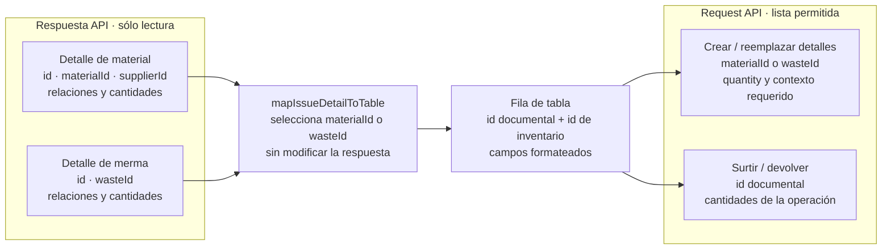

# Patrones de diseño y construcción aplicados

## Alcance de la revisión

Este documento registra patrones que tienen evidencia repetida en el código. Distingue
un **patrón formal o arquitectónico** de una simple función con un nombre parecido. El
objetivo no es asignar etiquetas GoF a todo el repositorio, sino saber qué solución debe
reutilizarse antes de construir otro flujo y dónde terminan sus límites.

## Resumen de patrones confirmados

| Nivel | Patrón o estrategia confirmada | Evidencia principal |
| --- | --- | --- |
| Arquitectura | Monolito modular organizado por dominio y capas | `src/routes`, `controllers`, `services`, `repository`, `views` y `public/js`, subdivididos en `admin`, `sales` y `warehouse` cuando aplica. |
| Transporte | Pipeline de middleware de Express | Rutas que componen autenticación, validadores, autorización y controller en un orden explícito. |
| Frontera | DTO funcional para normalizar entrada | Módulos bajo `src/dtos` que extraen y normalizan campos antes de llegar al servicio. |
| Autorización | Políticas declarativas como datos inmutables | `PERMISSIONS`, `AUTHORIZATION_POLICIES`, `createPolicy` y `getGrantedPermissions`. |
| Construcción | Factory functions configurables | `createCrudApplication`, `createIssueApplication` y `createDataTableListController`. |
| Composición | Extensión por composición de objetos | `createIssueApplication` incorpora el CRUD común y agrega encabezado, detalles y devolución sin herencia. |
| Persistencia | Propagación explícita del contexto transaccional | `getDb(tx)` selecciona la transacción recibida o el cliente Prisma compartido. |
| Consistencia | Límite transaccional para un caso de uso | Servicios que ejecutan documento, detalle, existencia y movimiento dentro de `$transaction`. |
| Integración | Publicación de eventos de actualización | `emitInventoryUpdated` traduce un contexto de inventario en eventos Socket.IO. |
| Presentación | Composición de componentes y ownership por recurso | `src/views/shared`, `src/public/js/ui`, `plugins` y componentes que permanecen en la carpeta de su recurso. |
| Pruebas | Test harness configurable | `createControllerTestApp` registra sólo las rutas necesarias para probar controllers con Supertest. |

## 1. Monolito modular por dominio y arquitectura por capas

Nexus se despliega como una aplicación, pero organiza responsabilidades por dominio y
capa. El recorrido habitual es:

```text
ruta/middleware → controller/DTO → servicio de dominio → Prisma → PostgreSQL
```

En el navegador, `services` encapsula HTTP, `application` expresa operaciones del caso
de uso y `pages` compone comportamiento visual. Esto se parece a MVC en algunos puntos,
pero no se declara un MVC estricto: los servicios de dominio, DTO, JavaScript del
navegador y eventos no encajan en tres componentes únicos.

**Regla de construcción:** un recurso nuevo conserva el mismo dominio y nombre a través
de sus capas. No se crea una carpeta horizontal nueva sólo para una operación CRUD.

## 2. Pipeline de middleware

Express construye cada endpoint como una secuencia de funciones. Nexus reutiliza esa
capacidad como pipeline: autenticación, validación de campos, consolidación de errores,
autorización y controller se ejecutan en el orden declarado por la ruta.

No se denomina automáticamente *Chain of Responsibility*: los middleware no eligen
libremente otro manejador; forman una tubería definida por Express. La propiedad que se
debe conservar es el **orden visible y revisable**, con seguridad y validación en el
servidor antes de la mutación.

**Pruebas:** los casos negativos verifican que una entrada o sesión inválida no alcance
el servicio ni escriba datos; la integración CRUD atraviesa el pipeline real.

## 3. DTO funcional y políticas declarativas

Los módulos de `src/dtos` aplican el patrón **Data Transfer Object** sin requerir clases:
seleccionan campos aceptados y normalizan valores de transporte antes de invocar el
servicio. Un DTO no contiene autorización ni reemplaza validadores o reglas de negocio.
Se reutiliza uno existente cuando dos endpoints aceptan el mismo contrato; no se fuerza
si una mutación especializada necesita campos o semántica diferentes.

La autorización se construye como una tabla inmutable: una clave de `PERMISSIONS` apunta
a roles y departamentos en `AUTHORIZATION_POLICIES`. `createPolicy` congela la
configuración y `getGrantedPermissions` la evalúa para los accesos de la sesión. Es una
**política declarativa**, no el patrón GoF *Strategy*: no intercambia algoritmos, sino
datos de decisión consumidos por un evaluador común.

**Regla de construcción:** un endpoint nuevo reutiliza un permiso existente sólo si la
capacidad y alcance son los mismos. Una operación especializada con riesgo distinto
recibe su propia clave y casos negativos de autorización.

## 4. Factory functions y composición de aplicaciones

### CRUD común del navegador

`createCrudApplication` recibe requests y claves de respuesta, y construye un objeto
inmutable con `getAll`, `register` y `edit`. `createApplicationMutation` concentra la
adaptación de `formData`, `id`, `detailId`, opciones adicionales de contexto y la
respuesta exitosa. La opción `additionalMutations` agrega al mismo objeto operaciones
con ese contrato, usando una clave de respuesta por nombre cuando corresponde.
Personas, usuarios, clientes, proveedores, materiales, mermas, entradas y salidas
configuran esta misma construcción; cada módulo conserva sus nombres de dominio y
adapta únicamente el payload que realmente difiere.

La aplicación no vuelve a enumerar campos que ya fueron seleccionados por el formulario
y normalizados por el DTO del servidor. Materiales envía el objeto recibido sin
reconstruirlo; su único adaptador de registro elimina `maxUnitCost` cuando el contexto
es una entrada de compra, porque ese costo procede del detalle de la entrada. Esta
excepción contextual no sustituye los mapeos existentes ni crea un segundo DTO en el
navegador.

Los listados CRUD devuelven la respuesta del recurso; no agregan métodos `get*Options`
si Select2 ya dispone de `mapOption` para construir `{ id, text }`. Proveedores y
materiales usan directamente `getAllSuppliers` y `getAllMaterials`, tanto en el AJAX del
select como en filtros. Un adaptador de opciones sólo permanece cuando resuelve una
necesidad distinta, por ejemplo precargar «Pendiente» o elegir la primera persona de un
departamento antes de inicializar el filtro.

El objeto construido permanece privado dentro del módulo de contexto. La frontera
pública son exports nombrados en lenguaje de dominio (`registerUser`,
`editGoodsReceiptHeader`, `returnWasteIssueDetail`, etc.), no un export del objeto
genérico. Así los consumidores no dependen de claves como `register`, `edit` o de la
forma interna de la factory; además pueden importar sólo la capacidad que utilizan.
Las referencias exportadas conservan también el formato de entrada de la factory:
`deleteMaterial` recibe `{ id }`, igual que las demás mutaciones, para que datatable,
aplicación y servicio no alternen firmas.

### Especialización de salidas

`createIssueApplication` configura `createCrudApplication` con `editHeader`,
`editDetails` y `returnDetail` como mutaciones adicionales. Salidas de material y de
merma inyectan sus requests y claves; no duplican la coordinación. Entradas de compra
replican el mismo criterio directamente con corrección y cancelación de detalle,
porque sus nombres y reglas de documento son distintos aunque el transporte coincida.

Se exporta **la función constructora** `createIssueApplication`, no una aplicación de
salida ya creada. Es un punto de composición compartido: cada módulo de salida la llama
con sus propios requests, guarda localmente la instancia resultante y publica sólo sus
operaciones de dominio. Mantener exportable el constructor permite que material y
merma repliquen el mismo proceso sin compartir estado ni exponer el objeto genérico a
la UI.

### Listados de catálogos

`createDataTableListController` construye controllers de lectura configurando función
de consulta, columnas y orden predeterminado. Roles, departamentos, presentaciones,
unidades, motivos y estados de cumplimiento reutilizan el mismo parsing de DataTable.

Son **factory functions**, no los patrones GoF *Factory Method* o *Abstract Factory*:
no existe jerarquía de creadores/productos. Tampoco `createIssueApplication` es
*Template Method*, porque especializa por composición de objetos y no por herencia.

**Regla de construcción:** primero se intenta configurar una factory existente. Sólo se
amplía la abstracción si la nueva operación conserva el mismo contrato en al menos dos
contextos; una diferencia exclusiva permanece en el módulo propietario.

**Regla de exposición:** no se exporta la instancia producida por la factory desde un
módulo de contexto. Se exportan referencias nombradas a sus operaciones, o un adaptador
cuando la firma de dominio difiere. Una función constructora puede exportarse desde un
módulo compartido cuando al menos dos contextos la consumen; su resultado permanece
privado en cada consumidor.

## 5. Contexto transaccional y consistencia atómica

`src/repository/baseRepository.js` expone únicamente `getDb(tx)`: propaga el cliente de
transacción cuando el caso de uso ya está dentro de `$transaction`, o usa Prisma cuando
no lo está. Esto permite que servicios auxiliares participen en la misma operación
atómica sin abrir transacciones anidadas ni depender de una variable global de
transacción.

El archivo **no implementa actualmente el patrón Repository completo**: no encapsula
colecciones ni ofrece repositorios por agregado. Tampoco se declara una implementación
propia de *Unit of Work*; Prisma administra el commit/rollback. La estrategia real es
**Transaction Script con propagación explícita de contexto**, coordinado por servicios
de caso de uso.

**Regla de construcción:** una operación que modifica documento, detalle, existencia y
movimiento abre un solo límite `$transaction` y pasa `tx` a las funciones participantes.
La prueba de integración debe demostrar tanto el efecto completo como el rollback.

## 6. Publicación de eventos de inventario

`emitInventoryUpdated` funciona como publicador: recibe `material` o `waste`, resuelve
los nombres de eventos y notifica inventario y movimientos mediante Socket.IO. Los
controllers publican sólo después de una mutación exitosa.

Es una aplicación ligera de **Publish/Subscribe** en el borde de presentación, no un bus
de eventos de dominio durable: no persiste mensajes, no garantiza entrega y no sustituye
la transacción. Una nueva notificación de inventario debe reutilizar este publicador;
otro tipo de evento sólo se incorpora aquí si comparte el mismo contrato y ciclo de
vida.

## 7. Composición y propiedad de componentes visuales

Los partials de `src/views/shared` y las piezas independientes del recurso bajo
`public/js/ui` o `plugins` se componen desde páginas específicas. Un formulario o modal
reutilizado por varias pantallas puede seguir perteneciendo a su recurso si conoce sus
selectores, validaciones y operaciones.

Este criterio evita dos extremos: duplicar componentes por contexto y crear una
abstracción «compartida» que todavía depende de un recurso concreto. Al editar EJS se
preserva el cierre final de `contentFor` en su lugar; no se elimina y vuelve a agregar
como efecto secundario de una refactorización.

### Contrato de los selects en modales

Los módulos de `plugins/select2/domains` reciben un `baseSelector` ya delimitado cuando
inicializan directamente un dominio. Las funciones de composición `setup*Select`, en
cambio, reciben el selector relativo del control y lo combinan una sola vez con
`modalSelector`. El contenedor del modal se pasa también a cada inicializador para que
Select2 inserte el desplegable dentro del contexto visual correcto.

Los módulos de página conservan esta distinción al reutilizar los selects: reconstruyen
sus selectores delimitados cada vez que se monta el componente, usan el formulario del
CRUD correspondiente para resolver su modo y limpian el control, no el formulario que
lo contiene. Las pruebas unitarias de frontend en
`tests/unit/public/js/plugins/select2` verifican este contrato para materiales y salidas
de merma sin duplicar el recorrido CRUD persistente de las integraciones.

El CRUD de merma reutiliza `mapSelectMaterialData`, el mismo adaptador del dominio de
materiales, tanto para los resultados remotos como para restablecer la relación incluida
al editar. El adaptador, los accesores de material/merma y el texto común viven en
`public/js/utils/warehouseInventoryUtils.js`: su alcance incluye Select2, DataTables y
páginas de inventario, por lo que no pertenecen exclusivamente a un plugin de selects.
De este modo el `id` de Select2 continúa siendo el de proveedor-material y el texto
conserva material, medidas y proveedor sin mantener un segundo normalizador ni
introducir otro flujo de consulta. Las decisiones visuales dependientes de la
presentación se resuelven con `getPresentation` sobre el material de la opción, sin
duplicar ese dato como un atributo adicional de Select2.

## 8. Patrones de construcción de pruebas

`createControllerTestApp` es una factory de test harness: crea una aplicación Express
mínima, instala parsing JSON y deja que cada prueba registre las rutas necesarias. Se
reutiliza en unitarias de borde e integraciones de controller en vez de reconstruir una
aplicación distinta por CRUD.

La ubicación sigue indicando el propósito:

- reglas aisladas y efectos negativos en `tests/unit/controllers/<tipo>/<dominio>`;
- CRUD real por HTTP y Prisma en `tests/integration/controllers`;
- helpers compartidos en `tests/helpers`, con pruebas propias cuando contienen lógica.

Compartir harness o casos tabulados no elimina la integración de cada contexto: ésta
debe demostrar router, permiso, configuración, persistencia y efectos propios.

## Decisión antes de crear otro flujo

1. **¿Es listar/crear/editar con el mismo contrato del navegador?** Configurar
   `createCrudApplication`.
2. **¿Es una salida con encabezado, detalles y devolución?** Configurar
   `createIssueApplication` y conservar requests/servicios por contexto.
3. **¿Es un catálogo de sólo lectura para DataTable?** Configurar
   `createDataTableListController`.
4. **¿Participa en una escritura compuesta?** Recibir y propagar `tx` mediante `getDb`.
5. **¿Notifica un cambio de inventario confirmado?** Reutilizar
   `emitInventoryUpdated` después de la mutación.
6. **¿La UI ignora el recurso que la consume?** Reutilizar o extraer a `ui`, `plugins` o
   `views/shared`; si conoce el recurso, mantenerla con su propietario.
7. **¿Sólo cambia material por merma u otro contexto?** Parametrizar primero; separar
   únicamente reglas, permisos, persistencia o lenguaje que sean realmente distintos.

## Mantenimiento

Un patrón se documenta como aplicado sólo cuando hay al menos una implementación y un
uso verificables. Si una refactorización cambia su contrato o elimina sus consumidores,
se actualizan este documento, los diagramas, la matriz de operaciones y las pruebas
relacionadas. Los patrones propuestos se describen como decisión pendiente, nunca como
arquitectura vigente.
### Adaptadores de detalles de inventario

Las respuestas de salidas de material y de merma se consideran objetos de solo
lectura. Antes de mostrarlas, el adaptador compartido de
`warehouseInventoryUtils.js` identifica si cada detalle contiene `materialId` o
`wasteId`, crea una fila nueva y conserva por separado el identificador del detalle
documental y el del material o merma. El primer identificador se usa al surtir o
devolver; el segundo,
al crear o reemplazar detalles del CRUD. Los adaptadores de request aplican una
lista permitida de campos. Para crear o reemplazar detalles, el navegador conserva el
adaptador específico del inventario; al surtir, `mapIssueDetailsToSupplyRequest` recorre
las filas una sola vez y conserva únicamente `id`, `isSupplied` y
`projectConvertedQuantity` de las nuevas selecciones. Los DTO de salida vuelven a
aplicar esa lista permitida como frontera del servidor. La etiqueta compartida de
select y tabla obtiene el nombre del material y del proveedor mediante getters que
encapsulan las variantes del contrato (`material`, `supplierMaterial` o valores ya
aplanados), en lugar de repetir navegación opcional dentro del formateador.

#### Vista del contrato de datos de los detalles

Esta vista focalizada responde, para desarrollo y revisión, **qué identidad conserva
cada etapa** entre la respuesta HTTP, la tabla y los requests de una salida. Su alcance
es sólo la adaptación en el navegador; no sustituye el futuro contrato OpenAPI ni el
diagrama ER. La fuente de verdad son los DTO de salidas y los adaptadores de
`warehouseInventoryUtils.js`; `issueFormUI.js` conserva únicamente coordinación visual.



Las flechas expresan transformación de datos, no llamadas entre capas. `id` siempre
identifica el detalle documental; `materialId` y `wasteId` identifican el elemento de
inventario según el contexto. El diagrama se revisa cuando cambien los DTO de salida,
los campos permitidos de un request o `mapIssueDetailToTable`; `npm run docs:check`
continúa validando únicamente las vistas generadas, por lo que esta vista curada también
requiere revisión visual de Mermaid.
