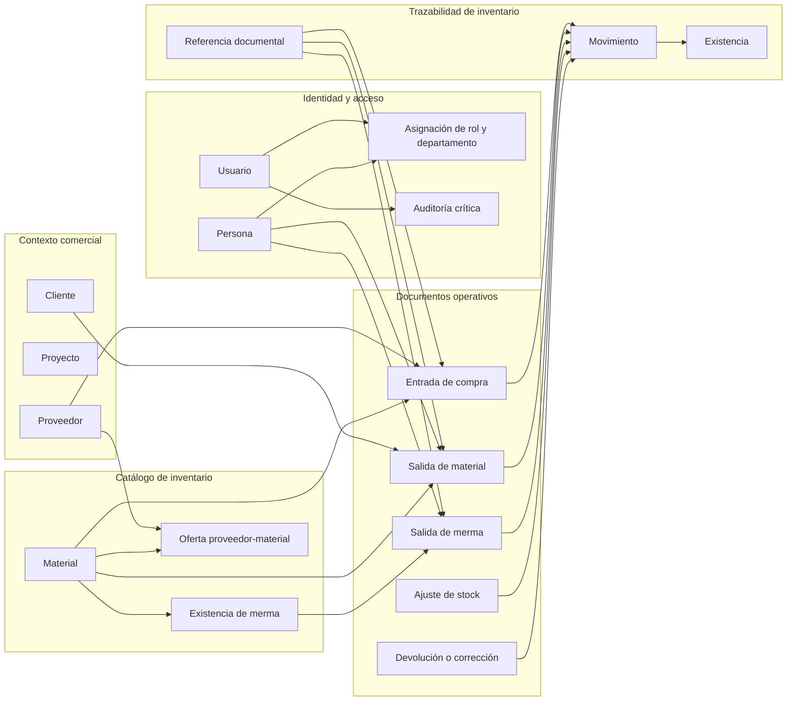
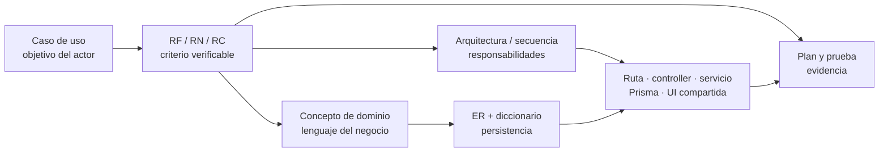

# Modelo de dominio, casos de uso y relación entre vistas

## Alcance y decisión

La documentación anterior ya contenía diagramas ER y un mapa de capacidades por actor,
pero faltaban dos vistas explícitas:

1. un **modelo de dominio conceptual**, independiente de tablas y detalles de Prisma;
2. una **vista de casos de uso**, que separe lo disponible de lo solamente modelado.

Se agregan como vistas curadas porque el código no puede inferir por sí solo el lenguaje
del negocio, el propósito de una relación ni la intención de un actor. Los diagramas ER
y el diccionario técnico continúan generándose desde Prisma.

## Modelo de dominio conceptual

Este diagrama muestra conceptos y relaciones del negocio, no clases JavaScript,
cardinalidades SQL ni todos los campos persistidos. Un concepto puede materializarse en
varios modelos Prisma o coordinarse mediante funciones de servicio. Sus nombres siguen
el [glosario del negocio](business-glossary.md).

Las flechas significan «participa en» o «produce/afecta» según la etiqueta del concepto;
no expresan una clave foránea concreta. Para cardinalidades y propiedad de relaciones se
consulta el [diagrama ER](generated/database-schema.md); para campos y restricciones
técnicas, el [diccionario de datos](generated/data-dictionary.md).

## Casos de uso por actor

El mapa funcional existente se adopta como la vista canónica de casos de uso y se
renombra explícitamente en [diagramas de requisitos](requirements-diagrams.md). Agrupa
objetivos por actor, enlaza la especificación y diferencia capacidades vigentes de las
pendientes; no se crea aquí un segundo diagrama que pueda divergir.

Un caso de uso representa un objetivo observable y puede atravesar varias rutas y
servicios. El inventario de endpoints permanece en el mapa generado, mientras el estado
y el criterio de aceptación permanecen en la especificación de requisitos.

## ¿Hace falta un diagrama de clases?

No se agrega un diagrama de clases global en el estado actual. La aplicación se
implementa principalmente con módulos y funciones JavaScript, factories configurables,
objetos Prisma generados y plantillas EJS; representar cada módulo como una «clase»
produciría una vista engañosa y duplicaría el mapa de dependencias.

La necesidad se cubre mejor con:

- el diagrama de capas y la secuencia para responsabilidades en ejecución;
- el mapa generado de imports para dependencias de código;
- el modelo de dominio para conceptos de negocio;
- el ER y el diccionario para estructura persistente.

Se añadirá un diagrama de clases **focalizado**, no global, cuando exista una jerarquía o
colaboración real de clases cuyo contrato no se entienda mejor mediante esas vistas. En
ese caso mostrará únicamente clases existentes, responsabilidades, herencia/composición
y el caso de uso que justifica la vista.

## Relación y trazabilidad entre diagramas

Cada vista responde una pregunta distinta y se conecta mediante identificadores o
nombres estables; ninguna sustituye a las demás.

| Cambio | Vistas que se revisan |
| --- | --- |
| Nuevo objetivo de actor | Caso de uso, requisito y plan de pruebas; después dominio, arquitectura y datos afectados. |
| Nueva regla o estado | Requisito y diagrama de estados; servicio y pruebas de decisión/límite correspondientes. |
| Nuevo concepto de negocio | Modelo de dominio; sólo después modelos Prisma, ER y diccionario si requiere persistencia. |
| Cambio de modelo Prisma | ER y diccionario generados; dominio únicamente si cambia el significado del negocio. |
| Nueva dependencia externa o límite de ejecución | Contexto, contenedores y, cuando exista infraestructura verificable, despliegue. |
| Nuevo CRUD en otro contexto | Revisar primero fábrica, componentes y ciclo CRUD existentes; documentar sólo la diferencia real. |

## Otras vistas evaluadas

- **Datos:** el ER existente cubre relaciones y cardinalidades; se complementa con el
  nuevo diccionario técnico generado. No se crea un segundo ER manual.
- **Despliegue:** queda pendiente hasta que exista una topología verificable de ambientes,
  nodos, redes y servicios administrados. El diagrama de contenedores no debe inventarla.
- **Estados:** se mantiene el ciclo CRUD transversal y se agregan diagramas focalizados
  sólo para documentos con transiciones de negocio propias.
- **Componentes:** la vista de capas y el mapa de imports cubren el nivel actual. Se crea
  una vista por componente únicamente si una decisión no puede explicarse allí.

Todas estas vistas aplican las [convenciones de diagramas](diagram-conventions.md).
