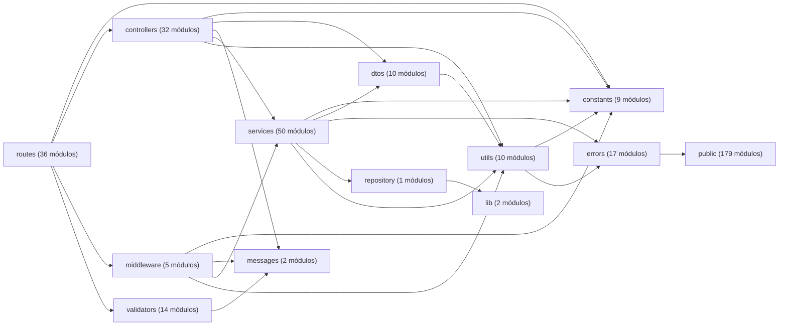

<!-- Archivo generado por scripts/generateArchitectureDocs.js. No editar manualmente. -->
# Mapa del código

Este inventario se genera **a partir del código fuente**. Ejecuta `npm run docs:architecture`
después de cambiar rutas o dependencias entre capas; `npm run docs:check` detecta si esta
versión quedó desactualizada. La semántica y el patrón de esta vista se describen en las
[convenciones de diagramas](../architecture/diagram-conventions.md).

## Dependencias entre áreas

Cada flecha representa al menos un `import` relativo desde el área de origen hacia el
área de destino. El diagrama permite detectar acoplamientos reales sin intentar mostrar
cada archivo individual.

> Alcance: módulos JavaScript bajo `src/`. Los recursos EJS, CSS y el esquema Prisma se
> explican en la documentación curada, porque una lista automática no describe sus
> decisiones de diseño.

## Endpoints API (61)

| Método | Ruta | Definición |
| --- | --- | --- |
| `POST` | `/api/auth/login` | [`src/routes/api/authApiRoute.js`](../../src/routes/api/authApiRoute.js) |
| `GET` | `/api/auth/me` | [`src/routes/api/authApiRoute.js`](../../src/routes/api/authApiRoute.js) |
| `POST` | `/api/auth/refresh` | [`src/routes/api/authApiRoute.js`](../../src/routes/api/authApiRoute.js) |
| `GET` | `/api/sales/clients` | [`src/routes/api/sales/clientApiRoute.js`](../../src/routes/api/sales/clientApiRoute.js) |
| `POST` | `/api/sales/clients` | [`src/routes/api/sales/clientApiRoute.js`](../../src/routes/api/sales/clientApiRoute.js) |
| `PUT` | `/api/sales/clients/:id` | [`src/routes/api/sales/clientApiRoute.js`](../../src/routes/api/sales/clientApiRoute.js) |
| `GET` | `/api/sales/reports/clients/excel` | [`src/routes/api/sales/reportApiRoute.js`](../../src/routes/api/sales/reportApiRoute.js) |
| `GET` | `/api/warehouse/materials` | [`src/routes/api/warehouse/materialApiRoute.js`](../../src/routes/api/warehouse/materialApiRoute.js) |
| `POST` | `/api/warehouse/materials` | [`src/routes/api/warehouse/materialApiRoute.js`](../../src/routes/api/warehouse/materialApiRoute.js) |
| `PATCH` | `/api/warehouse/materials/:id` | [`src/routes/api/warehouse/materialApiRoute.js`](../../src/routes/api/warehouse/materialApiRoute.js) |
| `PATCH` | `/api/warehouse/materials/:id/stock` | [`src/routes/api/warehouse/materialApiRoute.js`](../../src/routes/api/warehouse/materialApiRoute.js) |
| `DELETE` | `/api/warehouse/materials/:id` | [`src/routes/api/warehouse/materialApiRoute.js`](../../src/routes/api/warehouse/materialApiRoute.js) |
| `GET` | `/api/warehouse/wastes/material-templates` | [`src/routes/api/warehouse/wasteApiRoute.js`](../../src/routes/api/warehouse/wasteApiRoute.js) |
| `GET` | `/api/warehouse/wastes` | [`src/routes/api/warehouse/wasteApiRoute.js`](../../src/routes/api/warehouse/wasteApiRoute.js) |
| `POST` | `/api/warehouse/wastes` | [`src/routes/api/warehouse/wasteApiRoute.js`](../../src/routes/api/warehouse/wasteApiRoute.js) |
| `PATCH` | `/api/warehouse/wastes/:id` | [`src/routes/api/warehouse/wasteApiRoute.js`](../../src/routes/api/warehouse/wasteApiRoute.js) |
| `PATCH` | `/api/warehouse/wastes/:id/stock` | [`src/routes/api/warehouse/wasteApiRoute.js`](../../src/routes/api/warehouse/wasteApiRoute.js) |
| `GET` | `/api/warehouse/waste-issues` | [`src/routes/api/warehouse/wasteIssueApiRoute.js`](../../src/routes/api/warehouse/wasteIssueApiRoute.js) |
| `POST` | `/api/warehouse/waste-issues` | [`src/routes/api/warehouse/wasteIssueApiRoute.js`](../../src/routes/api/warehouse/wasteIssueApiRoute.js) |
| `PATCH` | `/api/warehouse/waste-issues/:id` | [`src/routes/api/warehouse/wasteIssueApiRoute.js`](../../src/routes/api/warehouse/wasteIssueApiRoute.js) |
| `PATCH` | `/api/warehouse/waste-issues/:id/header` | [`src/routes/api/warehouse/wasteIssueApiRoute.js`](../../src/routes/api/warehouse/wasteIssueApiRoute.js) |
| `PATCH` | `/api/warehouse/waste-issues/:id/details` | [`src/routes/api/warehouse/wasteIssueApiRoute.js`](../../src/routes/api/warehouse/wasteIssueApiRoute.js) |
| `PATCH` | `/api/warehouse/waste-issues/:id/details/:detailId/returns` | [`src/routes/api/warehouse/wasteIssueApiRoute.js`](../../src/routes/api/warehouse/wasteIssueApiRoute.js) |
| `GET` | `/api/warehouse/suppliers` | [`src/routes/api/warehouse/supplierApiRoute.js`](../../src/routes/api/warehouse/supplierApiRoute.js) |
| `POST` | `/api/warehouse/suppliers` | [`src/routes/api/warehouse/supplierApiRoute.js`](../../src/routes/api/warehouse/supplierApiRoute.js) |
| `PUT` | `/api/warehouse/suppliers/:id` | [`src/routes/api/warehouse/supplierApiRoute.js`](../../src/routes/api/warehouse/supplierApiRoute.js) |
| `GET` | `/api/warehouse/goods-receipts` | [`src/routes/api/warehouse/goodsReceiptApiRoute.js`](../../src/routes/api/warehouse/goodsReceiptApiRoute.js) |
| `POST` | `/api/warehouse/goods-receipts` | [`src/routes/api/warehouse/goodsReceiptApiRoute.js`](../../src/routes/api/warehouse/goodsReceiptApiRoute.js) |
| `PATCH` | `/api/warehouse/goods-receipts/:id` | [`src/routes/api/warehouse/goodsReceiptApiRoute.js`](../../src/routes/api/warehouse/goodsReceiptApiRoute.js) |
| `PATCH` | `/api/warehouse/goods-receipts/:id/details/:detailId/corrections` | [`src/routes/api/warehouse/goodsReceiptApiRoute.js`](../../src/routes/api/warehouse/goodsReceiptApiRoute.js) |
| `PATCH` | `/api/warehouse/goods-receipts/:id/details/:detailId/cancel` | [`src/routes/api/warehouse/goodsReceiptApiRoute.js`](../../src/routes/api/warehouse/goodsReceiptApiRoute.js) |
| `GET` | `/api/warehouse/goods-issues` | [`src/routes/api/warehouse/goodsIssueApiRoute.js`](../../src/routes/api/warehouse/goodsIssueApiRoute.js) |
| `POST` | `/api/warehouse/goods-issues` | [`src/routes/api/warehouse/goodsIssueApiRoute.js`](../../src/routes/api/warehouse/goodsIssueApiRoute.js) |
| `PATCH` | `/api/warehouse/goods-issues/:id` | [`src/routes/api/warehouse/goodsIssueApiRoute.js`](../../src/routes/api/warehouse/goodsIssueApiRoute.js) |
| `PATCH` | `/api/warehouse/goods-issues/:id/header` | [`src/routes/api/warehouse/goodsIssueApiRoute.js`](../../src/routes/api/warehouse/goodsIssueApiRoute.js) |
| `PATCH` | `/api/warehouse/goods-issues/:id/details` | [`src/routes/api/warehouse/goodsIssueApiRoute.js`](../../src/routes/api/warehouse/goodsIssueApiRoute.js) |
| `PATCH` | `/api/warehouse/goods-issues/:id/details/:detailId/returns` | [`src/routes/api/warehouse/goodsIssueApiRoute.js`](../../src/routes/api/warehouse/goodsIssueApiRoute.js) |
| `GET` | `/api/warehouse/reports/inventory/excel` | [`src/routes/api/warehouse/reportApiRoute.js`](../../src/routes/api/warehouse/reportApiRoute.js) |
| `GET` | `/api/warehouse/reports/goods-issues/excel` | [`src/routes/api/warehouse/reportApiRoute.js`](../../src/routes/api/warehouse/reportApiRoute.js) |
| `GET` | `/api/warehouse/reports/waste-issues/excel` | [`src/routes/api/warehouse/reportApiRoute.js`](../../src/routes/api/warehouse/reportApiRoute.js) |
| `GET` | `/api/warehouse/reports/goods-receipts/excel` | [`src/routes/api/warehouse/reportApiRoute.js`](../../src/routes/api/warehouse/reportApiRoute.js) |
| `GET` | `/api/warehouse/reports/wastes/excel` | [`src/routes/api/warehouse/reportApiRoute.js`](../../src/routes/api/warehouse/reportApiRoute.js) |
| `GET` | `/api/warehouse/reports/suppliers/excel` | [`src/routes/api/warehouse/reportApiRoute.js`](../../src/routes/api/warehouse/reportApiRoute.js) |
| `GET` | `/api/warehouse/unit-measures` | [`src/routes/api/warehouse/unitMeasureApiRoute.js`](../../src/routes/api/warehouse/unitMeasureApiRoute.js) |
| `GET` | `/api/warehouse/presentations` | [`src/routes/api/warehouse/presentationApiRoute.js`](../../src/routes/api/warehouse/presentationApiRoute.js) |
| `GET` | `/api/warehouse/reasons` | [`src/routes/api/warehouse/reasonApiRoute.js`](../../src/routes/api/warehouse/reasonApiRoute.js) |
| `GET` | `/api/warehouse/fulfillment-statuses` | [`src/routes/api/warehouse/fulfillmentStatusApiRoute.js`](../../src/routes/api/warehouse/fulfillmentStatusApiRoute.js) |
| `GET` | `/api/admin/users` | [`src/routes/api/admin/userApiRoute.js`](../../src/routes/api/admin/userApiRoute.js) |
| `POST` | `/api/admin/users` | [`src/routes/api/admin/userApiRoute.js`](../../src/routes/api/admin/userApiRoute.js) |
| `PATCH` | `/api/admin/users/:id` | [`src/routes/api/admin/userApiRoute.js`](../../src/routes/api/admin/userApiRoute.js) |
| `PATCH` | `/api/admin/users/:id/password` | [`src/routes/api/admin/userApiRoute.js`](../../src/routes/api/admin/userApiRoute.js) |
| `GET` | `/api/admin/roles` | [`src/routes/api/admin/roleApiRoute.js`](../../src/routes/api/admin/roleApiRoute.js) |
| `GET` | `/api/admin/departments` | [`src/routes/api/admin/departmentApiRoute.js`](../../src/routes/api/admin/departmentApiRoute.js) |
| `GET` | `/api/admin/persons` | [`src/routes/api/admin/personApiRoute.js`](../../src/routes/api/admin/personApiRoute.js) |
| `POST` | `/api/admin/persons` | [`src/routes/api/admin/personApiRoute.js`](../../src/routes/api/admin/personApiRoute.js) |
| `PUT` | `/api/admin/persons/:id` | [`src/routes/api/admin/personApiRoute.js`](../../src/routes/api/admin/personApiRoute.js) |
| `GET` | `/api/admin/movements/wastes` | [`src/routes/api/admin/movementApiRoute.js`](../../src/routes/api/admin/movementApiRoute.js) |
| `GET` | `/api/admin/movements/materials` | [`src/routes/api/admin/movementApiRoute.js`](../../src/routes/api/admin/movementApiRoute.js) |
| `GET` | `/api/admin/reports/movements/materials/excel` | [`src/routes/api/admin/reportApiRoute.js`](../../src/routes/api/admin/reportApiRoute.js) |
| `GET` | `/api/admin/reports/movements/wastes/excel` | [`src/routes/api/admin/reportApiRoute.js`](../../src/routes/api/admin/reportApiRoute.js) |
| `GET` | `/api/admin/reports/users/excel` | [`src/routes/api/admin/reportApiRoute.js`](../../src/routes/api/admin/reportApiRoute.js) |

## Rutas web (16)

| Método | Ruta | Definición |
| --- | --- | --- |
| `GET` | `/` | [`src/routes/web/homeWebRoute.js`](../../src/routes/web/homeWebRoute.js) |
| `GET` | `/inicio-sesion` | [`src/routes/web/auth/loginWebRoute.js`](../../src/routes/web/auth/loginWebRoute.js) |
| `GET` | `/revocar-sesion` | [`src/routes/web/auth/refreshWebRoute.js`](../../src/routes/web/auth/refreshWebRoute.js) |
| `POST` | `/cerrar-sesion` | [`src/routes/web/auth/logoutWebRoute.js`](../../src/routes/web/auth/logoutWebRoute.js) |
| `GET` | `/almacen/materiales` | [`src/routes/web/warehouse/materialWebRoute.js`](../../src/routes/web/warehouse/materialWebRoute.js) |
| `GET` | `/almacen/mermas` | [`src/routes/web/warehouse/wasteWebRoute.js`](../../src/routes/web/warehouse/wasteWebRoute.js) |
| `GET` | `/compras` | [`src/routes/web/warehouse/goodsReceiptWebRoute.js`](../../src/routes/web/warehouse/goodsReceiptWebRoute.js) |
| `GET` | `/salidas/materiales` | [`src/routes/web/warehouse/goodsIssueWebRoute.js`](../../src/routes/web/warehouse/goodsIssueWebRoute.js) |
| `GET` | `/salidas/mermas` | [`src/routes/web/warehouse/wasteIssueWebRoute.js`](../../src/routes/web/warehouse/wasteIssueWebRoute.js) |
| `GET` | `/usuarios-sistemas` | [`src/routes/web/admin/userWebRoute.js`](../../src/routes/web/admin/userWebRoute.js) |
| `GET` | `/personas` | [`src/routes/web/admin/personWebRoute.js`](../../src/routes/web/admin/personWebRoute.js) |
| `GET` | `/clientes` | [`src/routes/web/sales/clientWebRoute.js`](../../src/routes/web/sales/clientWebRoute.js) |
| `GET` | `/proveedores` | [`src/routes/web/warehouse/supplierWebRoute.js`](../../src/routes/web/warehouse/supplierWebRoute.js) |
| `GET` | `/movimientos/materiales` | [`src/routes/web/admin/movementWebRoute.js`](../../src/routes/web/admin/movementWebRoute.js) |
| `GET` | `/movimientos/mermas` | [`src/routes/web/admin/movementWebRoute.js`](../../src/routes/web/admin/movementWebRoute.js) |
| `GET` | `/movimientos` | [`src/routes/web/admin/movementWebRoute.js`](../../src/routes/web/admin/movementWebRoute.js) |

## Símbolos exportados por controladores

Este inventario enumera los nombres públicos declarados por los módulos bajo
`src/controllers`. Permite localizar el adaptador HTTP o web sin inferir su propósito
desde el nombre. La responsabilidad, entrada, salida y servicio coordinado se explican
en la [documentación técnica del backend](../architecture/backend-technical-documentation.md)
cuando el flujo necesita una vista curada.

| Módulo | Símbolos exportados |
| --- | --- |
| [`src/controllers/api/admin/departmentController.js`](../../src/controllers/api/admin/departmentController.js) | `getAllDepartments` |
| [`src/controllers/api/admin/movementController.js`](../../src/controllers/api/admin/movementController.js) | `getAllMaterialMovements`, `getAllWasteMovements` |
| [`src/controllers/api/admin/personController.js`](../../src/controllers/api/admin/personController.js) | `editPerson`, `getAllPersons`, `registerPerson` |
| [`src/controllers/api/admin/reportController.js`](../../src/controllers/api/admin/reportController.js) | `exportMovementReport`, `exportPersonReport`, `exportUserReport`, `exportWasteMovementReport` |
| [`src/controllers/api/admin/roleController.js`](../../src/controllers/api/admin/roleController.js) | `getAllRoles` |
| [`src/controllers/api/admin/userController.js`](../../src/controllers/api/admin/userController.js) | `editUser`, `editUserPassword`, `getAllUsers`, `registerUser` |
| [`src/controllers/api/authController.js`](../../src/controllers/api/authController.js) | `getCurrentUser`, `login`, `refreshAuthToken` |
| [`src/controllers/api/createDataTableListController.js`](../../src/controllers/api/createDataTableListController.js) | `createDataTableListController` |
| [`src/controllers/api/sales/clientController.js`](../../src/controllers/api/sales/clientController.js) | `editClient`, `getAllClients`, `registerClient` |
| [`src/controllers/api/sales/reportController.js`](../../src/controllers/api/sales/reportController.js) | `exportClientReport` |
| [`src/controllers/api/warehouse/fulfillmentStatusController.js`](../../src/controllers/api/warehouse/fulfillmentStatusController.js) | `getAllFulfillmentStatuses` |
| [`src/controllers/api/warehouse/goodsIssueController.js`](../../src/controllers/api/warehouse/goodsIssueController.js) | `editGoodsIssue`, `editGoodsIssueDetails`, `editGoodsIssueHeader`, `getAllGoodsIssues`, `registerGoodsIssue`, `registerGoodsIssueDetailReturn` |
| [`src/controllers/api/warehouse/goodsReceiptController.js`](../../src/controllers/api/warehouse/goodsReceiptController.js) | `cancelGoodsReceiptDetail`, `correctGoodsReceiptDetail`, `editGoodsReceiptHeader`, `getAllGoodsReceipts`, `registerGoodsReceipt` |
| [`src/controllers/api/warehouse/materialController.js`](../../src/controllers/api/warehouse/materialController.js) | `editMaterial`, `editMaterialStock`, `getAllMaterials`, `registerMaterial`, `removeMaterial` |
| [`src/controllers/api/warehouse/presentationController.js`](../../src/controllers/api/warehouse/presentationController.js) | `getAllPresentations` |
| [`src/controllers/api/warehouse/reasonController.js`](../../src/controllers/api/warehouse/reasonController.js) | `getAllReasons` |
| [`src/controllers/api/warehouse/reportController.js`](../../src/controllers/api/warehouse/reportController.js) | `exportGoodsIssueReportExcel`, `exportGoodsReceiptReportExcel`, `exportSupplierReportExcel`, `exportWarehouseReportExcel`, `exportWasteIssueReportExcel`, `exportWasteReportExcel` |
| [`src/controllers/api/warehouse/supplierController.js`](../../src/controllers/api/warehouse/supplierController.js) | `editSupplier`, `getAllSuppliers`, `registerSupplier` |
| [`src/controllers/api/warehouse/unitMeasureController.js`](../../src/controllers/api/warehouse/unitMeasureController.js) | `getAllUnitMeasures` |
| [`src/controllers/api/warehouse/wasteController.js`](../../src/controllers/api/warehouse/wasteController.js) | `editWaste`, `editWasteStock`, `getAllWastes`, `getWasteMaterialTemplates`, `registerWaste` |
| [`src/controllers/api/warehouse/wasteIssueController.js`](../../src/controllers/api/warehouse/wasteIssueController.js) | `editWasteIssue`, `editWasteIssueDetails`, `editWasteIssueHeader`, `getAllWasteIssues`, `registerWasteIssue`, `registerWasteIssueDetailReturn` |
| [`src/controllers/web/admin/movementController.js`](../../src/controllers/web/admin/movementController.js) | `getMaterialMovementPage`, `getWasteMovementPage` |
| [`src/controllers/web/admin/personController.js`](../../src/controllers/web/admin/personController.js) | `getPersonsPage` |
| [`src/controllers/web/admin/userController.js`](../../src/controllers/web/admin/userController.js) | `getUsersPage` |
| [`src/controllers/web/authController.js`](../../src/controllers/web/authController.js) | `login`, `logout`, `refreshAuthToken` |
| [`src/controllers/web/sales/clientController.js`](../../src/controllers/web/sales/clientController.js) | `getClientsPage` |
| [`src/controllers/web/warehouse/goodsIssueController.js`](../../src/controllers/web/warehouse/goodsIssueController.js) | `getGoodsIssuesPage` |
| [`src/controllers/web/warehouse/goodsReceiptController.js`](../../src/controllers/web/warehouse/goodsReceiptController.js) | `getGoodsReceiptsPage` |
| [`src/controllers/web/warehouse/materialController.js`](../../src/controllers/web/warehouse/materialController.js) | `getMaterialsPage` |
| [`src/controllers/web/warehouse/supplierController.js`](../../src/controllers/web/warehouse/supplierController.js) | `getSuppliersPage` |
| [`src/controllers/web/warehouse/wasteController.js`](../../src/controllers/web/warehouse/wasteController.js) | `getWastesPage` |
| [`src/controllers/web/warehouse/wasteIssueController.js`](../../src/controllers/web/warehouse/wasteIssueController.js) | `getWasteIssuesPage` |

## Símbolos exportados por servicios

Este inventario enumera los nombres públicos declarados por los módulos bajo
`src/services`. No presenta cada export como regla de negocio ni sustituye el contrato
de la función: los parámetros, efectos, transacciones, errores y pruebas se documentan
sólo cuando aportan información que el código no expresa por sí mismo.

| Módulo | Símbolos exportados |
| --- | --- |
| [`src/services/admin/departmentService.js`](../../src/services/admin/departmentService.js) | `findAllDepartments`, `findDepartmentById` |
| [`src/services/admin/person/personRules.js`](../../src/services/admin/person/personRules.js) | `isValidInternalClientAdvisor` |
| [`src/services/admin/person/personService.js`](../../src/services/admin/person/personService.js) | `createPerson`, `findAllPersons`, `findPersonById`, `updatePerson` |
| [`src/services/admin/roleService.js`](../../src/services/admin/roleService.js) | `findAllRoles` |
| [`src/services/admin/userService.js`](../../src/services/admin/userService.js) | `createUser`, `findAllUsers`, `getLoggedUser`, `getUserIdByLogin`, `updateUser`, `updateUserPassword` |
| [`src/services/audit/auditService.js`](../../src/services/audit/auditService.js) | `isAuditWriteRequest`, `persistWriteAudit` |
| [`src/services/authService.js`](../../src/services/authService.js) | `getNewRefreshToken`, `loginUser` |
| [`src/services/document/referenceNumberService.js`](../../src/services/document/referenceNumberService.js) | `generateYearlyReferenceNumber`, `incrementNonYearlyReferenceNumberCounter`, `throwIfReferenceNumberAlreadyExists` |
| [`src/services/inventory/materialIdentity.js`](../../src/services/inventory/materialIdentity.js) | `getMaterialIdentityWidth` |
| [`src/services/inventory/movementHelpers.js`](../../src/services/inventory/movementHelpers.js) | `buildInventoryMovementDetail`, `buildStockUpdateSummary` |
| [`src/services/inventory/movementQueryService.js`](../../src/services/inventory/movementQueryService.js) | `findAllMaterialMovements`, `findAllWasteMovements` |
| [`src/services/inventory/movementService.js`](../../src/services/inventory/movementService.js) | `applyInventoryMovement`, `createInventoryMovement` |
| [`src/services/inventory/reportService.js`](../../src/services/inventory/reportService.js) | `findMovementReportRows` |
| [`src/services/inventory/stockHelpers.js`](../../src/services/inventory/stockHelpers.js) | `assertSufficientStock`, `calculateConvertedQuantity`, `hasDimensions` |
| [`src/services/jwtService.js`](../../src/services/jwtService.js) | `generateAccessToken`, `generateOneTimeToken`, `generateRefreshToken`, `verifyAccessToken`, `verifyOneTimeToken`, `verifyRefreshToken`, `verifyToken` |
| [`src/services/roleService.js`](../../src/services/roleService.js) | `getRoleNameById` |
| [`src/services/sales/clientService.js`](../../src/services/sales/clientService.js) | `createClient`, `findAllClients`, `findClientById`, `updateClient` |
| [`src/services/serviceErrorHandler.js`](../../src/services/serviceErrorHandler.js) | `executeServiceOperation`, `handleServiceError` |
| [`src/services/warehouse/adjustmentService.js`](../../src/services/warehouse/adjustmentService.js) | `createStockAdjustment`, `createStockAdjustmentByQuantityChange` |
| [`src/services/warehouse/fulfillmentStatusService.js`](../../src/services/warehouse/fulfillmentStatusService.js) | `findAllFulfillmentStatuses`, `findFulfillmentStatusIdByName`, `findFulfillmentStatusIdsByName` |
| [`src/services/warehouse/goodsIssues/detailReturns/goodsIssueReturnService.js`](../../src/services/warehouse/goodsIssues/detailReturns/goodsIssueReturnService.js) | `returnGoodsIssueDetail` |
| [`src/services/warehouse/goodsIssues/goodsIssueDetailSelect.js`](../../src/services/warehouse/goodsIssues/goodsIssueDetailSelect.js) | `GOODS_ISSUE_DETAIL_SELECT` |
| [`src/services/warehouse/goodsIssues/goodsIssueFulfillmentRules.js`](../../src/services/warehouse/goodsIssues/goodsIssueFulfillmentRules.js) | `resolveGoodsIssueDetailFulfillmentStatusName` |
| [`src/services/warehouse/goodsIssues/goodsIssueHelpers.js`](../../src/services/warehouse/goodsIssues/goodsIssueHelpers.js) | `buildGoodsIssueDetails` |
| [`src/services/warehouse/goodsIssues/goodsIssueService.js`](../../src/services/warehouse/goodsIssues/goodsIssueService.js) | `createGoodsIssue`, `findAllGoodsIssues`, `updateGoodsIssue`, `updateGoodsIssueDetails`, `updateGoodsIssueHeader` |
| [`src/services/warehouse/goodsReceipts/detailChanges/goodsReceiptCancellationService.js`](../../src/services/warehouse/goodsReceipts/detailChanges/goodsReceiptCancellationService.js) | `cancelGoodsReceiptDetailLine` |
| [`src/services/warehouse/goodsReceipts/detailChanges/goodsReceiptCorrectionService.js`](../../src/services/warehouse/goodsReceipts/detailChanges/goodsReceiptCorrectionService.js) | `correctGoodsReceiptDetailLine` |
| [`src/services/warehouse/goodsReceipts/detailChanges/goodsReceiptDetailChangeService.js`](../../src/services/warehouse/goodsReceipts/detailChanges/goodsReceiptDetailChangeService.js) | `GOODS_RECEIPT_DETAIL_STATUS`, `createGoodsReceiptDetailChange`, `createGoodsReceiptDetailChangeMovementAndUpdateStock`, `findReceiptDetailForChange` |
| [`src/services/warehouse/goodsReceipts/goodsReceiptHelpers.js`](../../src/services/warehouse/goodsReceipts/goodsReceiptHelpers.js) | `GOODS_RECEIPT_DETAIL_INCLUDE`, `buildGoodsReceiptDetails`, `calculateGoodsReceiptTotals`, `cancelGoodsReceiptDetailAndTotals`, `correctGoodsReceiptDetailAndTotals`, `createGoodsReceiptDetailsAndUpdateTotals` |
| [`src/services/warehouse/goodsReceipts/goodsReceiptInvoiceService.js`](../../src/services/warehouse/goodsReceipts/goodsReceiptInvoiceService.js) | `assertGoodsReceiptInvoiceAvailable` |
| [`src/services/warehouse/goodsReceipts/goodsReceiptService.js`](../../src/services/warehouse/goodsReceipts/goodsReceiptService.js) | `createGoodsReceipt`, `findAllGoodsReceipts`, `updateGoodsReceipt` |
| [`src/services/warehouse/issues/issueFulfillmentRules.js`](../../src/services/warehouse/issues/issueFulfillmentRules.js) | `resolveIssueDetailFulfillmentStatus`, `resolveIssueFulfillmentStatus` |
| [`src/services/warehouse/issues/issueHeaderService.js`](../../src/services/warehouse/issues/issueHeaderService.js) | `resolveIssueHeaderData` |
| [`src/services/warehouse/materials/materialHelpers.js`](../../src/services/warehouse/materials/materialHelpers.js) | `prepareMaterialData`, `withRetry` |
| [`src/services/warehouse/materials/materialRelations.js`](../../src/services/warehouse/materials/materialRelations.js) | `syncSupplierMaterial` |
| [`src/services/warehouse/materials/materialService.js`](../../src/services/warehouse/materials/materialService.js) | `createMaterial`, `deleteMaterial`, `existsMaterial`, `findAllMaterials`, `findMaterialsSnapshot`, `updateMaterial`, `updateMaterialStock` |
| [`src/services/warehouse/materials/supplierMaterialService.js`](../../src/services/warehouse/materials/supplierMaterialService.js) | `adjustSupplierMaterialStock`, `countTotalSupplierMaterials`, `deleteSupplierMaterial`, `existsMaterialUsage`, `findAllSupplierMaterials`, `findCurrentSupplierMaterialByMaterialId`, `findSupplierMaterialById`, `findSupplierMaterialByIds`, `findSupplierMaterialsForStockMovement`, `findSupplierMaterialsSnapshot`, `mapSupplierMaterial`, `recalculateConvertedQuantityByMaterial`, `recalculateMaterialUnitCosts`, `saveSupplierMaterial`, `updateMaterialUnitCostIfHigher`, `updateSupplierMaterialStock` |
| [`src/services/warehouse/presentationService.js`](../../src/services/warehouse/presentationService.js) | `findAllPresentations`, `findUniquePresentation` |
| [`src/services/warehouse/reasonService.js`](../../src/services/warehouse/reasonService.js) | `INITIAL_STOCK_REASON_NAME`, `findAllReasons`, `findGoodsReceiptDetailChangeReason`, `findInitialStockAdjustmentReason` |
| [`src/services/warehouse/reportService.js`](../../src/services/warehouse/reportService.js) | `buildMonthlyGoodsReceiptSummary`, `buildWasteReportSummary`, `findGoodsIssueReportRows`, `findGoodsReceiptReportRows`, `findSupplierReportRows`, `findWarehouseReportRows`, `findWasteIssueReportRows`, `findWasteReportRows` |
| [`src/services/warehouse/supplierService.js`](../../src/services/warehouse/supplierService.js) | `createSupplier`, `findAllSuppliers`, `findUniqueSupplier`, `findUniqueSupplierCode`, `updateSupplier` |
| [`src/services/warehouse/unitMeasureService.js`](../../src/services/warehouse/unitMeasureService.js) | `findAllUnitMeasures`, `findUniqueUnitMeasure` |
| [`src/services/warehouse/wasteIssues/detailReturns/wasteIssueReturnService.js`](../../src/services/warehouse/wasteIssues/detailReturns/wasteIssueReturnService.js) | `returnWasteIssueDetail` |
| [`src/services/warehouse/wasteIssues/wasteIssueFulfillmentService.js`](../../src/services/warehouse/wasteIssues/wasteIssueFulfillmentService.js) | `findWasteIssueFulfillmentStatusIds` |
| [`src/services/warehouse/wasteIssues/wasteIssueService.js`](../../src/services/warehouse/wasteIssues/wasteIssueService.js) | `createWasteIssue`, `findAllWasteIssues`, `updateWasteIssue`, `updateWasteIssueDetails`, `updateWasteIssueHeader` |
| [`src/services/warehouse/wastes/wasteInventoryService.js`](../../src/services/warehouse/wastes/wasteInventoryService.js) | `applyWasteStockChange` |
| [`src/services/warehouse/wastes/wasteMaterialService.js`](../../src/services/warehouse/wastes/wasteMaterialService.js) | `findWasteMaterialTemplates`, `resolveWasteMaterialSnapshot` |
| [`src/services/warehouse/wastes/wasteMovementService.js`](../../src/services/warehouse/wastes/wasteMovementService.js) | `applyWasteIssueMovement`, `applyWasteIssueReturnMovement`, `createWasteMovement` |
| [`src/services/warehouse/wastes/wasteService.js`](../../src/services/warehouse/wastes/wasteService.js) | `createWasteWithInitialStockAdjustment`, `findAllWastes`, `updateWaste`, `updateWasteStock` |
| [`src/services/warehouse/wastes/wasteStockAdjustmentService.js`](../../src/services/warehouse/wastes/wasteStockAdjustmentService.js) | `registerWasteStockAdjustment` |
