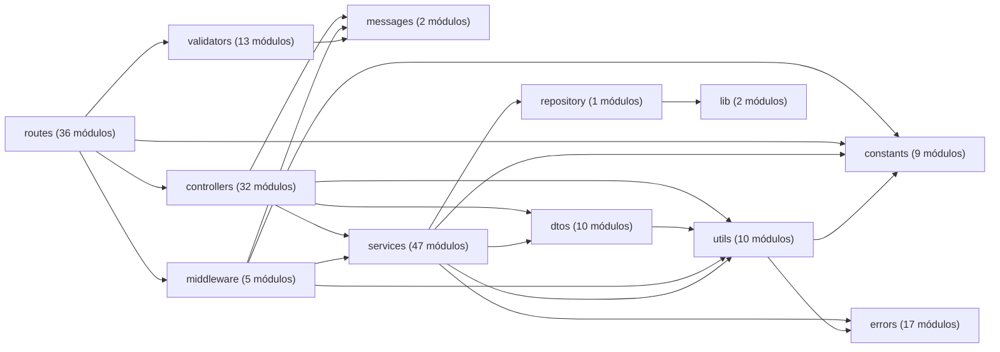

<!-- Archivo generado por scripts/generateArchitectureDocs.js. No editar manualmente. -->
# Mapa del código

Este inventario se genera **a partir del código fuente**. Ejecuta `npm run docs:architecture`
después de cambiar rutas o dependencias entre capas; `npm run docs:check` detecta si esta
versión quedó desactualizada. La semántica y el patrón de esta vista se describen en las
[convenciones de diagramas](../diagram-conventions.md).

## Dependencias entre áreas

Cada flecha representa al menos un `import` relativo desde el área de origen hacia el
área de destino. El diagrama permite detectar acoplamientos reales sin intentar mostrar
cada archivo individual.

> Alcance: módulos JavaScript bajo `src/`. Los recursos EJS, CSS y el esquema Prisma se
> explican en la documentación curada, porque una lista automática no describe sus
> decisiones de diseño.

## Endpoints API (60)

| Método | Ruta | Definición |
| --- | --- | --- |
| `POST` | `/api/auth/login` | [`src/routes/api/authApiRoute.js`](../../src/routes/api/authApiRoute.js) |
| `GET` | `/api/auth/me` | [`src/routes/api/authApiRoute.js`](../../src/routes/api/authApiRoute.js) |
| `POST` | `/api/auth/refresh` | [`src/routes/api/authApiRoute.js`](../../src/routes/api/authApiRoute.js) |
| `GET` | `/api/sales/clients` | [`src/routes/api/sales/clientApiRoute.js`](../../src/routes/api/sales/clientApiRoute.js) |
| `POST` | `/api/sales/clients` | [`src/routes/api/sales/clientApiRoute.js`](../../src/routes/api/sales/clientApiRoute.js) |
| `PUT` | `/api/sales/clients/:id` | [`src/routes/api/sales/clientApiRoute.js`](../../src/routes/api/sales/clientApiRoute.js) |
| `GET` | `/api/sales/reports/clients/excel` | [`src/routes/api/sales/reportApiRoute.js`](../../src/routes/api/sales/reportApiRoute.js) |
| `GET` | `/api/warehouse/materials` | [`src/routes/api/warehouse/materialApiRoute.js`](../../src/routes/api/warehouse/materialApiRoute.js) |
| `POST` | `/api/warehouse/materials` | [`src/routes/api/warehouse/materialApiRoute.js`](../../src/routes/api/warehouse/materialApiRoute.js) |
| `PATCH` | `/api/warehouse/materials/:id` | [`src/routes/api/warehouse/materialApiRoute.js`](../../src/routes/api/warehouse/materialApiRoute.js) |
| `PATCH` | `/api/warehouse/materials/:id/stock` | [`src/routes/api/warehouse/materialApiRoute.js`](../../src/routes/api/warehouse/materialApiRoute.js) |
| `DELETE` | `/api/warehouse/materials/:id` | [`src/routes/api/warehouse/materialApiRoute.js`](../../src/routes/api/warehouse/materialApiRoute.js) |
| `GET` | `/api/warehouse/wastes` | [`src/routes/api/warehouse/wasteApiRoute.js`](../../src/routes/api/warehouse/wasteApiRoute.js) |
| `POST` | `/api/warehouse/wastes` | [`src/routes/api/warehouse/wasteApiRoute.js`](../../src/routes/api/warehouse/wasteApiRoute.js) |
| `PATCH` | `/api/warehouse/wastes/:id` | [`src/routes/api/warehouse/wasteApiRoute.js`](../../src/routes/api/warehouse/wasteApiRoute.js) |
| `PATCH` | `/api/warehouse/wastes/:id/stock` | [`src/routes/api/warehouse/wasteApiRoute.js`](../../src/routes/api/warehouse/wasteApiRoute.js) |
| `GET` | `/api/warehouse/waste-issues` | [`src/routes/api/warehouse/wasteIssueApiRoute.js`](../../src/routes/api/warehouse/wasteIssueApiRoute.js) |
| `POST` | `/api/warehouse/waste-issues` | [`src/routes/api/warehouse/wasteIssueApiRoute.js`](../../src/routes/api/warehouse/wasteIssueApiRoute.js) |
| `PATCH` | `/api/warehouse/waste-issues/:id` | [`src/routes/api/warehouse/wasteIssueApiRoute.js`](../../src/routes/api/warehouse/wasteIssueApiRoute.js) |
| `PATCH` | `/api/warehouse/waste-issues/:id/header` | [`src/routes/api/warehouse/wasteIssueApiRoute.js`](../../src/routes/api/warehouse/wasteIssueApiRoute.js) |
| `PATCH` | `/api/warehouse/waste-issues/:id/details` | [`src/routes/api/warehouse/wasteIssueApiRoute.js`](../../src/routes/api/warehouse/wasteIssueApiRoute.js) |
| `PATCH` | `/api/warehouse/waste-issues/:id/details/:detailId/returns` | [`src/routes/api/warehouse/wasteIssueApiRoute.js`](../../src/routes/api/warehouse/wasteIssueApiRoute.js) |
| `GET` | `/api/warehouse/suppliers` | [`src/routes/api/warehouse/supplierApiRoute.js`](../../src/routes/api/warehouse/supplierApiRoute.js) |
| `POST` | `/api/warehouse/suppliers` | [`src/routes/api/warehouse/supplierApiRoute.js`](../../src/routes/api/warehouse/supplierApiRoute.js) |
| `PUT` | `/api/warehouse/suppliers/:id` | [`src/routes/api/warehouse/supplierApiRoute.js`](../../src/routes/api/warehouse/supplierApiRoute.js) |
| `GET` | `/api/warehouse/goods-receipts` | [`src/routes/api/warehouse/goodsReceiptApiRoute.js`](../../src/routes/api/warehouse/goodsReceiptApiRoute.js) |
| `POST` | `/api/warehouse/goods-receipts` | [`src/routes/api/warehouse/goodsReceiptApiRoute.js`](../../src/routes/api/warehouse/goodsReceiptApiRoute.js) |
| `PATCH` | `/api/warehouse/goods-receipts/:id` | [`src/routes/api/warehouse/goodsReceiptApiRoute.js`](../../src/routes/api/warehouse/goodsReceiptApiRoute.js) |
| `PATCH` | `/api/warehouse/goods-receipts/:id/details/:detailId/corrections` | [`src/routes/api/warehouse/goodsReceiptApiRoute.js`](../../src/routes/api/warehouse/goodsReceiptApiRoute.js) |
| `PATCH` | `/api/warehouse/goods-receipts/:id/details/:detailId/cancel` | [`src/routes/api/warehouse/goodsReceiptApiRoute.js`](../../src/routes/api/warehouse/goodsReceiptApiRoute.js) |
| `GET` | `/api/warehouse/goods-issues` | [`src/routes/api/warehouse/goodsIssueApiRoute.js`](../../src/routes/api/warehouse/goodsIssueApiRoute.js) |
| `POST` | `/api/warehouse/goods-issues` | [`src/routes/api/warehouse/goodsIssueApiRoute.js`](../../src/routes/api/warehouse/goodsIssueApiRoute.js) |
| `PATCH` | `/api/warehouse/goods-issues/:id` | [`src/routes/api/warehouse/goodsIssueApiRoute.js`](../../src/routes/api/warehouse/goodsIssueApiRoute.js) |
| `PATCH` | `/api/warehouse/goods-issues/:id/details` | [`src/routes/api/warehouse/goodsIssueApiRoute.js`](../../src/routes/api/warehouse/goodsIssueApiRoute.js) |
| `PATCH` | `/api/warehouse/goods-issues/:id/header` | [`src/routes/api/warehouse/goodsIssueApiRoute.js`](../../src/routes/api/warehouse/goodsIssueApiRoute.js) |
| `PATCH` | `/api/warehouse/goods-issues/:id/details/:detailId/returns` | [`src/routes/api/warehouse/goodsIssueApiRoute.js`](../../src/routes/api/warehouse/goodsIssueApiRoute.js) |
| `GET` | `/api/warehouse/reports/inventory/excel` | [`src/routes/api/warehouse/reportApiRoute.js`](../../src/routes/api/warehouse/reportApiRoute.js) |
| `GET` | `/api/warehouse/reports/goods-issues/excel` | [`src/routes/api/warehouse/reportApiRoute.js`](../../src/routes/api/warehouse/reportApiRoute.js) |
| `GET` | `/api/warehouse/reports/waste-issues/excel` | [`src/routes/api/warehouse/reportApiRoute.js`](../../src/routes/api/warehouse/reportApiRoute.js) |
| `GET` | `/api/warehouse/reports/goods-receipts/excel` | [`src/routes/api/warehouse/reportApiRoute.js`](../../src/routes/api/warehouse/reportApiRoute.js) |
| `GET` | `/api/warehouse/reports/wastes/excel` | [`src/routes/api/warehouse/reportApiRoute.js`](../../src/routes/api/warehouse/reportApiRoute.js) |
| `GET` | `/api/warehouse/reports/suppliers/excel` | [`src/routes/api/warehouse/reportApiRoute.js`](../../src/routes/api/warehouse/reportApiRoute.js) |
| `GET` | `/api/warehouse/unit-measures` | [`src/routes/api/warehouse/unitMeasureApiRoute.js`](../../src/routes/api/warehouse/unitMeasureApiRoute.js) |
| `GET` | `/api/warehouse/presentations` | [`src/routes/api/warehouse/presentationApiRoute.js`](../../src/routes/api/warehouse/presentationApiRoute.js) |
| `GET` | `/api/warehouse/reasons` | [`src/routes/api/warehouse/reasonApiRoute.js`](../../src/routes/api/warehouse/reasonApiRoute.js) |
| `GET` | `/api/warehouse/fulfillment-statuses` | [`src/routes/api/warehouse/fulfillmentStatusApiRoute.js`](../../src/routes/api/warehouse/fulfillmentStatusApiRoute.js) |
| `GET` | `/api/admin/users` | [`src/routes/api/admin/userApiRoute.js`](../../src/routes/api/admin/userApiRoute.js) |
| `POST` | `/api/admin/users` | [`src/routes/api/admin/userApiRoute.js`](../../src/routes/api/admin/userApiRoute.js) |
| `PATCH` | `/api/admin/users/:id` | [`src/routes/api/admin/userApiRoute.js`](../../src/routes/api/admin/userApiRoute.js) |
| `PATCH` | `/api/admin/users/:id/password` | [`src/routes/api/admin/userApiRoute.js`](../../src/routes/api/admin/userApiRoute.js) |
| `GET` | `/api/admin/roles` | [`src/routes/api/admin/roleApiRoute.js`](../../src/routes/api/admin/roleApiRoute.js) |
| `GET` | `/api/admin/departments` | [`src/routes/api/admin/departmentApiRoute.js`](../../src/routes/api/admin/departmentApiRoute.js) |
| `GET` | `/api/admin/persons` | [`src/routes/api/admin/personApiRoute.js`](../../src/routes/api/admin/personApiRoute.js) |
| `POST` | `/api/admin/persons` | [`src/routes/api/admin/personApiRoute.js`](../../src/routes/api/admin/personApiRoute.js) |
| `PUT` | `/api/admin/persons/:id` | [`src/routes/api/admin/personApiRoute.js`](../../src/routes/api/admin/personApiRoute.js) |
| `GET` | `/api/admin/movements/wastes` | [`src/routes/api/admin/movementApiRoute.js`](../../src/routes/api/admin/movementApiRoute.js) |
| `GET` | `/api/admin/movements/materials` | [`src/routes/api/admin/movementApiRoute.js`](../../src/routes/api/admin/movementApiRoute.js) |
| `GET` | `/api/admin/reports/movements/materials/excel` | [`src/routes/api/admin/reportApiRoute.js`](../../src/routes/api/admin/reportApiRoute.js) |
| `GET` | `/api/admin/reports/movements/wastes/excel` | [`src/routes/api/admin/reportApiRoute.js`](../../src/routes/api/admin/reportApiRoute.js) |
| `GET` | `/api/admin/reports/users/excel` | [`src/routes/api/admin/reportApiRoute.js`](../../src/routes/api/admin/reportApiRoute.js) |

## Rutas web (16)

| Método | Ruta | Definición |
| --- | --- | --- |
| `GET` | `/` | [`src/routes/web/homeWebRoute.js`](../../src/routes/web/homeWebRoute.js) |
| `GET` | `/inicio-sesion` | [`src/routes/web/auth/loginWebRoute.js`](../../src/routes/web/auth/loginWebRoute.js) |
| `GET` | `/revocar-sesion` | [`src/routes/web/auth/refreshWebRoute.js`](../../src/routes/web/auth/refreshWebRoute.js) |
| `POST` | `/cerrar-sesion` | [`src/routes/web/auth/logoutWebRoute.js`](../../src/routes/web/auth/logoutWebRoute.js) |
| `GET` | `/almacen/materiales` | [`src/routes/web/warehouse/materialWebRoute.js`](../../src/routes/web/warehouse/materialWebRoute.js) |
| `GET` | `/almacen/mermas` | [`src/routes/web/warehouse/wasteWebRoute.js`](../../src/routes/web/warehouse/wasteWebRoute.js) |
| `GET` | `/compras` | [`src/routes/web/warehouse/goodsReceiptWebRoute.js`](../../src/routes/web/warehouse/goodsReceiptWebRoute.js) |
| `GET` | `/salidas/materiales` | [`src/routes/web/warehouse/goodsIssueWebRoute.js`](../../src/routes/web/warehouse/goodsIssueWebRoute.js) |
| `GET` | `/salidas/mermas` | [`src/routes/web/warehouse/wasteIssueWebRoute.js`](../../src/routes/web/warehouse/wasteIssueWebRoute.js) |
| `GET` | `/usuarios-sistemas` | [`src/routes/web/admin/userWebRoute.js`](../../src/routes/web/admin/userWebRoute.js) |
| `GET` | `/personas` | [`src/routes/web/admin/personWebRoute.js`](../../src/routes/web/admin/personWebRoute.js) |
| `GET` | `/clientes` | [`src/routes/web/sales/clientWebRoute.js`](../../src/routes/web/sales/clientWebRoute.js) |
| `GET` | `/proveedores` | [`src/routes/web/warehouse/supplierWebRoute.js`](../../src/routes/web/warehouse/supplierWebRoute.js) |
| `GET` | `/movimientos/materiales` | [`src/routes/web/admin/movementWebRoute.js`](../../src/routes/web/admin/movementWebRoute.js) |
| `GET` | `/movimientos/mermas` | [`src/routes/web/admin/movementWebRoute.js`](../../src/routes/web/admin/movementWebRoute.js) |
| `GET` | `/movimientos` | [`src/routes/web/admin/movementWebRoute.js`](../../src/routes/web/admin/movementWebRoute.js) |
